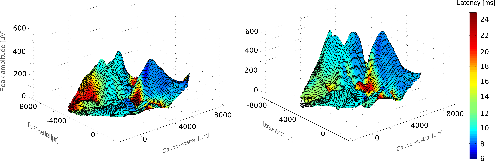

title: Kral Lab - Auditory Neuroscience

[Link to lab wesite](http://www.neuroprostheses.com)

We focus our research on neuroprosthetic devices, i.e. methods of artificial stimulation of the nervous system. So far, the cochlear implant has been the clinically most successful neuroprosthetic device. We work on further improvements of this prosthetic device and search for alternative ways of the stimulation of the brain.

Replacing a lost brain function by a neuroprosthesis requires to understand how neuronal assemblies represent the world and how neuronal circuits process information. We focus on the consequences of lost functions on information processing in the brain. As postnatal development of the brain depends on experience, the most devastating effects of lost functions are observed when deprivation starts in childhood. Our lab investigates how congenital auditory deprivation (deafness) affects the neuronal networks of the auditory system. We could show that some feature sensitivity is rudimentary preserved in the auditory cortex of congenitally deaf, whereas e.g. cortical interactions and binaural representations show extensive alterations. In it‘s ultimate consequence, congenital deafness leads to the inability to represent auditory stimuli and to learn. We could for the first time describe a neural correlate of a developmental sensitive (critical) period - the earier the restoration of hearing with cochlear implant is performed, the faster and better is the adaptation to the implant.

Detailed information is available at [the Lab's website](http://www.neuroprostheses.com).

## Research Topics
-   [Neurophysiology of Cochlear Implants](http://neuroprostheses.com/AK/Cochlear_Implants.html)
-   [Plasticity & Critical Periods](http://www.neuroprostheses.com/AK/Brain_plasticity.html)
-   [Development & Sensory Deprivation](http://neuroprostheses.com/AK/Deafness.html)
-   [Single-Sided Deafness](http://neuroprostheses.com/AK/Single-sided_deafness.html)
-   [Deafness and Space](http://neuroprostheses.com/AK/Binaural_CIs.html)
-   [Crossmodal Plasticity](http://www.neuroprostheses.com/AK/Crossmodal_plasticity.html)
-   [Morphology of the Cochlea](http://www.neuroprostheses.com/AK/Cochlear_anatomy.html)
-   [“Hearing” Light](http://neuroprostheses.com/AK/Laser_prosthesis.html)
-   [Anaesthesia & the Cortex](http://neuroprostheses.com/MouseLab/Burst-Suppression.html)
-   [Mouse Brain](http://neuroprostheses.com/MouseLab/Mouse_V1.html)

---------------------
## Methods used by our lab
- [Methods](http://neuroprostheses.com/AK/Methods.html)

## Courses that we teach
- [Courses](http://neuroprostheses.com/AK/Students_corner.html)

## Full list of publications
- [Publications](http://neuroprostheses.com/AK/Papers.html)

## Press reports on our work & Interviews
- [Press reports](http://neuroprostheses.com/AK/Press_%26_TV.html)

Contact: Prof. Dr. Dr. med. A. Kral: <Kral.Andrej@mh-hannover.de>
