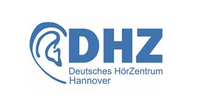
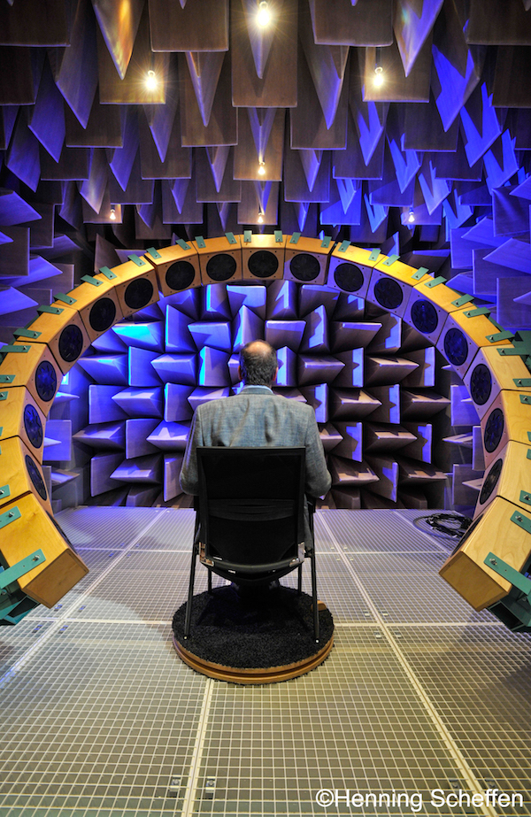

title: Büchner Lab - Signal Processing for Auditory Implants
***

# Forschungsthemen: #

{style="float:right; margin-left:3em"}

- Signal processing for cochlear implants

- Measurement of auditory evoked potentials by intracochlear electrodes (Cochlear Microphonics, summating potential, compound action potential)

- Measurement of electrical evoked potentials (EEG)

- Objectification of hearing with objective measuring methods

- Sound localization and binaural processing of auditory psychophysics 

----------

The group is working on the development of signal processing strategies for cochlear implants. Depending on the manufacturer, 12 to 22 intracochlear electrode contacts of the cochlear implant electrically stimulate the auditory nerve to cause a hearing sensation in CI patients. The electrodes are activated in rapid succession several hundred to a thousand times a second. The composition of these intracochlear stimulation patterns, which are calculated by signal processing strategies, determines the auditory impression of the CI patient. This results in the following main topics:

{style="width:300px; float:right; margin-left:3em"}

- **Development of signal processing strategies for cochlear implants** taking into account the perception characteristics of the human hearing system. In particular, the consideration of perception thresholds as a function of the acoustic signal is being researched in order to make better use of the limited bandwidth of the electrode-nerve interface. In order to improve hearing in the growing group of EAS (Electric-Acoustic Stimulation) patients, interactions between electrical and acoustic stimulation in patients with residual acoustic hearing are also being investigated.

- **Development of binaural stimulation strategies for cochlear implants** with the aim of improving limited directional hearing in bilateral cochlear implants patients. Evaluation of the strategies in an anechoic chamber with lower limit frequency of 90 Hz using a fixed localization sound system.

- **Use of high-resolution EEG systems** (128 channels, sampling rate 20,000 Hz) for the objectification of auditory sensations in CI patients (frequency, volume and temporal resolution).

- **Development of automated fitting procedures** based on objective measurements and patient feedback.

- **Development and evaluation of noise cancellation and beamforming algorithms** to improve signal-to-noise ratio in different listening environments to improve hearing in CI patients.
- - - 

**Contact:**

[DHZ-Deutsches HörZentrum Hannover](http://www.hoerzentrum-hannover.de/index.php?id=1)

    Prof. Dr. Dipl.-Inform. Andreas Büchner
    Karl-Wiechert-Allee 3 
    30625 Hannover
    

Buechner(at)hoerzentrum-hannover.de
