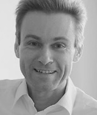

title: Prof. Dr. Dipl.-Inform. Andreas Büchner 	

**Head of Research of the German Hearing Centre Hannover (DHZ)**

Professor for „Auditory Implants“

Since 2003, Prof. Büchner has been the scientific director of the German Hearing Center in Hannover at the ENT Clinic at MHH. In addition to his research activities in the field of implantable hearing systems, he also works with the process optimization in the care of patients with hearing systems and contract arrangement with the cost carriers.

**Contact:**

	Andreas Büchner
	Deutsches HörZentrum Hannover
	Karl-Wiechert-Allee 3
	30625 Hannover
	Buechner(at)mh-hannover.de

**Links:**

* **[DHZ](https://www.dhz.clinic/wir-ueber-uns/team/forschung)**

* **[HNO - für Wissenschaftler](https://www.mhh.de/forschung/forschungsschwerpunkte-netzwerke/biomedizintechnik-implantate)**

* **[Hearing4all](https://hearing4all.eu/DE/)**:
	* [Research Thread II: IT-based diagnostics and rehabilitation](https://hearing4all.de/forschung/it-gestuetzte-diagnose-und-rehabilitation/)
	* [Principal Investigators H4A 2.0](https://hearing4all.de/h4a/personen/wissenschaftler/)		

* **[Initiative Wissenschaften Hannover](https://wissen.hannover.de/Einrichtungen/Medizinische-%C2%ADHochschule-%C2%ADHannover/H%C3%B6ren-f%C3%BCr-alle-Hearing4all)**
Hearing4all - Exzellente Hörforschung - Im Interview: Prof. Dr. Andreas Büchner, Jun. Prof. Dr. Waldo Nogueira (Quelle: Madsack Medienagentur) 

* **[ResearchGate](https://www.researchgate.net/profile/Andreas_Buechner)**

* **[DFG](https://gepris.dfg.de/gepris/person/215993710)**

***

