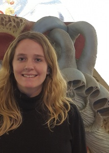
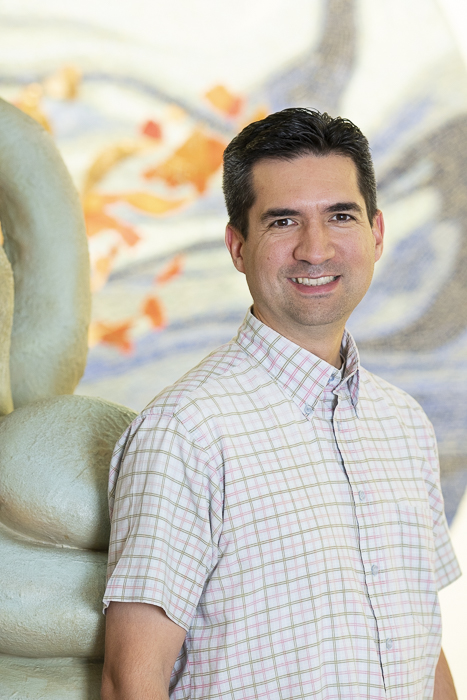
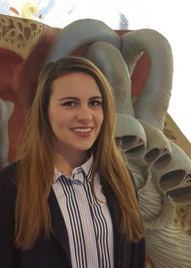
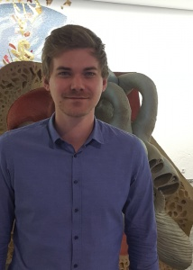
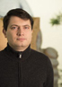
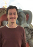
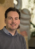

title: Staff

- - - 

| Head of Research Group                                   |                                      |
|:------------------------------|:-----------------------|-------------------------------:|
| | Prof. Dr. Dipl.-Inform. A. Büchner | Buechner(at)hoerzentrum-hannover.de   |

 

| Research Team                                                                                                      |
|:------------------------------|:----------------------------------------------|--------------------------------------:|
|    | Michael Bardt                     | Bardt.Michael(at)mh-hannover.de        |
|	| Hanna Bönitz                       | Boenitz.Hanna(at)mh-hannover.de	  |
|	| Karl-Heinz Dyballa, Dr. rer. biol. hum. 					 | Dyballa.Karl-Heinz(at)mh-hannover.de	  |
|	| Annette Günther                   | Guenther.Annette(at)mh-hannover.de	  |
|	| Sven Kliesch                       | Kliesch.Sven(at)mh-hannover.de	  |
|	| Eugen Kludt, Dr. rer. nat. 	    				 | Kludt.Eugen(at)mh-hannover.de	  |
|	| Timo Leinemann, Dr. 			       		 | Leinemann.Timo(at)mh-hannover.de	  |
|	| Mark Schüssler 				           	 | Schuessler.Mark(at)mh-hannover.de	  |
|	| Tobias Weller 					                 | Weller.Tobias(at)mh-hannover.de	  |

| Cooperating Workgroups                                                                                                      |
|:------------------------------|:----------------------------------------------|--------------------------------------:|
|     Waldo Nogueira, Prof. Dr.-Ing.| Professor for Auditory Prosthesis   | 
NogueiraVazquez.Waldo(at)mh-hannover.de        |
|	 Hannes Maier, Prof. Dr. phil. nat.| Director MEI-Team Professor for „Experimental Audiological Diagnostic“ 	 | 
Maier.Hannes(at)mh-hannover.de 	  |

| Links                                                                                                      |
|:------------------------------|:----------------------------------------------|--------------------------------------:|
| | **[Team Forschung DHZ](https://www.hoerzentrum-hannover.de/wir-ueber-uns/team/forschung/)**    |      |
|	| **[Team Ingenieure DHZ](https://www.hoerzentrum-hannover.de/wir-ueber-uns/team/ingenieure/)** 	|  	   |

| Alumni                                                                                                     |
|:------------------------------|:----------------------------------------------|--------------------------------------:|
| |   |      |
|	|  	|  	   |

---------------------------

