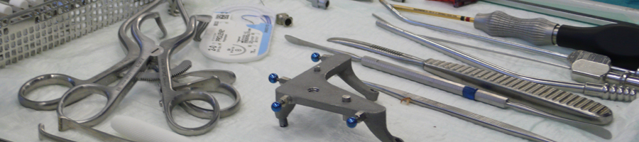

title: CAS Lab - Computer-Assisted Surgery

- - - 

Open Positions ([Here](https://www.vianna.de/04_jobs.html)

## Who we are

{style="width:400px; float:right; margin-left:1em"}

The group "Computer-Assisted Surgery and Electrode Development" (CAS-h) is an [interdisciplinary research group](cas/staff.html "Staff") of engineers, physicians, and natural scientist at the Department of Otolaryngology whose common focus is the development of technologies and methods for surgical rehabilitation of the inner ear (cochlea). 

This includes research activities dedicated to the design and development of **surgical assistance systems** in order to improve surgical techniques - with special focus on **minimally invasive cochlear implant surgery (minCIS)** and **automated electrode insertion**. Based on pre-operative imaging and patient-specific planning different technologies of image-guided surgery systems, mechatronic assistance devices as well as micro-stereotactic frames are incorporated into the surgical workflow for a highly accurate and less traumatic surgical intervention. 

The second  research focus lies on the **improvement of the electrode array** of a cochlear implant (CI) including the insertion technique. In this field, our research group covers the complete design and development process. Starting with imaging and three-dimensional (3D) modelling of the human inner ear, the methods used include: development of improved electrode designs using computer aided design (CAD) software and finite element analysis (FEA); the simulation and optimization of the insertion process; experimental characterization of the electrode arrays by manual and/or automated insertion in artificial cochlear models and/or temporal bone specimens. Of special interest is the **functionalization of the electrode array** by integrating of actuators (e.g. using shape memory materials, fluid mechanical actuators, and tubular manipulators) for an individual adaption of the shape of the implant to the helical shaped inner ear in order to improve hearing preservation.  

A more detailed list of our research activities can be found [here](cas/methods.html).

- - - 

- - - 

** Contact: Dr.-Ing. Thomas S. Rau**

    Head of Research Group
    Computer-Assisted Surgery and Electrode Development
    
    Hannover Medical School
    Department of Otolaryngology
    VIANNA - Institute of AudioNeuroTechnology
    Stadtfelddamm 34
    30625 Hannover
    
    phone: +49(0)511/532-3025
    email: rau.thomas@mh-hannover.de

