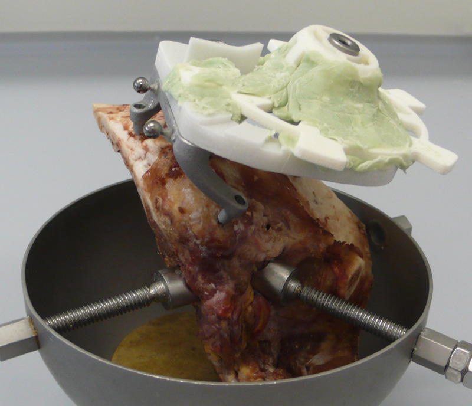
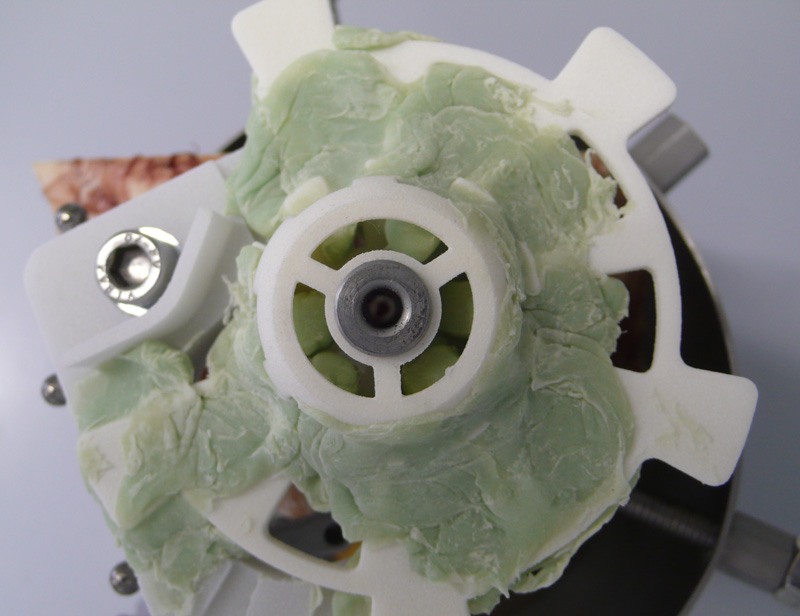
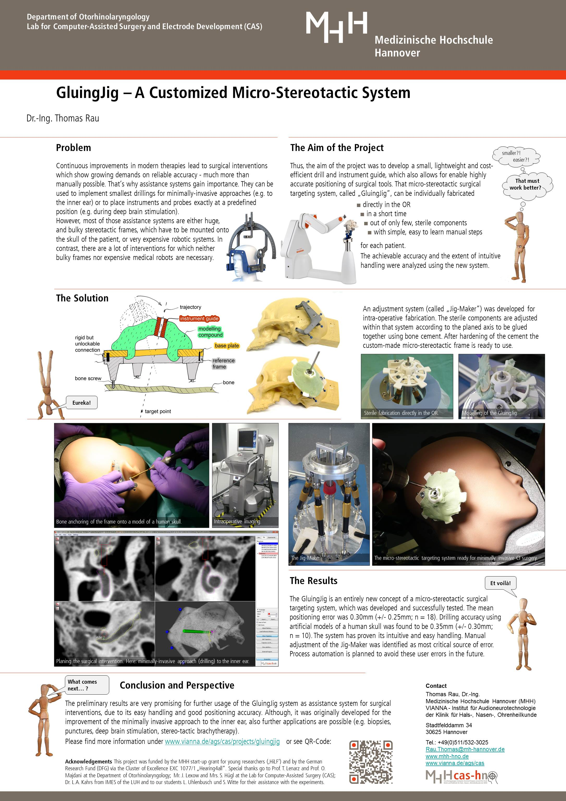

Title: GluingJig

- - -

# An individually mouldable surgical targeting system

Minimally-invasive cochlear implantation surgery requires appropiate surgical tools to drill a single bore hole from outside the skull directly down to the basal turn of the cochea. In this project a new concept for providing a customized surgical tool, also known as "micro-stereotactic frame" had been developed. Main idea is to utilize bone cement to fix the individual pose of the template according to a previosly planned trajectory using individual images (e.g. CT or CBCT). This new surgical targeting system includes an aligment device, referred to as "Jig Maker", based on a passive hexapod with manually adjustable legs for temporary fixation of the single components (disposables) until the bone cement is cured. In a preliminary study, 18 samples of the surgical template were fabricated and evaluated regarding positioning accuracy \[[Rau _et al_. 2017](../publications/Rau2017_spie.pdf "External Link to full text")\]. The mean positioning error at the target point (located in a depth of approx. 70 mm) was 0.30 mm with a standard deviation of 0.25mm. 

The developed system allows the patient specific individualization of a drill guide under sterile conditions. It does not require expensive equipment or technical personal. The whole process can be performed by OR staff in few minutes. These are advantages compared to previously developed systems and might facilitate its integration into clinical routine.

 
        

 

In 2018 we were able to demonstrates the feasibility of performing the minimally invasive access to the middle ear in a proof-of-concept study using the GluingJig surgical targeting system \[[Rau _et al_. 2018c](https://www.degruyter.com/downloadpdf/j/cdbme.2018.4.issue-1/cdbme-2018-0096/cdbme-2018-0096.pdf "External Link to full text")\]. In that study, the system was evaluated for the first time in a human cadaver trial. After screwing the reference frame ("Trifix") on one temporal bone specimen, a trajectory through the facial recess was planned after imaging. Using that plan the surgical template was composed utilizing bone cement and equipped with a linear guide for the surgical drill. After harding of the bone cement the template was mounted on top of the reference frame and used for drilling into the mastoid as previously planned. Facial nerve and chorda tympani could be preserved. The deviation between the actual drill hole and the planned trajectory was 0.17 mm at the level of the facial recess. The minimal distance of the drill hole to the facial nerve was 0.59 mm. 

 {style="width:250px"}  {style="width:280px"} 
 

 
        

 

{style="width:100px; float:left; margin-right:1em"}

For more information about a first prototype of the GluingJig surgical targeting system please download the flyer provided [here](gluingjig/PosterGluingJig_engl.pdf). A German version of the flyer is available [here](gluingjig/PosterGluingJig_dt.pdf).

- - -
### Contact:
If your are interested in this technology, want to join a collaboration for further development, or just have additional questions please do not hesitate to contact:

    Dr.-Ing. Thomas Rau
    rau.thomas@mh-hannover.de
    +49(0)511/532-3025

### Funding:
This work was supported by the start-up grant for young researches '[HiLF](https://www.mh-hannover.de/hilf.html)' of Hannover Medical School. 

### Patents:
-   European patent granted in 2017 and validated in DE, FR, GB, CH, NL: Rau Th. S., Majdani O., Lenarz T., Kahrs L. A.: _Surgical guidance device and method for its preparation_. **EP 3 058 890 B1.** \[[ Patent](https://depatisnet.dpma.de/DepatisNet/depatisnet?action=pdf&docid=EP000003058890B1&famSearchFromHitlist=1)\].
-   US patent application is pending. **US 2018/0008367 A1** \[[ PAP](https://depatisnet.dpma.de/DepatisNet/depatisnet?action=pdf&docid=US020180008367A1&famSearchFromHitlist=1)\]. 

### Further Reading:
|    |                                                               |
| -: | :------------------------------------------------------------ |
| [](https://www.degruyter.com/downloadpdf/j/cdbme.2018.4.issue-1/cdbme-2018-0096/cdbme-2018-0096.pdf)| Rau Th.S., Witte S., Uhlenbusch L., Lexow J., Hügl S., Kahrs L. A., Majdani O., Lenarz T. (2018c): _Minimally invasive mastoidectomy approach using a mouldable surgical targeting system_. \[[ doi](https://www.degruyter.com/downloadpdf/j/cdbme.2018.4.issue-1/cdbme-2018-0096/cdbme-2018-0096.pdf)\].|
| [](../publications/Rau2018b_CARS_Berlin_GluingJig.pdf) | Rau Th., Uhlenbusch L., Witte S., Lexow J., Kahrs LA, Lenarz Th., Ortmaier T., Majdani O. (2018b): _Determination of error sources and values for an individually mouldable surgical targeting system_. In Proc. 32nd International Congress and Exhibition on Computer Assisted Radiology and Surgery (CARS), June 20-23, Berlin, Germany. \[[ doi](https://link.springer.com/article/10.1007/s11548-018-1766-y)\].|
| [](../publications/Rau2017_spie.pdf "Fulltext") | Rau Th. S., Lexow G. J., Blume D., Kluge M., Lenarz Th., Majdani O. (2017): _Micro-stereotactic frame utilizing bone cement for individual fabrication. An initial investigation of its accuracy_. In Proc. SPIE Medical Imaging 2017: Image-Guided Procedures, Robotic Interventions, and Modeling, 101350P. \[[ doi](http://dx.doi.org/10.1117/12.2254304)\]. |
| [](../publications/Rau2016b_curac.pdf "Fulltext") | Rau Th. S., Lexow G. J., Kluge M., Lenarz Th., Majdani O. (2016): _An alternative concept for template-guided minimally-invasive cochlear implantation surgery_. In: Ansó J. et. al (Hrsg.): Proc. 15th Annual Meeting German Society for Computer- and Robot-Assisted Surgery (CURAC), 29.09.-01.10.2016, Bern. Seiten 149-154. \[[ doi](http://www.curac.org/images/advportfoliopro/images/CURAC2016/CURAC%202016%20Tagungsband.pdf)\]. |
