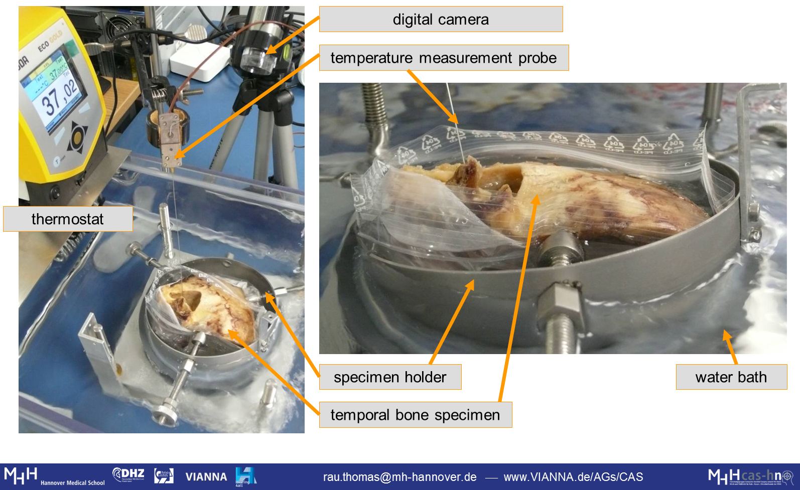

Title: MemoryCI

- - - 

# Functionalisation of Cochlear Implants Electrode Arrays by Use of Shape Memory Alloys

Shape memory materials, above all Nitinol, are of particular interest for minimally invasive applications in medicine. Their unique material properties allow a high degree of miniaturization and the realization of actuator functions. However, the design process of such shape memory actuators is complex and insufficiently controlled. Therefore, the use of Nitinol in medical engineering is up to now restricted to applications which do not require an accurate temperature-dependent behavior or for which the actuation movement can be generously and coarsely designed. This is the case when the transformation temperatures can be chosen considerably below or above body temperature or when the surrounding tissues are sufficiently robust (e.g. bone around compression staples).

The situation is different when functionalizing the electrode carrier of a cochlear implant (CI) by use of Nitinol. The desired change of its shape from a straight configuration required for implantation towards a spiral shape (adapted to the cochlea) suggests the use of shape memory materials. However, an unsolved challenge is the concurrent preservation of the functionally important, membranous structures inside the inner ear. Consequently, the temperature-dependent actuation movement and the corresponding forces on the surrounding tissue have to be controllable and adjusted very accurately. In addition, the narrow surgical access causes a high heat input from the surrounding tissues, so that a precise timing of the temperature-dependent actuator is crucial.  Thus, the cochlear implant serves as a prime example of a clinical application that requires both a very accurate adjustment of the thermo-mechanical behavior of the actuator to the clinical conditions as well as sufficient strategies to control the heat flow.

The proposed research project will address the special challenges of using thin Nitinol wires as actuator elements applied to the concrete example of the CI. The aim is to develop a sound knowledge for the dimensioning of wiry Nitinol shape memory actuators. Therefore, the influence of external forces on the thermal hysteresis will be quantified by a systematic thermo-mechanical characterization of different wire samples. This will be complemented by investigating the interdependence of the thermo-mechanical behaviour and the clinical preconditions (thermal: physiological threshold values, geometrical: anatomical boundaries, mechanical: maximum permissible contact forces). In addition, cooling methods suitable for the OR will be developed and active heating (externally controlled activation of the shape memory effect) will be experimentally investigated. Resulting surface temperatures will be quantified by use of thermography. This application-oriented basic research should support a broader utilization of miniaturized Nitinol shape memory actuators in medical technology.

### Funding:
German Research Foundation (DFG, [RA 2751/1-1](https://gepris.dfg.de/gepris/projekt/316068314), Title: "Functionalisation of implants by use of shape memory materials for temperature and force sensitive applications", since July 2017)

### Contact:
If your are interested in this technology, want to join a collaboration for further development, or just have additional questions please do not hesitate to contact:

    Dr.-Ing. Thomas Rau 	
    rau.thomas@mh-hannover.de
    ++49(0)511/532-3025

 
### Further Reading:

|  |       |
|-:|:------| 
| [](../publications/Rau2019d_ESAOPoster_vfinal.pdf) | Rau Th. S., Suzaly N., Hügl S., Lenarz T. (2019d): _On the characterization of thermomechanical properties of curved NiTi shape memory wires intended for cochlear implant electrode arrays_. In Proc. XLVI. Congress of the European Society for Artificial Organs (ESAO), September 4-7, Hannover, Germany. \[[ doi](https://journals.sagepub.com/doi/pdf/10.1177/0391398819860985)\]. |
| [](../publications/Suzaly2019_CIAPPoster.pdf) | Suzaly N., Hügl S., Rau Th. S., Lenarz T. (2019b): _Designing shape memory alloy actuators tailored to the human cochlea geometry_. In Proc. Conference on Implantable Auditory Prostheses (CIAP), July 14-19, Lake Tahoe, CA, US. |
| [](https://www.degruyter.com/downloadpdf/j/cdbme.2018.4.issue-1/cdbme-2018-0036/cdbme-2018-0036.pdf)| Rau Th.S., Suzaly N., Pawsey N., Hügl S., Lenarz T., Majdani O. (2018): _Histological evaluation of a cochlear implant electrode array with electrically activated shape change for perimodiolar positioning_. In Proc. 52nd Annual Conference of the German Society for Biomedical Engineering (DGBMT within VDE), September 26-28, Aachen, Germany. \[[ doi](https://www.degruyter.com/downloadpdf/j/cdbme.2018.4.issue-1/cdbme-2018-0036/cdbme-2018-0036.pdf)\].|

- - - 

# Previous Work

For several years, we have been exploring the shape memory effect of Nitinol, which is a well-established shape memory allow (SMA) made from nickel and titanium with numerous biomedical applications, as a potential mechanism for perimodiolar placement of the electrode array of a cochlear implant. A first demonstrator of this concept was announced in 2013 \[[Majdani _et al._](https://www.degruyter.com/downloadpdf/j/bmte.2013.58.issue-s1-A/bmt-2013-4002/bmt-2013-4002.pdf)\]. Later we performed temporal bone studies to show that there ist no higher risk of insertion trauma due to the additional stiffness of the integrated Nitinol wire \[[Rau _et al._ 2016](../publications/Rau2016_Hybrid-M_InsTrauma_v4_Rev2_v1_clean.pdf)]\. 

{style="width:500px"}

{style="width:500px"}

{style="width:500px"}

However, providing a functional EA for cochlear implantation surgery with shape memory effect is still an unsolved challenging issue due to the very narrow temperature range in which complete phase transformation has to take place. Fine tuning of the thermomechanical properties of the Nitinol wires requires further basic research in order to fulfil the application specific requirements.

### List of Publications:

|  |       |
|-:|:------| 
| | Suzaly N., Hügl S., Majdani O., Lenarz T., Rau TS. (2019): _Histologische Evaluierung des Elektrodenträgers eines Cochlea-Implantats mit einer für elektrische Erwärmung integrierten Formgedächtnislegierung_. In Proc. 90th Annual Meeting German Society of Oto-Rhino-Laryngology, Head and Neck Surgery, Mai 30- June 1st, Berlin, Germany. \[[ doi](https://www.thieme-connect.de/products/ejournals/abstract/10.1055/s-0039-1686520)\].|
| [](https://www.degruyter.com/downloadpdf/j/cdbme.2017.3.issue-2/cdbme-2017-0161/cdbme-2017-0161.pdf) | Rau Th. S., Hügl S., Lenarz Th., Majdani O. (2017d): _Toward steerable electrodes: An overview of concepts and current research_. In Current Directions in Biomedical Engineering  3(2):765-769. \[[ doi](https://doi.org/10.1515/cdbme-2017-0161)\].|
| [](../publications/Rau2016_Hybrid-M_InsTrauma_v4_Rev2_v1_clean.pdf)  | Rau Th. S., Harbach L., Pawsey N., Kluge M., Erfurt P., Lenarz T., Majdani O. (2016): _Insertion trauma of a cochlear implant electrode array with Nitinol inlay._ Eur Arch Otorhinolaryngol. 273(11):3573-3585. \[[ doi](https://doi.org/10.1007/s00405-016-3955-z)\].|
|   | Majdani O., Lenarz T., Pawsey N., Nullmeier M., Sedlmayr G., Rau Th. S. (2016): _Development of a prototype of a new cochlear implant electrode (Hybrid-M) with shape memory effect_. In Proc.: 87th Annual Meeting of the German Society of Oto-Rhino-Laryngology, Head and Neck Surgery. Mai 4-7, Düsseldorf, Germany.|
|   | Majdani O., Lenarz T., Pawsey N., Risi F., Prielozny L., Rau Th. S. (2014): _Insertion of a cochlear implant electrode with shape memory properties into the inner ear for nerve-close position_. Biomedical Engineering / Biomedizinische Technik 59 (S1): 1077–1079. |
|   | Majdani O.; Lenarz Th; Pawsey N.; Risi F.; Sedlmayr G.; Rau Th. S. (2013): _First Results with a Prototype of a new Cochlear Implant Electrode featuring Shape Memory Effect. Biomed Tech (Berl) 58(SI-1)_. \[[ doi](https://www.degruyter.com/downloadpdf/j/bmte.2013.58.issue-s1-A/bmt-2013-4002/bmt-2013-4002.pdf)\].| 

