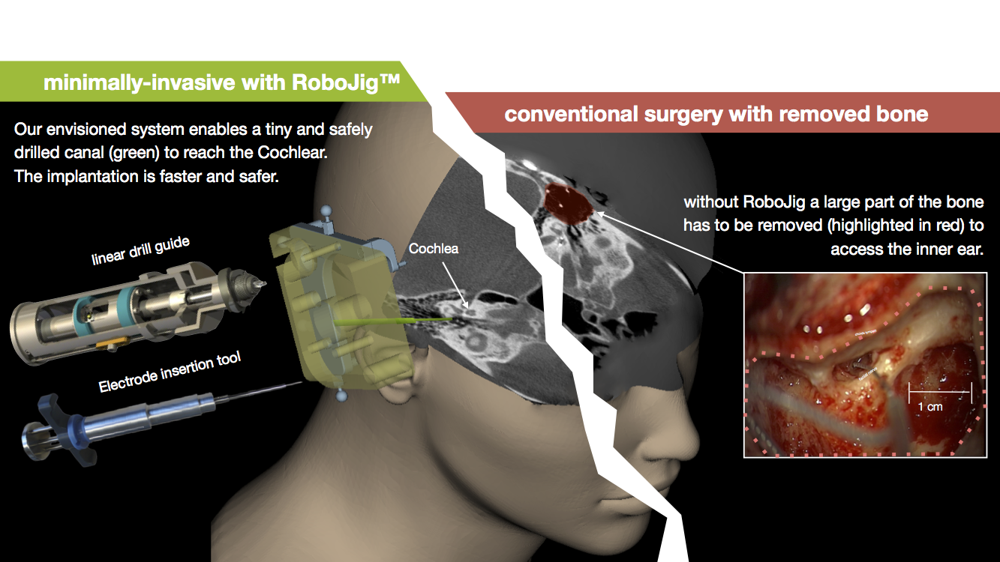

Title: RoboJig

- - -

# Toward fully minimally invasive cochlear implant surgery

### Summary
Few years ago we came up with the idea of a new micro-stereotactic targeting system to enable image-guided, minimally-invasive cochlear implant surgery. The development was driven by the aim to enable patient-specific fabrication of the instrument guide during the surgery uder sterile conditions. Therefore we had to simplify the customization procedure in comparison to previously introduced concepts (e.g. StarFix, Microtable). The proposed system consists of a reusable, bone-anchored frame and a customized jig which guides the surgical instruments along a previously planned trajectory. Only one single counterbored hole need to be drilled into a blank in order to intra-operatively finish the patient-individual jig.

From 2004 to 2008, funded by the Federal Ministry of Education and Research of Germany ([BMBF](https://www.bmbf.de/), grand number 13GW0019E), we developed first prototypes of the micro-stereotactic targeting system, referred to as "RoboJig". It was a joint research project with contribution of several academic and industrial partners:

- CAS Lab, Department of Otorhinolaryngology, Hannover Medical School
- Institut for Mechatronic Systems, Leibniz Universität Hannover
- [HörSys GmbH](https://hoersys.de/de/projects/), Hannover
- [A.R.C. Laser GmbH](https://www.arclaser.de/de/), Nürnberg
- [Fiagon GmbH](https://www.fiagon.com/ous/de/), Hennigsdorf
- [MED-EL Deutschland GmbH](https://www.medel.com/de), Starnberg

Parallel to the research project the "RoboJig" concept was patented and later transferred to the [OtoJig GmbH](https://otojig.com/). It is a German start-up company that now owns and further develops the mentioned technology under the brand name "OtoJig" in order to provide a commercial solution for minimally invasive CI surgery of tomorrow.

In the mean time, our research group goes on with research on the optimization of the general concept, especially regarding drilling accuracy, atraumatic opening of the inner ear and gentle electrode insertion. Recently, we obtained public funding for an additional research project in this field provided by the BMBF. The aim of the joint research project "OtoTrak" is the development of new algorithm for improved trajectory planning with special focus on hearing preservation as well as the development of new surgical tools with integrated force sensing capability.

- - -
### Contact:
If your are interested in RoboJig/OtoJig technology, want to join a collaboration for further development, or just have additional questions please do not hesitate to contact:

    Dr.-Ing. Thomas Rau
    rau.thomas@mh-hannover.de

### Patents:
-   European patent granted in 2018: Lenarz Th., Rau Th. S., Majdani O., Ortmaier T., Kobler J.-P., Kluge M., John S.: _Positioning Aid for Surgical Interventions_. **EP 3 128 942 B1.** \[[ Patent](https://depatisnet.dpma.de/DepatisNet/depatisnet?action=pdf&docid=EP000003128942B1&xxxfull=1)\].

- - -

### Further Reading:

|    |                                                              |
| -- | ------------------------------------------------------------ |
| [](../publications/Rau2019c_CIAPPoster.pdf)   | Rau TS., Blum T., Kluge M., John S., Kahrs LA., Ortmaier T., Fröhlich M., Majdani O., Lenarz T. (2019c): _Accuracy of drill depth control of an image-guided micro-stereotactic targeting system dedicated to cochlear implantation surgery_. In Proc. Conference on Implantable Auditory Prostheses (CIAP), July 14-19, Lake Tahoe, CA, US. |
| | Timm M., Stieghorst J., Kluge M., John S., Rau Th. S., Lenarz T. (2019): _Auf dem Weg zur minimal-invasiven Cochlea Implantation: Erste Ergebnisse einer Kadaverstudie_. In Proc. 90th Annual Meeting German Society of Oto-Rhino-Laryngology, Head and Neck Surgery, Mai 30- June 1st, Berlin, Germany. \[[ doi (dt.)](https://www.thieme-connect.de/products/ejournals/abstract/10.1055/s-0039-1686295)\] \[[ doi (engl.)](https://www.thieme-connect.de/products/ejournals/abstract/10.1055/s-0039-1686524)\].|
| [](../publications/Rau2018c_CURAC_PreclinicalEvaluationRoboJig.pdf) | Rau Th. S.Th, Timm M. E., Kluge M., John S., Stieghorst J., Fröhlich M., Kahrs L. A., Ortmaier T., Majdani O., Lenarz Th. (2018c): _Preclinical Evaluation of a Micro-Stereotactic Surgical Targeting System for Minimally Invasive Cochlear Implant Surgery_. In Proc. 17th Annual Meeting of the German Society for Computer and Robot Assisted Surgery (CURAC) 2018, September 13-15, Leipzig, Germany. \[[](https://www.curac.org/images/advportfoliopro/images/CURAC2018/CURAC%202018%20Tagungsband.pdf)\].|
|    | Majdani O., Kluge M., Kreul D., Lexow J., Lenarz T., Rau Th. (2018b): _Technical accuracy of the stereotactic minimally invasive “RoboJig” system for CI surgery_. 5th International Conference on Cochlear Implants and Other Implantable Auditory Technology (CI 2018), June 27-30, Antwerp, Belgium. |
| [](https://www.thieme-connect.de/products/ejournals/pdf/10.1055/s-0038-1639860.pdf) | Kluge M., Rau Th., Lexow J., Lenarz Th., Majdani O. (2018a): _Evaluation of the positional accuracy of the RoboJig for minimally invasive cochlear implant surgery_. In Proc. 89th Annual Meeting German Society of Oto-Rhino-Laryngology, Head and Neck Surgery, Mai 9-12, Lübeck, Germany.  \[[**DOI**](https://www.thieme-connect.de/products/ejournals/abstract/10.1055/s-0038-1639860)\]|
|    | Majdani O., Kluge M., Kreul D., Lexow J., Lenarz Th., Rau Th. (2018a): _Clinical assessment of the positioning accuracy of the RoboJig system by comparison with anatomical and surgical constraints_. 89th Annual Meeting German Society of Oto-Rhino-Laryngology, Head and Neck Surgery, Mai 9-12, Lübeck, Germany. \[[**DOI**](https://www.thieme-connect.de/products/ejournals/abstract/10.1055/s-0038-1639868)\]. |
| [](../publications/John2018_AROposter_sm.pdf)   | John S., Kluge M., Erfurt P., Müller S., Lexow J., Kahrs L. A., Rau Th., Ortmaier T., Majdani O., Lenarz Th. (2018a): _Feasibility of a Simple, Safe, and High-Precision Approach to Minimally Invasive Cochlear Implantation_. In Proc. Association for Research in Otolaryngology (ARO) Vol 41:236-237. |
|    | Majdani O., Kluge M., Lexow G., John S., Kahrs L. A., Ortmaier T., Müller S., Gaa J., Nülle K., Lenarz Th., Rau Th. S. (2017c): _Minimally invasive, mini-stereotactic approach for Cochlear Implant Surgery (CI): RoboJig_. In: Proc. of 16th Annual Meeting of the German Society for Computer and Robot Assisted Surgery (CURAC), October 05-07, Hannover. Pages 37-38. ISBN 978-3-95900-158-8. |
|    | John S., Schurzig D., Alcacer-Labrador D., Timm M. E., Rau Th. S., Lenarz Th. (2017): _Combining Surgical Expertise and Statistical Results for the Clinical Evaluation of the Cochlear Size and Shape_. In: Proc. of 16th Annual Meeting of the German Society for Computer and Robot Assisted Surgery (CURAC), October 05-07, Hannover. Pages 101-105. ISBN 978-3-95900-158-8. |
|    | Kluge M., Lexow G. J., Lenarz Th., Majdani O., Rau Th. S. (2017b): _Untersuchung zur Genauigkeit des intraoperativen Fertigungssystems für den RoboJig_. In: Proc. of 16th Annual Meeting of the German Society for Computer and Robot Assisted Surgery (CURAC), October 05-07, Hannover. Pages 262-265. ISBN 978-3-95900-158-8. |
|    | Lexow G. J., Kluge M., Majdani O., Lenarz Th., Rau Th. S. (2017a): _Phantom-based evaluation method for surgical assistance devices in minimally-invasive cochlear implantation_. In Proc. SPIE Medical Imaging 2017: Image-Guided Procedures, Robotic Interventions, and Modeling. 101352N. \[[**DOI**](http://dx.doi.org/10.1117/12.2254381)\]. |
| [](http://www.egms.de/static/pdf/journals/cpo/2017-13/cpo001699.pdf)   | Kluge M., Rau Th. S., Lexow J., Kahrs L. A., Kobler J.-P., Ortmaier T., Lenarz Th., Majdani O. (2017a): _Eine iterative Entwicklung eines Mini-Stereotaxiesystems für die laterale Schädelbasis_. In: Proc. 88th Annual Meeting of the German Society of Oto-Rhino-Laryngology, Head and Neck Surgery, May 24-27, Erfurt. \[[**DOI**](http://www.egms.de/static/en/meetings/hno2017/17hno315.shtml)\]. |
|    | Majdani O., Kluge M., Lexow G. J., John S., Kahrs L. A., Ortmaier T., Müller S., Lenarz Th., Rau, Th. S. (2017b): _Minimally invasive, mini-stereotactic approach for Cochlear Implant Surgery: RoboJIG_. In: Tagungsband Festival della Scienza Medica, April 20-23, Bologna. |
|    | Kluge M., Wellers J.-N., Lexow G. J., Lenarz Th., Müller S., Ortmaier T., Kahrs L. A., Majdani O., Rau Th. S. (2016): _Experimentelle Untersuchung zur Bohrgenauigkeit von Spiralbohrern in Knochenersatzmaterial für die minimal-invasive Cochleaimplantat Chirurgie_. In: Ansó J. et. al (Hrsg.): Proc. of 15th Annual Meeting of the German Society for Computer and Robot Assisted Surgery (CURAC), September 29 to October 1, Bern. pp. 164-169. |
|    | Lexow G. J., Rau Th. S., Kluge M., Majdani O. (2016): _Kostengünstige Methoden zum Auffinden präoperativ geplanter Punkte an der lateralen Schädelbasis_. In: Ansó J. et. al (Hrsg.): Proc. of 15th Annual Meeting of the German Society for Computer and Robot Assisted Surgery (CURAC), September 29 to October 1, Bern. Seiten 272-276. |
|    | John S., Rau Th. S., Kluge M., Lexow J., Gaa J., Müller S., Kahrs L., Majdani O., Ortmaier T., Lenarz T. (2016): _Designkonzept und daraus abgeleitete Prototypen für eine resthörerhaltende, minimal-invasive CI Operationsstrategie „RoboJig“_. In Proc. 87th Annual Meeting German Society of Oto-Rhino-Laryngology, Head and Neck Surgery, May 04-07, Düsseldorf. |
|    | Kluge M., Rau Th. S., Lexow G. J., Kobler J.-P., John S., Lenarz Th., Ortmaier T., Kahrs L. A., Majdani O. (2015): _Anatomische Bauraumanalyse für knochenverankerte Mini-Stereotaxiesysteme der lateralen Schädelbasis_. In: Proc. of 14th Annual Meeting of the German Society for Computer and Robot Assisted Surgery (CURAC), September 17-19, Bremen. Seiten 337-342. |
|    | John S., Kluge M., Kobler J.-K., Rau Th. S. Lexow J., Gaa J., Müller S., Kahrs L., Majdani O., Ortmaier T., Lenarz Th. (2015): _Towards minimally invasive cochlea implantation by individualized mini-stereotactic frames for children and adults_. 12th European Symposium Pediatric Cochlear Implant (ESPCI 2015), June 18-21, Toulouse. |
|    | John S., Kluge M., Kobler J. P., Lexow J., Rau Th. S., Gaa J., Müller S., Kahrs L., Majdani O., Ortmaier T., Lenarz T. (2015): _RoboJiG – Overview and Design Decisions for a New Integrated, Minimally Invasive CI Surgery Strategy_. 3rd Congress of European ORL-HNS, June 07-11, Prag. |
|    | Majdani O., John S., Kluge M., Kobler J.-P., Lexow J., Gaa J., Müller S., Kahrs L., Ortmaier T., Lenarz T., Rau Th. S. (2015): _A novel individualized stereotactic frame for minimally invasive Cochlear Implant Surgery_. In: Proc. 49th Annual Conference of the German Society for Biomedical Engineering (BMT), September 16-18, Lübeck. |
