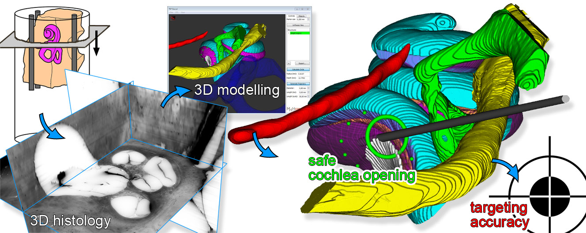
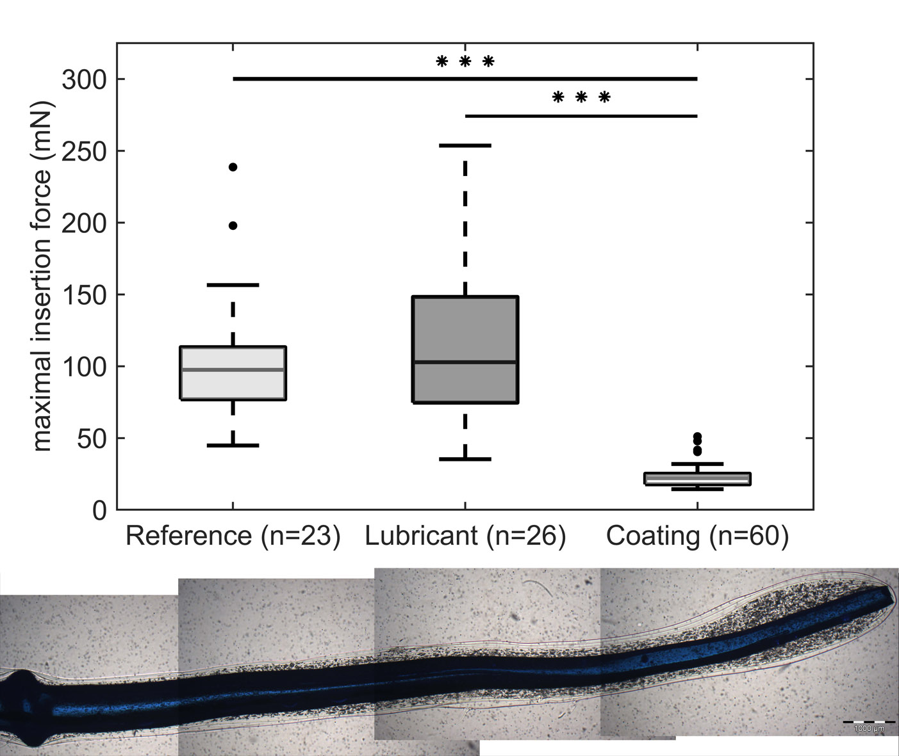

title: Publications
- - -

### Journal Papers

Rau Th. S., Kreul D., Lexow J., Hügl S., Zuniga G. M., Lenarz Th., Majdani O. (2019e): _Characterizing the size of the target region for atraumatic opening of the cochlea through the facial recess_. Computerized Medical Imaging and Graphics. \[[ doi](https://www.sciencedirect.com/science/article/abs/pii/S0895611119300710); IF: 3.298\]. (epub ahead of print 30 Aug 2019)

!!! Temporary free access using this link: [**FREE ACCESS**](https://authors.elsevier.com/a/1ZlIX3Bessdt1c) until November 06, 2019 !!!

{style="width:280px; float:right; margin-left:1em"}

- *Highlights*
    - image-processing software for analysing the cochlear hook region was developed
    - first measure for the size of the valid target region using 3D histological data of multiple temporal bone specimens
    - cochlea opening is safely possible within a region of ∅ 1.56 mm ± 0.10 mm
    - accuracy for hearing preservation surgery needs to be ≤ 0.3mm
    - anatomical 3D models depict the complexity of the cochlear hook region

Müller S., Kahrs L., Gaa J., Tauscher S., Kluge M., John S., Rau Th. S., Lenarz Th., Ortmaier T., Majdani O. (2019): _Workflow assessment as a preclinical development tool_. Int J Comput Assist Radiol Surg. 14(8):1389-1401. \[[ doi](https://doi.org/10.1007/s11548-019-02002-3); IF: 2.155\].

Hügl S., Scheper V., Gepp M. M., Lenarz Th., Rau Th. S., Schwieger J. (2019b): _Coating stability and insertion forces of an alginate-cell-based drug delivery implant system for the inner ear_. J Mech Behav Biomed Mater. 97: 90-98. \[[](https://www.sciencedirect.com/science/article/pii/S1751616118317259/pdfft?md5=e747450acdb13300028d9e38fc20d5da&pid=1-s2.0-S1751616118317259-main.pdf); [ doi](https://www.sciencedirect.com/science/article/pii/S1751616118317259); IF: 3.239\]. 

{style="width:220px; float:right; margin-left:1em"}
 	
- *Highlights*
    - Application of alginate-cell solution to a cochlea model as lubricant is possible.
    - Alginate-cell solution slightly increased insertion forces in a cochlea model.
    - Alginate-cell coating of an electrode array is possible.
    - Coating is considerable resistant to handling and insertion into a cochlea model.
    - Coated electrode arrays had a significant, 75% reduction of insertion forces.

### Conference Papers
| {style="width:50px"}| BMT 2019 - 53rd Annual Conference of the German Society for Biomedical Engineering (DGBMT within VDE), September 25-26, Frankfurt am Main, Germany|
|-:|:------| 
| [](https://www.degruyter.com/downloadpdf/j/cdbme.2019.5.issue-1/cdbme-2019-0111/cdbme-2019-0111.pdf)| Hügl S., Aldag N., Becker A., Leanrz Th., Glasmacher B., Rau Th.S. (2019): _Identification of factors influencing insertion characteristics of cochlear implant electrode carriers_. Current Directions in Biomedical Engineering 5(1). \[[ doi](https://www.degruyter.com/downloadpdf/j/cdbme.2019.5.issue-1/cdbme-2019-0111/cdbme-2019-0111.pdf)\].|
| [](https://www.degruyter.com/downloadpdf/j/cdbme.2019.5.issue-1/cdbme-2019-0049/cdbme-2019-0049.pdf)| Hügl S., Erfurt P., Lenarz Th., Majdani O., Rau Th.S. (2019): _Reconstruction accuracy of an automated serial cross-sectional preparation technique for morphological human temporal bone imaging_. Current Directions in Biomedical Engineering 5(1). \[[ doi](https://www.degruyter.com/downloadpdf/j/cdbme.2019.5.issue-1/cdbme-2019-0049/cdbme-2019-0049.pdf)\].|
| [](https://www.degruyter.com/downloadpdf/j/cdbme.2019.5.issue-1/cdbme-2019-0112/cdbme-2019-0112.pdf)| Suzaly N., Keller M.Ch., Hügl S., Karsten E., Lenarz Th., Rau Th.S. (2019): _Characterization of a measurement setup for the thermomechanical characterization of curved shape memory alloy actuators_. Current Directions in Biomedical Engineering 5(1). \[[ doi](https://www.degruyter.com/downloadpdf/j/cdbme.2019.5.issue-1/cdbme-2019-0112/cdbme-2019-0112.pdf)\].|

### Posters & Abstracts

| {style="width:50px"} | Inner Ear Biology Workshop (IEB), 7-10 September , Padua, Italy| 
|-:|:------| 
| [](publications/Schwieger2019_PosterIEB.pdf) |Schwieger J., Hügl S., Gepp M. M.,  Lenarz Th., Rau Th. S., Scheper V. (2019): _Effect of alginate-cell based drug-delivery systems on the insertion forces of CI-electrodes._|

| {style="width:50px"} | XLVI. Congress of the European Society for Artificial Organs (ESAO), September 3-7, Hannover, Germany| 
|-:|:------| 
| [](publications\Hügl2019_ESAO_Poster_InsStudie.pdf) | Hügl S., Aldag N., Becker A., Lenarz T., Glasmacher B., Rau Th. S. (2019c): _Toward understanding the impact of cochlear model curvature, insertion speed, and implant stiffness for the prediction of insertion forces_. \[[ doi](https://journals.sagepub.com/doi/pdf/10.1177/0391398819860985)\] |
| [](publications\Rau2019d_ESAOPoster_vfinal.pdf) | Rau Th. S., Suzaly N., Hügl S., Lenarz T. (2019d): _On the characterization of thermomechanical properties of curved NiTi shape memory wires intended for cochlear implant electrode arrays_. \[[ doi](https://journals.sagepub.com/doi/pdf/10.1177/0391398819860985)\] |

| {style="width:50px"} | Conference on Implantable Auditory Prostheses (CIAP), July 14-19, Lake Tahoe, CA, US| 
|-:|:------| 
| [](publications\Rau2019c_CIAPPoster.pdf) | Rau Th. S., Blum T., Kluge M., John S., Kahrs LA., Ortmaier T., Fröhlich M., Majdani O., Lenarz T. (2019c): _Accuracy of drill depth control of an image-guided micro-stereotactic targeting system dedicated to cochlear implantation surgery_.|
| [](publications\Rau2019b_CIAPPoster.pdf) | Rau Th. S., Hügl S., Nullmeier M., Pawsey N., Majdani O., Lenarz T., Salcher R. (2019b): _On the development of realistic artificial cochlea models_.|
|  [](publications\Salcher2019_CIAPPoster_vfinal.pdf) | Salcher R., Nullmeier M., Cramer J., Pawsey N., Lenarz T., Rau Th. S. (2019b): _Artificial cochlea model material validation for insertion force measurement_.|
| [](publications/Scheper2019_CIAPPoster.pdf) | Scheper V., Hügl S., Hamm A., Gepp MM., Schulz A., Hubka P., Pannier C., Lenarz T., Rau Th. S., Hoffmann A., Schwieger J. (2019): _BDNF overexpressing human stem cells in alginate for cochlear implant optimization_.|
|  	[](publications\Suzaly2019_CIAPPoster.pdf) | Suzaly N., Hügl S., Rau Th. S., Lenarz T. (2019b): _Designing shape memory alloy actuators tailored to the human cochlea geometry_.|

| {style="width:50px"} | 90th Annual Meeting German Society of Oto-Rhino-Laryngology, Head and Neck Surgery, Mai 30- June 1st, Berlin, Germany| 
|-:|:------| 
| | Hügl S., Henke M., Kahrs LA., Ortmaier T., Lenarz T., Rau Th. S (2019): _Entwicklung eines Versuchsstandes für die Insertionskraftmessung bei präziser Ausrichtung von Präparaten mittels stereooptischer Navigation_. \[[ doi (dt.)](https://www.thieme-connect.de/products/ejournals/abstract/10.1055/s-0039-1686177)\] \[[ doi (engl.)](https://www.thieme-connect.de/products/ejournals/abstract/10.1055/s-0039-1686402)\].|
| | Suzaly N., Hügl S., Majdani O., Lenarz T., Rau Th. S. (2019): _Histologische Evaluierung des Elektrodenträgers eines Cochlea-Implantats mit einer für elektrische Erwärmung integrierten Formgedächtnislegierung_. \[[ doi (dt.)](https://www.thieme-connect.de/products/ejournals/abstract/10.1055/s-0039-1686291)\] \[[ doi (engl.)](https://www.thieme-connect.de/products/ejournals/abstract/10.1055/s-0039-1686520)\].|
| | Timm M., Stieghorst J., Kluge M., John S., Rau Th. S., Lenarz T. (2019): _Auf dem Weg zur minimal-invasiven Cochlea Implantation: Erste Ergebnisse einer Kadaverstudie_. \[[ doi (dt.)](https://www.thieme-connect.de/products/ejournals/abstract/10.1055/s-0039-1686295)\] \[[ doi (engl.)](https://www.thieme-connect.de/products/ejournals/abstract/10.1055/s-0039-1686524)\].|

| {style="width:50px"} | ARO 42nd Annual MidWinter Meeting, February 9-13, Baltimore, MD, USA| 
|-:|:------| 
| [](publications/Rau2019_AROposter.pdf)  | Rau Th. S., Nullmeier M., Cramer J., Hügl S., Pawsey N., Lenarz Th., Salcher R. (2019): _A Method for Building Individualized Two-Dimensional Artificial Cochlea Models_. In Proc. Association for Research in Otolaryngology (ARO) Vol 42:36. |
| [](publications/Salcher2019_AROPoster.pdf)  | Salcher R., Nullmeier M., Cramer J., Pawsey N., Lenarz Th., Rau Th. S.(2019): _Validation of PTFE Artificial Cochlea Model for Insertion Force Measurements_. In Proc. Association for Research in Otolaryngology (ARO) Vol 42:36. |

### Patents
-

- - -

Previous publications can be found here:

* [**2018**](publications/w2018.html)
* [**2017**](publications/x2017.html)
* [**2016**](publications/y2016.html)
* [**2015**](publications/z2015.html)

- - - 
Sources: [Photo](https://www.pexels.com/photo/woman-uses-black-typewriter-917476) by rawpixel.com from Pexels.
