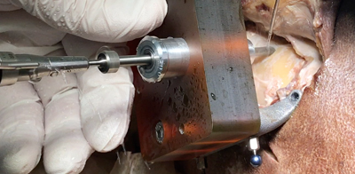

title: 2023
- - -

### Journal Papers

<!-- Aufbau eines Eintrags in der Rubrik "Journal Papers" -->
<!-- Grafical Abstract einfügen mittels: {style="width:400px; float:left; margin-right:1em"} - Die Grafik muss dafür als Datei FilneName.jpg im Ordner /cas/publications/ gespeichert sein. Über den Wert width:400px kann die Breite noch angepasst werden, so dass es mit dem umfließenden Text gut aussieht. -->
<!-- Stern-Icon einfügen mittels:  -->
<!-- Autorenliste; Titel des Artikels kursiv durch vorangestellste und nachfolgend Unterstriche -->
<!-- in eckigen Klammern \[ und \] folgen dann Links auf den Volltext und die DOI sowie den Impact-Faktor, falls vorhanden: -->
<!-- \[[](https://www.LinkAufVolltext.pdf) bzw. [ doi](https://www.LinkAufDOI); IF: 3.239\] -->

Cramer J, Böttcher-Rebmann G, Lenarz T, Rau TS (2023): _A method for accurate and reproducible specimen alignment for insertion tests of cochlear implant electrode arrays_. Int J Comput Assist Radiol Surg. Epub ahead of print. \[[](https://link.springer.com/content/pdf/10.1007/s11548-023-02930-1.pdf); [ doi](https://link.springer.com/article/10.1007/s11548-023-02930-1); IF: 3.421\].

Cramer J, Dassow N, Böttcher-Rebmann G, Budde L, Lenarz T, Rau TS (2023): _Temporal bone phantom for decoupled cochlear implant electrode insertion force measurement_. Current Directions in Biomedical Engineering 9(1):130-133. \[[](https://www.degruyter.com/document/doi/10.1515/cdbme-2023-1033/pdf?licenseType=open-access); [ doi](https://www.degruyter.com/document/doi/10.1515/cdbme-2023-1033/html)\]. 

Böttcher-Rebmann G, Lange V, Schell V, Cramer J, Lenarz T, Rau TS (2023): _Universal test bench for repeatable multiparametric cochlear implant insertion tests_. Current Directions in Biomedical Engineering 9(1):126-129. \[[](https://www.degruyter.com/document/doi/10.1515/cdbme-2023-1032/pdf?licenseType=open-access); [ doi](https://www.degruyter.com/document/doi/10.1515/cdbme-2023-1032/html)\].

Böttcher-Rebmann G, Schell V, Zuniga MG, Salcher R, Lenarz T, Rau TS (2023): _Preclinical evaluation of a tool for insertion force measurements in cochlear implant surgery_. Int J Comput Assist Radiol Surg. 18(11):2117-2124. doi: 10.1007/s11548-023-02975-2. \[[](https://link.springer.com/content/pdf/10.1007/s11548-023-02975-2.pdf); [ doi](https://link.springer.com/article/10.1007/s11548-023-02975-2); IF: 3.421\].

Geiger L, Zuniga MG, Lenarz T, Majdani O, Rau TS (2023): _Drilling accuracy evaluation of a mouldable surgical targeting system for minimally invasive access to anatomic targets in the temporal bone_. Eur Arch Otorhinolaryngol. 280(10):4371-4379. \[[](https://link.springer.com/content/pdf/10.1007/s00405-023-07925-x.pdf); [ doi](https://link.springer.com/article/10.1007/s00405-023-07925-x); IF: 3.236\].

{style="width:250px; float:right; margin-left:1em"}

Böttcher-Rebmann G, Schell V, Budde L, Zuniga MG, Baier C, Lenarz T, Rau TS (2023): _A Tool to Enable Intraoperative Insertion Force Measurements for Cochlear Implant Surgery_. IEEE Transactions on Biomedical Engineering 70(5):1643-1650. \[[](https://ieeexplore.ieee.org/stamp/stamp.jsp?tp=&arnumber=9963684); [ doi](https://ieeexplore.ieee.org/document/9963684); IF: 4.756\].

{style="width:250px; float:right; margin-left:1em"}

Rau TS, John S, Kluge M, Repp F, Zuniga MG, Stieghorst J, Timm ME, Fröhlich M, Majdani O, Lenarz T (2023): _Ex Vivo Evaluation of a Minimally Invasive Approach for Cochlear Implant Surgery_. IEEE Transactions on Biomedical Engineering 70(1):390-398. \[[](https://ieeexplore.ieee.org/stamp/stamp.jsp?tp=&arnumber=9851918); [ doi](https://ieeexplore.ieee.org/document/9851918);IF: 4.756\].
 
 
 

### Posters & Abstracts

| {style="width:50px"}  | DGHNO 2023 - 94th Annual Meeting German Society of Oto-Rhino-Laryngology, Head and Neck Surgery e. V, May 17-21, Leipzig, Germany |
|-:|:------| 
|  | Rau TS, Fandio K, Schell V, Lenarz T, Böttcher-Rebmann (2023): _Visual feedback of insertion forces in cochlear implantation surgery._ Laryngo-Rhino-Otologie 2023; 102(S02): 278 - 278 [ doi](https://eref.thieme.de/ejournals/1438-8685_2023_S02#/10.1055-s-0043-1767380)\]. |
|  | Cramer J, Ihmann N, Lenarz T, Rau TS (2023): _Comparison of manual and hydraulically automated actuation for cochlear implant electrode insertion._ Laryngo-Rhino-Otologie 2023; 102(S02): 266 - 266 [ doi](https://eref.thieme.de/ejournals/1438-8685_2023_S02#/10.1055-s-0043-1767333)\]. |
|  | Böttcher-Rebmann G, Cramer J, Schell V, Lenarz T, Rau TS (2023): _Cochlear implant electrode insertion test bench with adjustable trajectory and CBCT process control._ Laryngo-Rhino-Otologie 2023; 102(S02): 264 - 264 [ doi](https://eref.thieme.de/ejournals/1438-8685_2023_S02#/10.1055-s-0043-1767325)\]. |

|  | ESPCI 2023 - 16th European symposium on pediatric cochlear implantation, May 31st - June 3rd, Rotterdam, the Netherlands |
|-:|:------|

### Patents
--

- - -

Previous publications can be found here:

* [**2022**](s2022.html)
* [**2021**](t2021.html)
* [**2020**](u2020.html)
* [**2019**](v2019.html)
* [**2018**](w2018.html)
* [**2017**](x2017.html)
* [**2016**](y2016.html)
* [**2015**](z2015.html)

- - - 
Sources: [Photo](https://www.pexels.com/photo/woman-uses-black-typewriter-917476) by rawpixel.com from Pexels.
