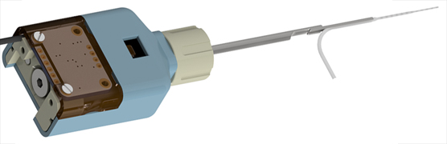
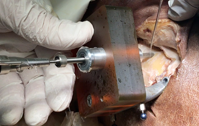

title: 2022
- - -

### Journal Papers

<!-- Aufbau eines Eintrags in der Rubrik "Journal Papers" -->
<!-- Grafical Abstract einfügen mittels: {style="width:400px; float:left; margin-right:1em"} - Die Grafik muss dafür als Datei FilneName.jpg im Ordner /cas/publications/ gespeichert sein. Über den Wert width:400px kann die Breite noch angepasst werden, so dass es mit dem umfließenden Text gut aussieht. -->
<!-- Stern-Icon einfügen mittels:  -->
<!-- Autorenliste; Titel des Artikels kursiv durch vorangestellste und nachfolgend Unterstriche -->
<!-- in eckigen Klammern \[ und \] folgen dann Links auf den Volltext und die DOI sowie den Impact-Faktor, falls vorhanden: -->
<!-- \[[](https://www.LinkAufVolltext.pdf) bzw. [ doi](https://www.LinkAufDOI); IF: 3.239\] -->

{style="width:300px; float:right; margin-left:1em"}

Böttcher-Rebmann G, Schell V, Budde L, Zuniga MG, Baier C, Lenarz T, Rau TS (2022): _A Tool to Enable Intraoperative Insertion Force Measurements for Cochlear Implant Surgery_. IEEE Transactions on Biomedical Engineering, doi: 10.1109/TBME.2022.3224528. Epub \[[](https://ieeexplore.ieee.org/stamp/stamp.jsp?tp=&arnumber=9963684); [ doi](https://ieeexplore.ieee.org/document/9963684); IF: 4.756\]

{style="width:250px; float:left; margin-right:1em"}

Rau TS, John S, Kluge M, Repp F, Zuniga MG, Stieghorst J, Timm ME, Fröhlich M, Majdani O, Lenarz T (2022b): _Ex Vivo Evaluation of a Minimally Invasive Approach for Ccohlear Implant Surgery_. IEEE Trans Biomed Eng. Doi: 10.1109/TBME.2022.3192144. Epub \[[](https://ieeexplore.ieee.org/stamp/stamp.jsp?tp=&arnumber=9851918); [ doi](https://ieeexplore.ieee.org/document/9851918);IF: 4.756\]
 
 

{style="width:300px; float:right; margin-left:1em"}

Rau TS, Ehmann T, Zuniga MG, Plaskonka K, Keck A, Majdani O, Lenarz T (2022a): _Toward a cochlear implant electrode array with shape memory effect for post-insertion perimodiolar positioning._ J Biomed Mater Res. 110(11):2494‐2505. \[[](https://onlinelibrary.wiley.com/doi/epdf/10.1002/jbm.b.35107); [ doi](https://doi.org/10.1002/jbm.b.35107); IP: 3.368\].

Schwieger J, Frisch AS, Rau TS, Lenarz T, Hügl S, Scheper V. (2022): _3D Printed Cell Culture Chamber for Testing the Effect of Pump-Based Chronic Drug Delivery on Inner Ear Tissue._ Biomolecules 12(4):589. \[[](https://www.mdpi.com/2218-273X/12/4/589/pdf); [ doi](https://doi.org/10.3390/biom12040589); IF: 4.879\]. 

### Patents
--

- - -

Previous publications can be found here:

* [**2021**](t2021.html)
* [**2020**](u2020.html)
* [**2019**](v2019.html)
* [**2018**](w2018.html)
* [**2017**](x2017.html)
* [**2016**](y2016.html)
* [**2015**](z2015.html)

- - - 
Sources: [Photo](https://www.pexels.com/photo/woman-uses-black-typewriter-917476) by rawpixel.com from Pexels.
