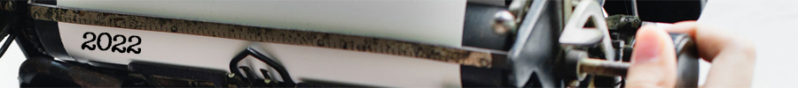
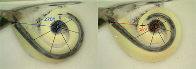
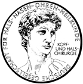

title: 2022
- - -

### Journal Papers

<!-- Aufbau eines Eintrags in der Rubrik "Journal Papers" -->
<!-- Grafical Abstract einfügen mittels: {style="width:400px; float:left; margin-right:1em"} - Die Grafik muss dafür als Datei FilneName.jpg im Ordner /cas/publications/ gespeichert sein. Über den Wert width:400px kann die Breite noch angepasst werden, so dass es mit dem umfließenden Text gut aussieht. -->
<!-- Stern-Icon einfügen mittels:  -->
<!-- Autorenliste; Titel des Artikels kursiv durch vorangestellste und nachfolgend Unterstriche -->
<!-- in eckigen Klammern \[ und \] folgen dann Links auf den Volltext und die DOI sowie den Impact-Faktor, falls vorhanden: -->
<!-- \[[](https://www.LinkAufVolltext.pdf) bzw. [ doi](https://www.LinkAufDOI); IF: 3.239\] -->

{style="width:250px; float:right; margin-left:1em"}

**Rau** TS, Ehmann T, Zuniga MG, Plaskonka K, Keck A, Majdani O, Lenarz T (2022a): _Toward a cochlear implant electrode array with shape memory effect for post-insertion perimodiolar positioning._ J Biomed Mater Res. 110(11):2494‐2505. \[[](https://onlinelibrary.wiley.com/doi/epdf/10.1002/jbm.b.35107); [ doi](https://doi.org/10.1002/jbm.b.35107); IP: 3.368\].

**Schwieger** J, Frisch AS, Rau TS, Lenarz T, Hügl S, Scheper V. (2022): _3D Printed Cell Culture Chamber for Testing the Effect of Pump-Based Chronic Drug Delivery on Inner Ear Tissue._ Biomolecules 12(4):589. \[[](https://www.mdpi.com/2218-273X/12/4/589/pdf); [ doi](https://doi.org/10.3390/biom12040589); IF: 4.879\]. 

### Posters & Abstracts

| {style="width:50px"}| BMT 2022 - Joint Annual Conference of the Austrian, German and Swiss Societies for Biomedical Engineering, September 28-30, Innsbruck, Austria|
|-:|:------|
|  | **Rau** TS, Tzschoppe E, Cramer J, Kilian J, Lenarz T, Zuniga MG (2022): _Toward image-guided positioning of an automated insertion tool for cochlear implant electrodes_. |
|  | **Cramer** J, Ihmann N, Zuniga MG, Lenarz T, Rau TS (2022): _A method to analyze the motion profile of hydraulically actuated automated electrode insertion using video-based data analysis_. |

| {style="width:50px"}  | 93rd Annual Meeting of the German Society of ORL-HNS, May 25-28, Hannover, Germany |
|-:|:------| 
|  | **Ra**u TS, Zuniga MG, Cramer J, Salcher R, Lenarz T. (2022): _Hydraulic actuation to operate ultra-slow insertion velocities_. Laryngo-Rhino-Otologie 101(S02):243-244. doi:10.1055/s-0042-1746795. |
|  | **Ehmann** T, Lenarz T, Rau TS (2022): _Toward a controlled intra-cochlear positioning change of an electrode array using a stepwise-activated shape memory effect_. Laryngo-Rhino-Otologie 101(S02):243-244. doi:10.1055/s-0042-1746743. |
|  | **Cramer** J, Böttcher-Rebmann G, Lenarz T, Rau TS (2022): _Toward more reliable testing of cochlear implant electrodes: A method for image-based alignment of cochlear specimens_. Laryngo-Rhino-Otologie 101(S02):243-244. doi:10.1055/s-0042-1746738. |
|  | **Schell** V, Böttcher-Rebmann G, Budde L, Zuniga MG, Lenarz T, Rau TS (2022): _A method to visualize orientation-independent forces in real-time during cochlear implant electrode array insertion_. Laryngo-Rhino-Otologie 101(S02):243-244. doi:10.1055/s-0042-1746802. |
|  | **Kilian** J, Engel T, Zuniga MG, Salcher R, Maier H, Artukarslan E, Lenarz T, Rau TS (2022): _A minimally invasive, micro-stereotactic strategy for implantation of active middle ear implants_. Laryngo-Rhino-Otologie 101(S02):243-244. |

| {style="width:50px"} | CI2022 DC, May 18-21, Washington DC, US | 
|-:|:------| 
|  | **Böttcher-Rebmann** G, Zuniga MG, Schell V, Salcher R, Lenarz T, Rau TS (2022): _Preclinical Evaluation of a Surgical Tool for the Measurement of Insertion Forces During Conventional Cochlear Implant Surgery_. |
|  | **Salcher** R, Nullmeier M, Ewald S, Pawsey N, Rau TS, Lenarz T (2022): _A Simple Method for Optimising the Position of Perimodiolar Electrodes within the Cochlea_. |

### Patents
--

- - -

Previous publications can be found here:

* [**2021**](t2021.html)
* [**2020**](u2020.html)
* [**2019**](v2019.html)
* [**2018**](w2018.html)
* [**2017**](x2017.html)
* [**2016**](y2016.html)
* [**2015**](z2015.html)

- - - 
Sources: [Photo](https://www.pexels.com/photo/woman-uses-black-typewriter-917476) by rawpixel.com from Pexels.
