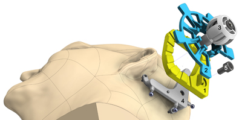
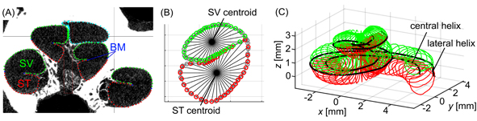

title: 2021
- - -

### Journal Papers

<!-- Aufbau eines Eintrags in der Rubrik "Journal Papers" -->
<!-- Grafical Abstract einfügen mittels: {style="width:400px; float:right; margin-left:1em"} - Die Grafik muss dafür als Datei FilneName.jpg im Ordner /cas/publications/ gespeichert sein. Über den Wert width:400px kann die Breite noch angepasst werden, so dass es mit dem umfließenden Text gut aussieht. -->
<!-- Stern-Icon einfügen mittels:  -->
<!-- Autorenliste; Titel des Artikels kursiv durch vorangestellste und nachfolgend Unterstriche -->
<!-- in eckigen Klammern \[ und \] folgen dann Links auf den Volltext und die DOI sowie den Impact-Faktor, falls vorhanden: -->
<!-- \[[](https://www.LinkAufVolltext.pdf) bzw. [ doi](https://www.LinkAufDOI); IF: 3.239\] -->

Zuniga M. G., Hügl S., Engst B., Lenarz Th., Rau Th. S. (2021): _The Effect of Ultra-slow Velocities on Insertion Forces: A Study Using a Highly Flexible Straight Electrode Array_. Otol Neurotol 42:xxx–xxx. Epub Ahead of Print. \[[ doi](https://journals.lww.com/otology-neurotology/Abstract/9000/The_Effect_of_Ultra_slow_Velocities_on_Insertion.95695.aspx); IF: 1.712\].

Schurzig D., Fröhlich M., Raggl S., Scheper V., Lenarz Th., Rau Th. S. (2021b): _Uncoiling the Human Cochlea—Physical Scala Tympani Models to Study Pharmacokinetics Inside the Inner Ear_. Life 2021, 11(5), 373. \[[](https://www.mdpi.com/2075-1729/11/5/373/pdf); [ doi](https://doi.org/10.3390/life11050373); IF: 2.991\].

{style="width:360px; float:right; margin-left:1em"}

Rau Th. S., Witte S., Uhlenbusch L., Kahrs L.A., Lenarz Th., Majdani O. (2021): _Concept description and accuracy evaluation of a moldable surgical targeting system_. J. Med. Imag. 8(1), 015003. \[[](https://www.spiedigitallibrary.org/journalArticle/Download?fullDOI=10.1117%2F1.JMI.8.1.015003); [ doi](https://doi.org/10.1117/1.JMI.8.1.015003)\]

- *Highlights*
    - a new concept for a surgical targeting system is prosposed
    - cost-effective, easy-to-use approach for accurate instrument guidance
    - mean positioning error was found to be 0.41 mm (SD: 0.30mm)
    - drilling was possible with an mean accuracy of 0.35mm (SD: 0.29mm)
    - demonstration of sufficient accuracy (0.35mm +/- 0.30mm) for many surgical applications

{style="width:400px; float:right; margin-left:1em"}

Schurzig D., Timm M.E., Majdani O., Lenarz Th., Rau Th. S. (2021): _The Use of Clinically Measurable Cochlear Parameters in Cochlear Implant Surgery as Indicators for Size, Shape, and Orientation of the Scala Tympani_.  Ear and Hearing. epub \[[](https://journals.lww.com/ear-hearing/Abstract/9000/The_Use_of_Clinically_Measurable_Cochlear.98564.aspx); [ doi](https://doi.org/10.1097/aud.0000000000000998); IF: 3.129\]. 
 	
- *Highlights*
    - µCT imaging and analysis of intracochlear geometrical variations
    - 15 detailed, 3D cochlear models investigated in terms of scalae height, cross-sectional size, and rotation
    - strong intracochlear anatomical variations could be observed
    - demand for highly flexible and self-adapting cochlear implant electrode array design

### Conference Papers

| {style="width:50px"} | CI2021 Cochlear Implants in Children and Adults, April 28 - May 1, Virutal, US| 
|-:|:------| 
| [](Rau2019_CI2021_ePoster_v3.pdf) | Rau Th. S., Spoida B., Hügl S., Schwieger J., Lenarz Th., Scheper V. (2021b): _A Prototype Setup for 4D Micro-Computed Tomography Imaging of the Intracochlear Movement of Cochlear Implant Electrode Carriers_.|
| [](X.pdf) | Salcher R., Nullmeier M., Cramer J., Pawsey N., Lenarz Th., Rau Th. S. (2021): _Segmented Cochlea Model: A New Tool for Measuring Intracochlear Contact Forces during Electrode Insertion_.|
|  | Zuniga M. G., Schell V., Lenarz Th., Rau Th. S. (2021b): _Hydraulic Insertion of CI Electrode Arrays Achieving Very Slow, Continuous Insertion Velocities: Proof of Concept._ |
|  | Zuniga M. G., Ehmann T., Lenarz Th., Rau Th. S. (2021c): _On the development of electrode arrays that change their intracochlear position: Does the incorporation of nitinol shape memory wires hamper a slow insertion speed?_ |

### Posters & Abstracts

### Patents
--

- - -

Previous publications can be found here:

* [**2020**](u2020.html)
* [**2019**](v2019.html)
* [**2018**](w2018.html)
* [**2017**](x2017.html)
* [**2016**](y2016.html)
* [**2015**](z2015.html)

- - - 
Sources: [Photo](https://www.pexels.com/photo/woman-uses-black-typewriter-917476) by rawpixel.com from Pexels.
