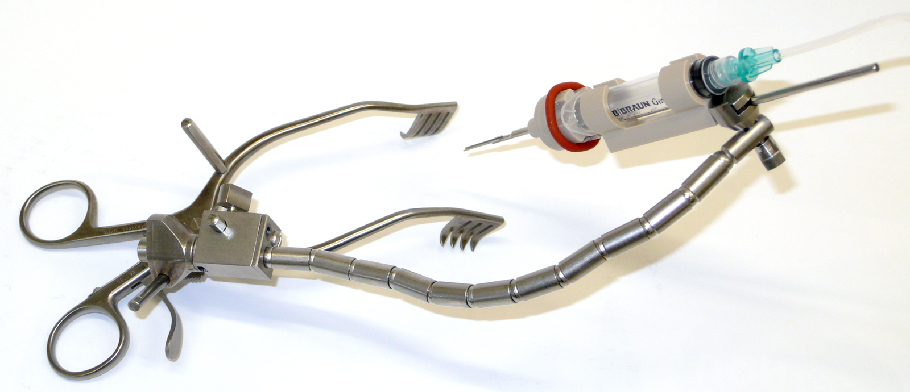

title: 2021
- - -

### Journal Papers

{style="width:400px; float:right; margin-left:1em"} Rau Th. S., Zuniga M. G., Salcher R., Lenarz Th. (2020d): _A simple tool to automate the insertion process in cochlear implant surgery_.  Int J CARS 5(11):1931-1939. \[[](https://link.springer.com/content/pdf/10.1007/s11548-020-02243-7.pdf); [ doi](https://doi.org/10.1007/s11548-020-02243-7); IF: 2.473\]. 
 	
- *Highlights*
    - concept of a new simple tool for automated electrode insertion introduced
    - insertion tool facilitates automated forward motion by repurosing a disposable syringe as hydraulic actuator
    - electrode insertion at ultra-low velocity of 0.03 mm/s revealed smooth force profile
    - alignment of the tool along a patient-specific insertion trajectory without additional invasive procedure
    - device positioning with an appropriate insertion axis was deemed feasibale and easy to achieve

### Conference Papers

--

### Posters & Abstracts

### Patents
--

- - -

Previous publications can be found here:

* [**2021**](v2020.html)
* [**2019**](v2019.html)
* [**2018**](w2018.html)
* [**2017**](x2017.html)
* [**2016**](y2016.html)
* [**2015**](z2015.html)

- - - 
Sources: [Photo](https://www.pexels.com/photo/woman-uses-black-typewriter-917476) by rawpixel.com from Pexels.
