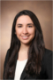
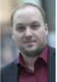
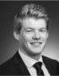
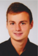
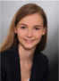
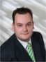
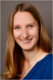

title:Staff

 Hannover in December 2016")

- - - 

| Members |
|:--|:------------------|:--------------------------------------|
| ***Head of Research Group*** |
| | Dr.-Ing. Thomas S. Rau         | rau.thomas@mh-hannover.de   |
| ***Research Team*** |
|  | M. Sc. Julia Kilian             | kilian.julia@mh-hannover.de |
| | Prof. Dr. Omid Majdani           | majdani.omid@mh-hannover.de        |
| | M. Geraldine Zuniga, MD			| zunigaManrique.maria@mh-hannover.de	  |
| ***Associated Staff***  |																
| | Dr. Martina Nullmeier	  Senior Scientist   Cochlear Deutschland GmbH & Co. KG | 
| | Dr. med. Rolf Salcher    Senior Physician ENT     		| salcher.rolf@mh-hannover.de|
| | Max Eike Timm    Assistant Physician ENT    | timm.max@mh-hannover.de |

| Students                                                                                             |
|:------------------------------|:------------------------------|-------------------------------------------------:|
| 	| Shari Barati								| Medical Doctoral Thesis, Hannover Medical School 	|
| 	| Tobias Blum 								| Student Assistant, Leibniz University Hannover      |
| 	| Tim Ehmann                  | Master Thesis, Leibniz University Hannover |
| 	| Malte Freiknecht            | Student Research Project |
|	| Lena Geiger								| Student Assistant, Hannover Medical School		| 
| 	| Clemens Griemsmann						| Student Assistant, Leibniz University Hannover      |
|	| Jan Mairose								| Student Assistant, Leibniz University Hannover 	| 
|| Christian Menke							| Medical Doctoral Thesis, Hannover Medical School	|
|   | Timo Stauß                  | Bachelor Thesis, Leibniz University Hannover | 
| 	| Sina Witte 				    			| Medical Doctoral Thesis, Hannover Medical School  |

| Former Staff																							|
|:------------------------------|:------------------------------|--------------------------------------:|
|  	| M. Sc. Silke Hügl                			 | now: [Vector Informatik GmbH](https://www.vector.com/de/de/) 	|
| 	  | M. Sc. Nuha Suzaly			   			 |     	|
|   | Dipl.-Ing. Jakob Lexow (11/2011 - 03/2018) | now: [Part Time Scientists (Berlin)](https://ptscientists.com/)         |
|  | Dr. Wouter J. van Drunen                   | now: [Implandata Ophthalmic Products GmbH (Hannover)](http://www.implandata.com) |
|  | Dipl.-Ing. Marcel Kluge (11/2014 - 07/2017)	| now: [OtoJig GmbH (Hannover)](http://www.otojig.com/)  |
|  | Dr.-Ing. Daniel Schurzig  (04/2014 - 08/2015) | now: [MED-EL Deutschland (Hannover)](www.medel.com) |
|   | Dipl.-Ing. Lenka Harbach  (12/2012 - 06/2014) | now: [Bertrandt AG](https://www.bertrandt.com/)                          				|
|    | Dipl.-Ing. (FH) Franziska Eckhardt  (09/2010 - 12/2012)|                           		|
|    | M. Sc. Priyant Mane  (05/2010 - 05/2012)   |  |

| Alumni                                                                                            |
|:------------------------------|:-------------------------------------------|--------------------------------------:|
|	                              | Nina Aldag								| Student Research Project, Leibniz University Hannover 	|
|                          	    | Dr. med. Claas Baier					| Medical Doctoral Thesis, Hannover Medical School	|
|	| Jakob Cramer 								| Student Assistant, Leibniz University Hannover     |
|| Alexander Becker 				| now: [Institut für Mehrphasenprozesse (IMP), LUH](https://www.imp.uni-hannover.de/11.html?&no_cache=1&tx_tkinstpersonen_pi1%5Balias%5D=Becker1)|
|   | Denise Blume 							| Bachelor Thesis, Leibniz University Hannover      |
| 	    | Till Gerking								| Medical Doctoral Thesis, Hannover Medical School	|
| 	  | Mehran Heidel 							| Medical Doctoral Thesis, Hannover Medical School	|
|		  | Maximilian Henke						| Master Thesis, Leibniz University Hannover   		|
|| Christina Keller				    		| Student Research Project, Leibniz University Hannover  |
| 	  | Tobias Krail								| Master Thesis, Leibniz University Hannover      |
| 	  | Dr. med. Diana Kreul					| now: Assistant Physician Radiology, [Kantonsspital Baden, Schweiz](https://www.kantonsspitalbaden.ch/Fachbereiche/Radiologie/index.html)	|
|   | Evelyn Pleger							   	| Medical Doctoral Thesis, Hannover Medical School	|
| | Christoph Rostkowski					| Medical Doctoral Thesis, Hannover Medical School	|
| | Katharina Rülander				| Internship, Master Thesis							 |
|	  | Henrik Schädlich				 	| Student Assistant, Master Thesis   |
| 	  | Veronika Shmatko						| Bachelor Thesis, Leibniz University Hannover		|
| 	  | Katharina Spichal							| Medical Doctoral Thesis, Hannover Medical School	|
|	  | Björn Spoida							| Master Thesis, Leibniz University Hannover   		|
|		    | Lea Uhlenbusch 							| Bachelor Thesis, Leibniz University Hannover      |
| 	| Jan-Niklas Wellers						| Medical Doctoral Thesis, Hannover Medical School  |
|  | Jennifer Wozniak				    	| Student Research Project, Leibniz University Hannover  |
| 	  | Dr. med. Waldemar Würfel				| Medical Doctoral Thesis, Hannover Medical School	|

