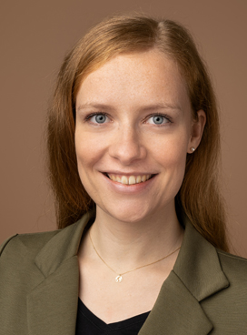

title:Staff

- - - 

|  | Members of the Group ||
|:--|:-------------------------------------------------|:--------------------------------------|
|      | ***Research Team*** ||
| {style="width:70px"} | PD Dr.-Ing. Thomas S. Rau   Head of Research Group           | rau.thomas@mh-hannover.de   +49(0)511/532-3025  |
| {style="width:70px"}  | M. Sc. Georg Böttcher-Rebmann   Research Engineer    | boettcher.georg@mh-hannover.de   +49(0)511/532-7264 |
| {style="width:70px"}    | M. Sc. Jakob Cramer   Research Engineer   | cramer.jakob@mh-hannover.de   +49(0)511/532-7264 |
| {style="width:70px"} | M. Sc. Anais Millan   Research Engineer | MillanCerezo.Anais@mh-hannover.de   +49(0)511/532-7263 |
| {style="width:70px"} | M. Sc. Subiran Shrestha   Research Engineer | Shrestha.Subiran@mh-hannover.de   +49(0)511/532-7263 |
| {style="width:70px"} | M. Sc. Anna Strube   Research Engineer | strube.anna@mh-hannover.de   +49(0)511/532-7263  |
| {style="width:70px"} | M. Sc. Jinhan Zhu   Research Engineer | zhu.jinhan@mh-hannover.de   +49(0)511/532-7263 |
|   | ***Associated Staff*** ||	
| {style="width:70px"} | Prof. Dr. Omid Majdani           | majdani.omid@mh-hannover.de        |
| {style="width:70px"} | Dr. med. Rolf Salcher    Senior Otolaryngologist, Skull Base Surgeon     		| salcher.rolf@mh-hannover.de|
| {style="width:70px"}  | Eralp Artukarslan   ENT Resident | Artukarslan.Eralp-Niyazi@mh-hannover.de |
|  | ***Students*** ||  
| {style="width:70px"}   | Lucas Mey       | Master Thesis  |
| {style="width:70px"}   | Dennis Christopher Michael       | Master Thesis  |

|  | Former Staff  ||
|:--|:------------------|:--------------------------------------|               				
| {style="width:70px"} | Dipl.-Ing. (FH) Franziska Eckhardt     |  now: [LinkedIn-Profil](https://www.linkedin.com/in/franziska-eckardt/) |
| {style="width:70px"} 	| M. Sc. Tim Ehmann     |  |
|    | Dipl.-Ing. Lenka Harbach                | now: [LinkedIn-Profil](https://www.linkedin.com/in/lenka-harbach-390b31b2/) |
| {style="width:70px"}	| Dr.-Ing Silke Hügl                			  | now: [LinkedIn-Profil](https://www.linkedin.com/in/silke-huegl/) 	|
| {style="width:70px"}  | M. Sc. Julia Kilian             | now:  [LinkedIn-Profil](https://www.linkedin.com/in/julia-kilian-75445010a/) |
|   | Dipl.-Ing. Marcel Kluge                 | now: [OtoJig GmbH]([http://www.otojig.com/](https://otojig.com/))  |
|    | Dr. Dipl.-Ing. Jakob Lexow                  | now: [LinkedIn-Profil](https://www.linkedin.com/in/jakob-lexow-9285b6158/)         |
| {style="width:70px"}  | M. Sc. Priyant Mane                    |  |
| {style="width:70px"} | Heera Puthussery                 | now: [LinkedIn-Profil](https://www.linkedin.com/in/heera-puthussery-mohan-651453114/)  | 
| {style="width:70px"}   | M. Sc. Viktor Schell  | now: [OtoJig GmbH](https://otojig.com/) |
|   | PD Dr.-Ing. Daniel Schurzig                | now: [LinkedIn-Profil](https://www.linkedin.com/in/danielschurzig/) |
|  	  | M. Sc. Nuha Suzaly			   			        |     	|
|     | Dr. Max Eike Timm         | now: [LinkedIn-Profil](https://www.linkedin.com/in/max-timm-1544b8333/) |
|   | Dr. Wouter J. van Drunen                | now: [LinkedIn-Profil](https://www.linkedin.com/in/dr-wouter-j-van-drunen-117ab8205/) |
| {style="width:70px"}  | M. Geraldine Zuniga, MD 	| now: [Link](https://earmedicalgroup.com/doctors/dr-zuniga/) |

| Alumni |  ||
|:--|:------------------|:--------------------------------------|
|	{style="width:70px"}                                | Nina Aldag								| Student Research Project (2019): _Parametric study to identify factors influencing the characteristics of forces during the insertion of cochlear implant electrode arrays_ |
| {style="width:70px"}                           | Alexander Becker 				|  Master Thesis (2017): _Load-adapted, FE-supported optimization of a support system for micro-stereotaxic systems of the lateral skull base._ |
|{style="width:70px"} | Carolin Betram              | Master Thesis (2021): _Experimental evaluation of trajectory-dependent insertion force variations in cochlear implants._ |
|{style="width:70px"} 	                               | Tobias Blum 								| Student Research Assistant &   Bachelor Thesis (2018): _Development and experimental evaluation of a drilling depth control for the RoboJig system._ &   Student Research Project (2020): _Investigation of the benefit of a digital display for the strut length setting of a manually operated hexapod._ |
|{style="width:70px"}   | Denise Blume 							| Bachelor Thesis (2018): _Development of a hydraulically actuated insertion tool for cochlear implant electrodes._    |
| {style="width:70px"}     | Nathalie Bochynek       | Master Thesis (2025): _Development and experimental evaluation of a system for acoustic  insertion force monitoring in cochlear implant surgery._ |
|{style="width:70px"}  | Leon Budde                  | Master Thesis (2020): _Development of a handheld, force-sensing insertion tool with integrated positioning sensor._|
|{style="width:70px"}	| Jakob Cramer 								| Student Assistent Assistant &   Bachelor Thesis (2018): _Development of an insertion test bench for cochlear implants with image-guided, stereotactic positioning of the specimens._  |
| {style="width:70px"} |  Niklas Dassow | Internship &   Bachelor Thesis (2023): _Development of a miniaturized actuation unit for the Cochlea Hydrodrive._ | 
| {style="width:70px"} 	| Tim Ehmann                  | Student Research Project (2021): _Set-up and testing of electrode carrier functional models with shape memory effect._   Master Thesis (2020): _Characterization of the electrical current heating process of CI electrode carriers using infrared thermography._ |
| {style="width:70px"}   | Friedrich Eickmann | Student Research Assistant |
| {style="width:70px"} | Thorben Engel               | Master Thesis (2020): _Development of minimally invasive, micro-stereotactic strategy for implantation of active middle ear implants._ |
|{style="width:70px"}   | Kevin Fandio                | Student Research Project (2021): _Improvement of measurement uncertainties in a force sensitive insertion tool to provide force feedback during CI surgery._   Master Thesis (2022): _Development of a method for intraoperative visualization of insertion forces._|
|{style="width:68px"}	| Malte Freiknecht            | Student Research Project (2000): _On the increase in accuracy when using thin-layers of liquid adhesive instead of bone cement for the GluingJig system._ |
|{style="width:70px"}              | Dr. med. h.c. Lena Geiger			  | Medical Doctoral Thesis (2023): _Drilling accuracy evaluation of a mouldable surgical targeting system for minimally invasive access to anatomic targets in the temporal bone._  |
|{style="width:70px"} 	| Clemens Griemsmann					| Student Research Assistant &   Bachelor Thesis (2020): _Influence of design variations for electrical heat activation of the shape memory effect on the transition temperatures of Nitinol alloy._|
| {style="width:70px"}                                | Patrik Haas                 | Student Research Assistant &   Bachelor Thesis (2021): _Design and evaluation of a digitized hexapod leg with integrated length measurement for a passive hexapod._ |
| {style="width:70px"}  	                              | Marie Heise                 | Student Research Assistant |
| 		  | Maximilian Henke						| Master Thesis (2018): _Development of a test bench for insertion force measurement with high-precision stereo-optical positioning of inner ear specimens._	|
| {style="width:70px"}  | Julian Heuer                | Master Thesis (2021): _Adaption of a moldable micro-stereotactic targeting system for neurosurgical applications. A first proof of concept study._ |
| {style="width:70px"}  | Niklas Ihmann               | Bachelor Thesis (2022): _Characterization of the hydraulic actuator behavior of the Cochlea Hydrodrive._ |
|  | Christina Keller				    		| Student Research Project (2019): _Characterization of a measurement method for determining the thermomechanical properties of nitinol wires as actuator elements for cochlear implants._ |
| {style="width:70px"}                               | Maximilian Keuter   | Student Research Assistant &   Master Thesis (2025): _Development and economic considerations of a wireless force-sensing insertion tool for CI surgeries._ |
| {style="width:70px"}	  | Tobias Krail								| Master Thesis (2020): _Development of a thermographic-based investigation method for the characterization of actively heated Nitinol wires as an actuator in the cochlear implant electrode carrier._|
| {style="width:70px"}    | Vera Lange                  | Student Research Assistant |
| {style="width:70px"}	    | Jan Mairose								  | Student Research Assistant &   Master Thesis (2021): _Resistance heating of thin-wire NiTi actuators by means of electrically conductive coating._ |
|                             | Christian Menke					  	| Medical Doctoral Thesis (2024): _Pull-Out Strength of Orthodontic Miniscrews in the Temporal Bone._ |
| {style="width:70px"} | Mohamed Fourat Nabli        | Master Thesis (2022): _Investigation of the influence of the density distribution along a drilling trajectory on the drilling forces in the mastoid._ |
| {style="width:70px"}   | Jannis Rasch | Master Thesis (2024): _Development of a handheld insertion tool for automated insertion of cochlear implant electrodes._ | 
| {style="width:70px"} | Tobias Raschke | Internship | 
| {style="width:70px"}    | Philip Reinke              | Student Research Assistant |
|  | Katharina Rülander				| Master Thesis (2017): _Conception, creation, construction and characterization of a 1:1 cochlear model for the validation of novel implants for mechanical stimulation of the cochlea._							 |
| {style="width:70px"}      | Lucy Siegl              | Intership   |
| 	  | Björn Spoida							| Master Thesis (2019): _Development of a method for step-by-step micro-computed tomographic visualization of the insertion of the electrode array of a cochlear implant._ 		|
| {style="width:70px"}   | Timo Stauß                  | Bachelor Thesis (2020): _Design and evaluation of a laser-based verification method for a customized instrument guide._ | 
| {style="width:70px"}  | Martin Steven               | Student Research Assistant |
| {style="width:70px"}                                 | Dennis Tepfer               | Bachelor Thesis (2022): _Development of an automated dip coating process for coating of electrode arrays with alginate._ |
| {style="width:70px"}    | Erik Tzschoppe              | Bachelor Thesis (2021): _Hydraulically actuated electrode insertion for an image-guided approach to the inner ear using a micro-stereotactic frame._|
| 		    | Lea Uhlenbusch 							| Bachelor Thesis (2017): _Investigation of accuracy and error sources of a surgical template made of bone cement._ |
| {style="width:70px"}                                | Konstantyn Vasylenko        | Student Research Project (2022): _Design of a Kinematic Structure for Precision Adjustment in the Manufacturing of Individual Drilling Jigs._ |
| {style="width:70px"}  |  Cara Weise | Student Research Assistant &   Student Research Project (2024): _Investigation of insertion forces in alginate-coated cochlear implant electrodes._ | 
| {style="width:70px"}  	                              | Sina Witte 				    			| Medical Doctoral Thesis (2023): _Experimental evaluation of a bone cement-based mini-stereotaxic system for creating direct access to the cochlea._ |
|   | Jennifer Wozniak				    	| Student Research Project  |
| {style="width:70px"}  | Nacer Zayani            | Student Research Assistant |
| {style="width:70px"}                             | Jinhan Zhu           | Student Research Project (2023): _Influence of anatomical parameters on insertion forces in porcine cochlear specimens._ &   Master Thesis (2024): _Feasibility study on insertion force measurement in a hydraulic system using an integrated force sensor._
| | |
| {style="width:70px"}    | Dr. med. Claas Baier					| Medical Doctoral Thesis |
| {style="width:70px"}   | Shari Barati								| Medical Doctoral Thesis |
| 	    | Till Gerking								| Medical Doctoral Thesis|
| {style="width:70px"}   | Mehran Heidel 							| Medical Doctoral Thesis	|
| 	  | Dr. med. Diana Kreul					| Medical Doctoral Thesis	|
|   | Evelyn Pleger							   	| Medical Doctoral  Thesis|
| | Christoph Rostkowski					| Medical Doctoral  Thesis	|
| {style="width:70px"}    | Katharina Spichal							| Medical Doctoral Thesis	|
| {style="width:70px"}    | Dr. med. Waldemar Würfel				| Medical Doctoral  Thesis	|

