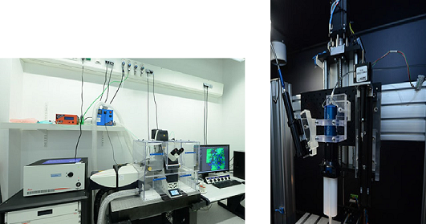

title: Doll Lab - Biomaterial Engineering

<!---->

{style="width:33%;}

* (Mechanically) Active Neural Implants
* Electrode Nerve Interface
* Biocompatible Nanocomposites
* Medical Grade Silicone rubber 3D printing
* Hydrogel-Silicone Rubber compounds
* Brain Computer Interface
* Closing the auditory loop
* Life Cycle biocompatibility testing

 

<!---->

The research group BioMaterial Engineering works towards development and production techniques for new electrode concepts for active implants.
Our material concepts cover nanocomposites as biocompatible, low impedance CNT-silicone rubber electrodes , microelectronic circuits for implantable on-board electronics as well as encapsulation strategies to chronic application of them. Also sillicone rubber 3D printing is developed for medical device applications. We develop biochemical sensors for acute in-vivo use as well actuators that make implants hugging to their target tissue.
More information about current projects can be found [here](doll/projects.html).
 
The work group has dual appointment to Fraunhofer. In its [Institute for Toxicology and Experimental Medicine ITEM](https://www.item.fraunhofer.de/en/services_expertise/medical_engineering.html) we perform addditional biocompatibility testing, risk- and quality management and devlop advanced testing methods suitable for implant developments that go beyond clinical standards.

The group cooperates with the following institutions:

* [Charité-Universitätsmedizin Berlin](https://www.charite.de/en/)
* [Harvard Medical School](https://hms.harvard.edu/)
* [Jade Hochschule](https://www.jade-hs.de/en/)
* [Johannes Keppler Universität Linz](http://www.jku.at/content)
* [Katholieke Universiteit Leuven](http://www.kuleuven.be/english/)
* [Leibniz Universität Hannover](https://www.uni-hannover.de/en/?no_cache=1)
* [Linköpings Universitet](https://liu.se/en)
* [Technische Universität Braunschweig](https://www.tu-braunschweig.de/wirueberuns/index.html)
* [Technische Universität München](https://www.tum.de/en/homepage/)
* [The University of Utah](https://www.utah.edu/)
* [Universidad de Salamanca](http://www0.usal.es/webusal/en)
* [Universidad de Santiago de Chile](http://www.usach.cl/en)

***

**Contact Information:**

Adress:

    BioMaterial Engineering 
    Prof. Doll
    Medizinische Hochschule Hannover
    Stadtfelddamm 34
    30625 Hannover
    
    Translationale Medizintechnik
    Prof. Doll
    Fraunhofer ITEM
    Nikolai-Fuchs-Str. 1 (Haupteingang am Stadtfelddamm)
    30625 Hannover

Contact Information:

    Phone: +49 (0)511 5350 247
    

A list of the staff can be found [here](doll/staff.html).
