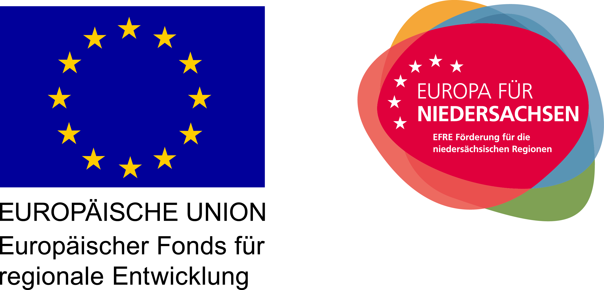

title: Projects

Publications regarding these projects can be found [here](70_publications.md)

## Ongoing Projects
* **MDOT - Medical Device Obligations Taskforce** (European Union, Horizon 2020-NMBP -HUBS-2018)

* **Biodegradable Inflammation sensor on aktive stimulating electrode** ([Hearing4All](http://hearing4all.eu/EN/))

* **Hearing -Device manufactoring platform** ([Hearing4All](http://hearing4all.eu/EN/))

* **IHeaR - International Hearing Research**
The IHeaR project reaches the hearing research as well as the hearing restoration. The Cooperation partners are planning a long-term establishment of a “German-Chilean hearing research center”. ([IHeaR](http://vianna.de/01_workgroups/doll/50_ihear.html))
* **Sketch - Selfbending CI Electrode using Hydrogel/LCST** (Zentrales Innovationsprogramm Mittelstand (ZIM))

* **Translationale Fertigungsplattform Medizininnovation - TransPlaMed** (Innovation durch Hochschulen und Forschungseinrichtungen MWK)
In Zusammenarbeit mit dem Institut für Mikrotechnik (IMT, Technische Universität Braunschweig), der Hochschule für Angewandte Wissenschaft und Kunst (HAWK) dem Fraunhofer Institut für Schicht- und Oberflächentechnik (IST) und dem Fraunhofer Institut für Toxikologie und Experimentelle Medizin (ITEM) soll im Rahmen des Förderprojektes „TransPlaMed“ (NBank) eine Fertigungsplattform für Medizininnovationen erarbeitet werden.
Medizintechnische Innovationen von klein- und mittelständischen Unternehmen (KMU) scheitern häufig an der Umsetzung von Spezialprozessen, die für die Herstellung des Medizinproduktes nötig sind, und so den Transfer von der Grundlagenforschung in den Markt nicht schaffen. Hingegen sind teure Maschinen in den Universitäten nicht ausreichend ausgelastet. Deswegen soll durch die Plattform „TransPlaMed“ der Technologie- und Wissenstransfer von Spezialprozessen in der Medizintechnik optimiert werden. Das Vorhaben vereint Wirtschaftspädagogik, Wirtschafts- und Technikwissenschaften im Spannungsfeld von Forschungsfreiheit und Ressourceneffizienz mit dem Ziel des Senkens von Innovationshürden in der Medizintechnik.

* **Leistungszentrum Translational Medical Engineering** (in Cooperation with Fraunhofer Foundation)
This competence centre establishes a framework of non-standard compliant medical device manufacturing services especially for SME innovations. Its basis are quality and risk management supporting services developed for external processes. Also novel test procedures especially for accelerated life cycling are developed. 
Please contact [Prof. Doll](01_pagedoll.md) for more information.

##Conferences
* In July 2015 we hosted the Conference **[Engineering of Functional Interfaces](http://vianna.de/03_enfi-2015.html)**
* In October 2015 we organized the International Symposium **„Closing the Auditory Loop“** funded by the VW-Stiftung.   
The main goal of the Symposium was the creation of a roadmap that defines challenges, critical experiments and milestones on a pre-competitive basis. Another goal was to initiate new research collaborations as well as joint funding programs. To achieve this challenging goal selected, international leading experts of the various contributing fields (anatomy, signal processing, modelling, surgery, system integration, technology etc.) were invited. Besides academia also representatives from specialized industry were invited to participate.

##Closed Projects

* **Carbon Nanotube Neurite Interface for CI and ECoG** ([Hearing4All](http://hearing4all.eu/EN/))    
This is a follow up project to the recently finished project *Flexible, selfbending multielectrode shafts*. 
The optimization of highly flexible neural electrodes for both stimulating CI and recording BCI applications is the mayor goal of the Biomaterial engineering group in Hearing 4 All. Hence, parameters are high physiological limits of current density and signal to noise ratio, wide electrochemical windows, low chronic tissue corrosion and biocompatibility with low fibrotic overgrowth.
Based on previous work, Carbon Nanotubes are further explored for these applications with the final goal of proving their suitability for chronic implantation and to review their performance with respect to the state of the art as well as towards ongoing other new material concepts.

* **The future of hearing restoration** (NFB - Österreich)
Please contact [Prof. Doll](01_pagedoll.md) for further information.

* **Feedback loop and fluid flow electrode - FLOWTRODE** (BMBF: KMU Innovativ Medizintechnik)  
Combination of thin film ECoG array development incl. the development of a flexible electrode material with microdialysis and neurotransmitter sensing functions for neuropharmacological developments. The combination of methods leads to a drastical reduction of necessary studies.
Please contact [Prof. Doll](01_pagedoll.md) for more information.

* **Flexible Individualized Active Medical Implants – 3D Printing of Silicone Rubber Connectors and Electrodes - FINAMI** (BMWi: ZIM KF-VP)   
Development of a rapid 3D printing technique for medical grade silicone rubber devices. This comes with fundamental theory of vulcanization under non standard conditions like laser illumination.
Please contact [Prof. Doll](01_pagedoll.md) for more information.   

* **Multizentren-Produktionslogistik und Qualitätssicherung für Neurotechnologie** (Innovationsförderprogramm Forschung und Entwicklung, N-Bank) Adapted, highly flexible ECoG electrode systems are developed, leading to a prototype that can be testet by the end-user. By implementing an innovative multicenter product development and suitable product logistics a resource saving process is possible.    
Please contact [Prof. Doll](01_pagedoll.md) for more information.

* **Flexible, selfbending multielectrode shafts** ([Hearing4All](http://hearing4all.eu/EN/))   
We explore the hypothesis that for CI better ambient noise understanding can be achieved by a higher number of electrode contacts – if the CIs clinge well to the modiolus. A side aspect of such R&D must be that the stiffness of CIs must not exceed the present state in order to avoid increased insertion tissue damage and trauma in general. Thus the wiring techniques of today must be altered. We test Au on parylene / polyimide films and CNTs immersed in silicone rubber. Parallelly we explore Hydrogel bimorph swelling elements for proper clinging actuation. The Start project lays the basis to further procurement of third-party funds. Our objectives are increased electrode number to 30 and 50 with almost maintained impedances and flexibility and the design and testing of actuation principles.       
Please contact [Prof. Doll](01_pagedoll.md) for more information.

* **Improvement of electrode-nerv-interaction using neural cell adhesion molecules** ([Hearing4All](http://hearing4all.eu/EN/))   
Large distances between the electrode contacts of CIs and the to be stimulated spiral ganglion neurons of the cochlea as well as connective tissue growth, caused by insertion trauma and foreign body response are hypothesized to affect the quality of hearing in CI patients. The subjective of the envisaged project is to improve the electrode-nerve interaction by initiating strong adhesion of the neurons onto electrode material surfaces. At the same time a reduction of fibrous encapsulation of the electrode body is aimed. For this issue, body own cell adhesion molecules of immunoglobulin superfamily (Ig-CAMs) should be synthesized in bactria and will be used to functionalize model surfaces. The interaction of neurons onto the functionalized surfaces will be investigated using StED-microscopy to reveal any changes in neural cell adhesion with respect to surface modifications.     
Please contact [Prof. Doll](01_pagedoll.md) for more information.

* **Dual Energy**
A new radiographic method is developed, simulating parall measurement with two devices or different energies using only one device. Mikrostructured filters for radiographic inspection are developed. The field of application is to determine the ratio between fat tissue and muscle tissue and to distinguish foreign bodies in tissue and soft matter.   
Project Partner is [Wipotec GmbH](http://www.wipotec.com/german)   
Please contact [Prof. Doll](01_pagedoll.md) for more information.

* **Fleximplants** (Lower Austra Life Science Grants)
For the recovery of senses in the face region and motorical functions in varios applications, highly flexible, multichannel and active sensors are necessary. These may allow easier surgery techniques, shorter rehabilitation and complications intervention. The reasearch group realises all-polymer electrodes for cochlear implants and demonstrates the usability in preparations or animal models. The electrodes exhibit atraumatic insertion, feasabitlity of a high number of electrode contacts and an aktive mobility and drug release. This is possible by bioinert nanofunctionalosation in 3D siloxane-hybrid systems and simulataneously developed minimally invasive insertion tools for handling very flexible miniature electrodes.   
Project partners are [ACMIT](http://www.acmit.at/) and [Otholaryngology Department](http://www.stpoelten.lknoe.at/abteilungen/hals-nasen-ohren-abteilung.html) at Universitätsklinikum St. Pölten.   
Please contact [Prof. Doll](01_pagedoll.md) for more information.
