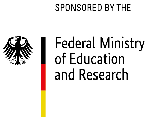

title: IHeaR

  

## The International Hearing Research - I H e a R 
The aim of the IHeaR project is the hearing research as well as the hearing restoration with the disciplines of health, biomedicine and biomedical engineering. Cooperation partners (see below) are planning a long-term establishment of a "German-Chilean hearing research center". This collaboration is sponsored by the German Federal Ministry of Education and Research.

## Partner

* Prof. Dr. Mariela Claudia Torrente Avendaño - Santiago [Universidad de Chile](http://www.uchile.cl/)
* Prof. Dr. Paul H. Délano - Santiago [Laboratorio Neurobiología de la Audición Departamento Neurociencia](http://www.audicion.cl/)
* Prof. Dr. Ana Belén Elgoyhen - Buenos Aires [Instituto de Investigaciones en Ingenieria Genetica y Biologia Molecular - (INGEBI)](http://ingebi-conicet.gov.ar/es_fisiologia-y-genetica-de-la-audicion/)
* The Auditory and Cognition Center -Interdisciplinary research groups - Santiago ([AUCO](http://www.auco.cl/))
* Prof. Prof. Dr. Thomas Lenarz, Cluster of Excellence Hearing4all - Hanover ([Hearing4All](http://hearing4all.eu/EN/))
* Prof. Dr. Theodor Doll, Fraunhofer Institut für Toxikologie und Experimentelle Medizin - Hannover ([Translationale Medizintechnik](https://www.item.fraunhofer.de/de/angebot/medizintechnik.html/))

## Publications

Víctor Fuenzalida, Theodor Doll, Katharina Tegtmeier, Achim Walter Hassel, "Materials in Medicine: Interface between Implants and Body fluids", IHeaR 2018 Proceedings, Valparaiso, Chile, Mar 7-9, 2018

