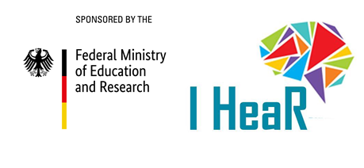
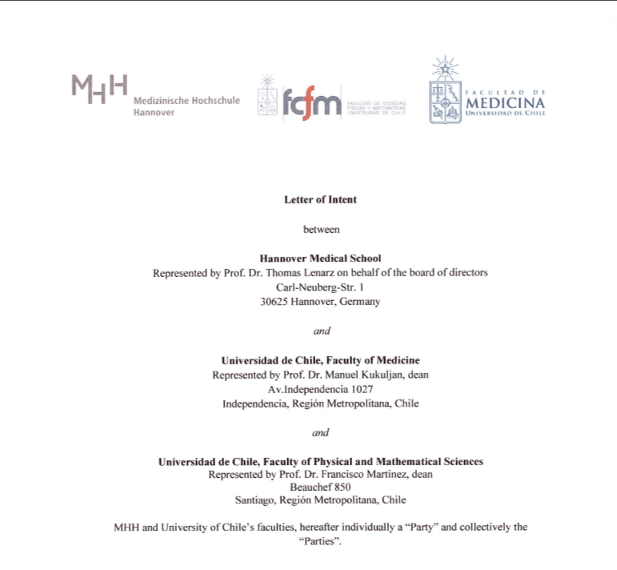

title: IHeaR

  

## The International Hearing Research - I H e a R 
The aim of the IHeaR project is the hearing research as well as the hearing restoration with the disciplines of health, biomedicine and biomedical engineering. Cooperation partners (see below) are planning a long-term establishment of a "German-Chilean hearing research center". This collaboration is sponsored by the German Federal Ministry of Education and Research.

## Partner

* Prof. Dr. Mariela Claudia Torrente Avendaño - Santiago [Universidad de Chile](http://www.uchile.cl/)
* Prof. Dr. Paul H. Délano - Santiago [Laboratorio Neurobiología de la Audición Departamento Neurociencia](http://www.audicion.cl/)
* Prof. Dr. Ana Belén Elgoyhen - Buenos Aires [Instituto de Investigaciones en Ingenieria Genetica y Biologia Molecular - (INGEBI)](http://ingebi-conicet.gov.ar/es_fisiologia-y-genetica-de-la-audicion/)
* The Auditory and Cognition Center -Interdisciplinary research groups - Santiago ([AUCO](http://www.auco.cl/))
* Prof. Prof. Dr. Thomas Lenarz, Cluster of Excellence Hearing4all - Hanover ([Hearing4All](http://hearing4all.eu/EN/))
* Prof. Dr. Theodor Doll, Fraunhofer Institut für Toxikologie und Experimentelle Medizin - Hannover ([Translationale Medizintechnik](https://www.item.fraunhofer.de/de/angebot/medizintechnik.html/))

## Publications

* Víctor Fuenzalida, Theodor Doll, Katharina Tegtmeier, Achim Walter Hassel, "Materials in Medicine: Interface between Implants and Body fluids", IHeaR 2018 Proceedings, Valparaiso, Chile, Mar 7-9, 2018

* Dragicevic C, Krüger B, Lopez-Poveda EA, Délano PH, Nogueira W: Frequency distribution of contralateral modulation of cochlear mechanics in single-sided deaf cochlear implant users, as revealed by otoacoustic emissions; IHeaR 2019 Symposium, Buenos Aires, Argentine, 24-26. April, 2019. 

* Hassel AW, Fuenzalida V, Doll T: Routes towards corrosion-free implant materials; IHeaR 2019 Symposium, Buenos Aires, Argentine, 24-26. April, 2019.

* Nogueira W, Lopez-Poveda EA, Délano PH, Dragicevic C: Contralateral suppression of human hearing sensitivity in single-sided deaf cochlear implant users; IHeaR 2019 Symposium, Buenos Aires, Argentine, 24-26. April, 2019. 

* Yilmaz-Bayraktar S, Schwieger J, Scheper V, Lenarz T, Böer U, Kreienmeyer M, Torrente M, Doll T:  Decellularized equine carotid artery layers as matrix for regenerated neurites of spiral ganglion neurons 2019; submitted.

* Knipper M, van Dijk P, Schulz H, Norena A, Mazurek B, Krauss P, Scheper V, Warnecke A, Schwabe K, Singer W, Braun C, Schulze J, Délano PH, Elgoyhen AB, Schlee W, Searchfield G, Rauschecker J, Langguth B, Fallgatter AJ, Ehlis AC, Munk MHJ, Baguley D, Rüttiger L: Tinnitus models all present and correct! Tinnitus in the context of deafness and cochlear implants 2019; in process.

