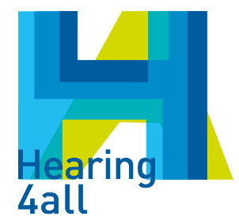
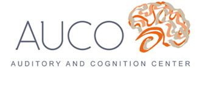

title: About

The **IHeaR** project, developed by a team of Prof. Prof. Thomas Lenarz and Prof. Dr. Theodor Doll, combines the hearing research of the cluster of excellence [**Hearing4All (H4A)**](http://hearing4all.eu/EN/) in Hannover,

with the also internationally recognized group the [**Auditory and Cognition Center (AUCO)**](http://www.auco.cl/) in Chile and Argentina. 

This collaboration is sponsored by the German Federal Ministry of Education and Research. Based on the modell of the  hearing center in Hannover, the german-chilean corporation aims to provide basic research, as well as to continually improve patient care. The basis of the project is initially the scientific exchange between the project partners in hearing, medical engineering research and brain-computer interfaces (BMI) for cognitive science. The IHeaR project want to advance the international hearing research by exchanging knowledge and working together. A particular concern is to improve and accelerate research results into medical care and ultimately to patients.  

