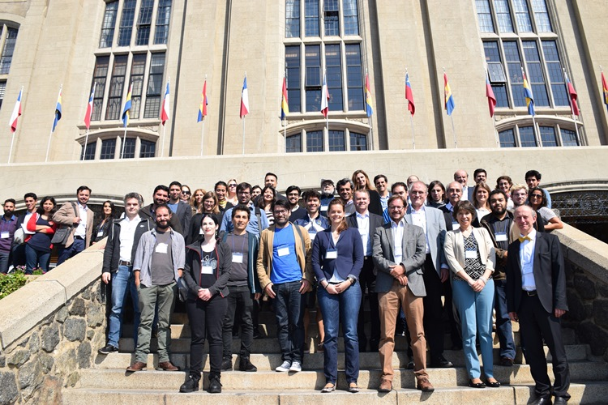
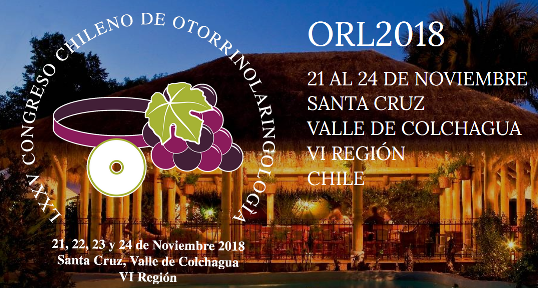

title: Conferences 

## Workshops & Meetings 
In order to ensure a bilateral exchange program for young researchers and doctors, three young doctors from Chile have already been received at **[Hannover Medical School (MHH)](https://www.mh-hannover.de/) in Hannover**. Following the successful workshop on **March 2018** (see figure below), the project partners are looking forward to the next meeting.

##Otorrinolaringología congress on 21-24 November 2018 in Santa Cruz

##The three-day conference with workshops on April 2019 in Buenos Aires, Argentina

In the following, further dates are listed. **We are looking forward to welcoming you!**

|Dates|Location|

|Kick-off of consolidation phase on November 2019 | Santiago de Chile|
|Two-day dissemination meeting in 2020 | Santiago de Chile|
|Symposium Workshop "Medicine and Engineering in Hearing Restoration" in 2020| Hannover|
|Scientific Meeting in 2021 | Buenos Aires|
|Last Scientific meeting in 2022  | Santiago de Chile|
|Wrap up Meeting in 2022| Buenos Aires|
