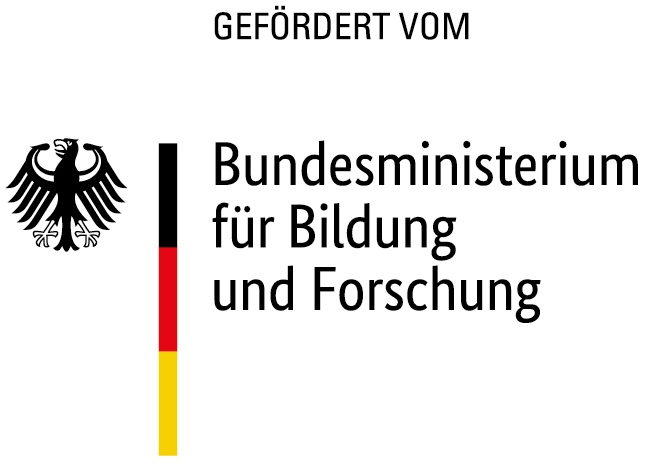

##Die Internationale Hörforschung (IHeaR)

Das IHeaR Projekt, bestehend aus einem Team rund um Prof. Prof. Dr. Thomas Lenarz und Prof. Dr. Theodor Doll, verbindet 
die Hörforschung des Exzellenzclusters „Hearing 4 All“ [Hearing4All (H4A)](http://hearing4all.eu/EN/)  in Hannover,
mit dem ebenfalls international ausgewiesenen Verbung „Audition and Cognition“ 
[Auditory and cognition center (AUCO)](http://www.auco.cl/)in Chile und Argentinien. 
Diese Zusammenarbeit wird vom deutschen Bundesministerium für Bildung und Forschung gefördert.
Nach dem Vorbild des deutschen Hörzentrums in Hannover, zielt sie neben der Grundlagenforschung auch 
auf die stetige Verbesserung der Patientenversorgung. Grundlagen des Projektes bildet vorerst der wissenschaftliche 
Austausch zwischen den Projektpartnern in den Bereichen Hören, medizinisch-ingenieurstechnischer Forschung und 
Brain-Computer-Interfaces für die Kognitionswissenschaft. Die H4A und AUCO wollen zusammen mit IHeaR in naher Zukunft 
Ergebnisse aus der Grundlagen- und klinischen Forschung in der medizinischen Versorgung in Deutschland und Südamerika erzielen.

##Konferenzen
Um ein bilaterales Austauschprogramm für junge Forscher und Ärzte zu gewährleisten,
wurden bereits drei junge Ärzte aus Chile an der medizinischen Hochschule Hannover (MHH) empfangen.
Nach dem erfolgreichen Workshop in diesem Jahr und dem bisherigen regen Austausch freuen sich die Projektpartner auf das 
nächste Treffen. 

Im November 2018 findet der Otorrinolaringología ([Otorrinolaringología (ORL 2018)](http://www.orl2018.cl/) Kongress 
in Santa Cruz mit anschließenden Meetings statt. Dem folgend wird die dreitägige Konferenz im April 2019 mit ebenfalls 
interessanten Workshops in Buenos Aires einen Überblick über den aktuellen Stand der Cochlea Implantat-Forschung geben.
Im November 2019, wird der Beginn der Konsolidierungsphase umgesetzt, um vorbereitete politische Entscheidungen auf der 
Ministerebene festzulegen. Im Jahr 2020 werden Ärzte und Hörforscher für das zweitägige Disseminationstreffen nach Santiago 
eingeladen. Anschließend werden Wissenschaftler und Experten aus Südamerika für das 2020 Symposium "Workshop Medizin und Technik 
in der Hörrehabilitation" in Hannover empfangen. Danach wird das wissenschaftliche Treffen in Buenos Aires im Jahr 2021 stattfinden. 
Schließlich wird das letzte wissenschaftliche Treffen im Jahr 2022 in Santiago stattfinden und ein Abschlusstreffen in Buenos Aires
wird das Projekt abrunden.

##Veröffentlichungen
Víctor Fuenzalida, Theodor Doll, Katharina Tegtmeier, Achim Walter Hassel, “Materials in Medicine: Interface between Implants
and Body fluids”, IHeaR 2018 Proceedings, Valparaiso, Chile, Mar 7-9, 2018

##Partner
Prof. Dr. Mariela Claudia Torrente Avendaño - Santiago ([Universidad de Chile](http://www.uchile.cl/))
Prof. Dr. Paul H. Délano - Santiago ([Laboratorio Neurobiología de la Audición Departamento Neurociencia](http://www.audicion.cl/))
Prof. Dr. Ana Belén Elgoyhen - Buenos Aires ([Instituto de Investigaciones en Ingenieria Genetica y Biologia Molecular - INGEBI](http://ingebi-conicet.gov.ar/es_fisiologia-y-genetica-de-la-audicion/))
The Auditory and Cognition Center -Interdisciplinary research groups - Santiago ([AUCO](http://www.auco.cl/))
Prof. Prof. Dr. Thomas Lenarz, Exzellenzcluster Hearing4all - Hannover ([Hearing4All](http://hearing4all.eu/EN/))
Prof. Dr. Theodor Doll, Fraunhofer Institut für Toxikologie und Experimentelle Medizin - Hannover 
 ([Translationale Medizintechnik](https://www.item.fraunhofer.de/de/angebot/medizintechnik.html/))
