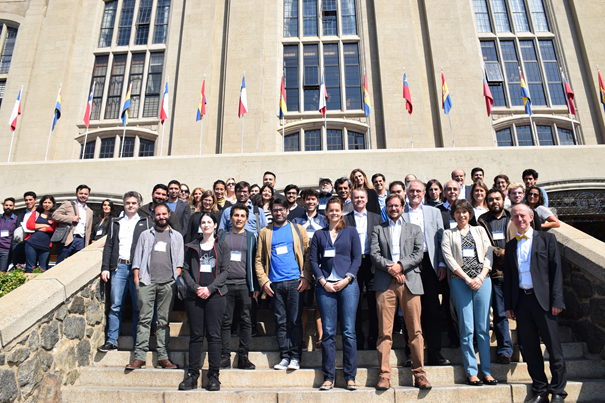

##About
This project achieves the international hearing research (IHeaR) between Germany - Hanover, Chile - Santiago and Argentines - Buenos Aires. Participating in this collaboration and exchange of research will be the cluster of exellence-[Hearing4All (H4A)](http://hearing4all.eu/EN/), which is the world's largest center for restoration of hearing with implants and subsequent patient care, the [Auditory and cognition center (AUCO)](http://www.auco.cl/) in Santiago, Chile which is composed of interdisciplinary research groups as well as research groups from Buenos Aires, Argentinia. The H4A and AUCO, together with IHeaR, want to advance the international hearing research by exchanging knowledge and working together and thereby improve and accelerate the reach of basic and clinical research into medical care and ultimately to patients. 

##Conferences
The next IHeaR meeting will be held on **April 2019** in Buenos Aires as a part of a scientific workshop. The three-day conference will facilitate an overview and exchange on the current state of CI research. Following this, in **November 2019** the kick-off of the consolidation phase will be implemented to manifestate prepared political decisions at ministerial level. In 2020, doctors and hearing researchers will be invited to Santiago for the two-day dissemination meeting. Subsequently, scientists and experts from South America will be invited to Hanover for the 2020 Symposium "Workshop Medicine and Engineering in Hearing Restoration". Thereafter,  a Scientific Meeting will take place in Buenos Aires in 2021. And finally, in 2022 the last Scientific meeting will be held in Santiago and a wrap up Meeting in Buenos Aires will complete the IHeaR project.

##Common publications
Víctor Fuenzalida, Theodor Doll, Katharina Tegtmeier, Achim Walter Hassel, "Materials in Medicine: Interface between Implants and Body fluids", IHeaR 2018 Proceedings, Valparaiso, Chile, Mar 7-9, 2018

##Partner
* Prof. Dr. Mariela Claudia Torrente Avendaño - Santiago ([Universidad de Chile](http://www.uchile.cl/))
* Prof. Dr. Paul H. Délano - Santiago ([Laboratorio Neurobiología de la Audición Departamento Neurociencia](http://www.audicion.cl/))
* Prof. Dr. Ana Belén Elgoyhen - Buenos Aires ([Instituto de Investigaciones en Ingenieria Genetica y Biologia Molecular - INGEBI](http://ingebi-conicet.gov.ar/es_fisiologia-y-genetica-de-la-audicion/))
* The Auditory and Cognition Center -Interdisciplinary research groups - Santiago ([AUCO](http://www.auco.cl/))
* Prof. Prof. Dr. Thomas Lenarz, Cluster of Excellence Hearing4all - Hanover ([Hearing4All](http://hearing4all.eu/EN/))
* Prof. Dr. Theodor Doll, Fraunhofer Institut für Toxikologie und Experimentelle Medizin - Hanover ([Translationale Medizintechnik](https://www.item.fraunhofer.de/de/angebot/medizintechnik.html/))

