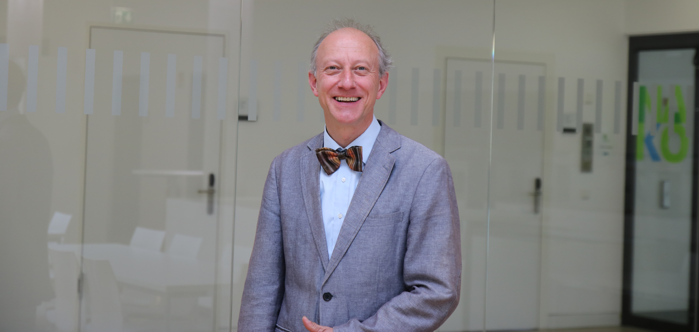

title: Prof. Dr.-Ing Theodor Doll

### Academic Education

|             |                                            |
|-------------|--------------------------------------------|
|    1999     | Habilitation in Microsystems Engineering   |
|    1995     | Doctorate in Electrical Engineering        |
|    1989     | Diploma in Physics                         |

### Professional Career

|             |                                              |
|-------------|----------------------------------------------|
| since 2016  | Co-Coordinator of Business Unit Translational Medical Engineering at Fraunhofer ITEM            |
| since 2013  | Professorship in Biomaterial Engineering at Hannover Medical School                          |
| 2006 - 2012 | Chief Scientist at Application and competence center for heterogeneous microsystems Dortmund |
| 2004 - 2009 | Professor microstructure physics, Johannes Gutenberg University Mainz                        |
| 2004 - 2006 | Mainz Institute of Microtechnology, CEO/CSO                                                  |
| 2002 - 2004 | Director of the Center of Micro- and Nanotechnologies (ZMN)                                  |
| 2000 - 2004 | Professor solid-state electronics, Technical University Ilmenau                              |
| 1998 - 2000 | Visiting Associate at California Institut of Technology, Pasadena, USA                       |
| 1998        | Assistant Professor at Univerität der Bundeswehr München                                     |
| 1997        | Post Doc at University of Chile, Santiago de Chile                                           |
| 1991 - 1996 | Research assistent at Universität der Bundeswehr München                                     |
| 1989 - 1991 | Sensor Development, KWS Electronic GmbH, Rosenheim                                           |

***

[Profile on XING](https://www.xing.com/profile/Theodor_Doll)

[Profile on ResearchGate](http://www.researchgate.net/profile/Theodor_Doll)

[Hearing for All Homepage](http://hearing4all.eu/EN/)

[MHH - Research Group at the Otolaryngology Department](http://www.mh-hannover.de/18078.98.html?&L=1&no_cache=1)

[Fraunhofer ITEM - Translational Medical Engineering](http://www.item.fraunhofer.de/en/services_expertise/medical_engineering.html)

***

**Contact Information:**

BioMaterial Engineering
Medizinische Hochschule Hannover
Stadtfelddam 34
30625 Hannover

Phone: 0511 5350 248
Mail: doll.theodor(at)mh-hannover.de
