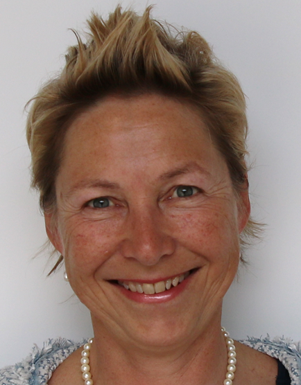

title: Mitarbeiter

|Arbeitsgruppenleiter|                |     |
|--------------|---------------|----|
||[Prof. Dr.-Ing. Theodor Doll](pagedoll.html)|	doll.theodor(at)mh-hannover.de|   

|Teamassistentin|                     |      |
|--------------|---------------------|------|
| | Bettina Goede	|	goede.bettina@mh-hannover.de     |
|    |   |Phone: +49 (0)511 532 7235 oder +49 (0)511 5350 247|

|Technische Mitarbeiter|                     |      |
|--------------|---------------------|------|
| | Michaela Kreienmeyer	|	kreienmeyer.michaela(at)mh-hannover.de     |

|Wissenschaftliche Mitarbeiter|             |    |
|---------|------|------|
|   |Dipl.-Ing. Juan Pablo Marcoleta | marcoleta.juan(at)mh-hannover.de|
| |  Dipl.-Ing. Jan Stieghorst|	stieghorst.jan(at)mh-hannover.de|    
|  | Katharina Tegtmeier, M.Sc. 	|	tegtmeier.katharina(at)mh-hannover.de | 

|Studenten|             |
|-----------|-------------|
|Ailke Behrens| Praktikum|
|Fabian Borrmann, B.Sc. | HiWi|
|Lennart Guntenhöner |Promotion Dr. med. |
|Steffen Hadeler | Bachelorarbeit|
|Filip Jakimovski, B. Sc.| Masterarbeit|
|Wiebke Kossow, B.Eng. |  Masterarbeit|
|Fabian Müller|Praktikum|
|Bich Ngoc Tran, B. Sc.| HiWi|
|Tan Tan, B. Sc.| Masterarbeit|
|Annette Winter | Promotion Dr. med.|
|Eugen Zukin | HiWi |

