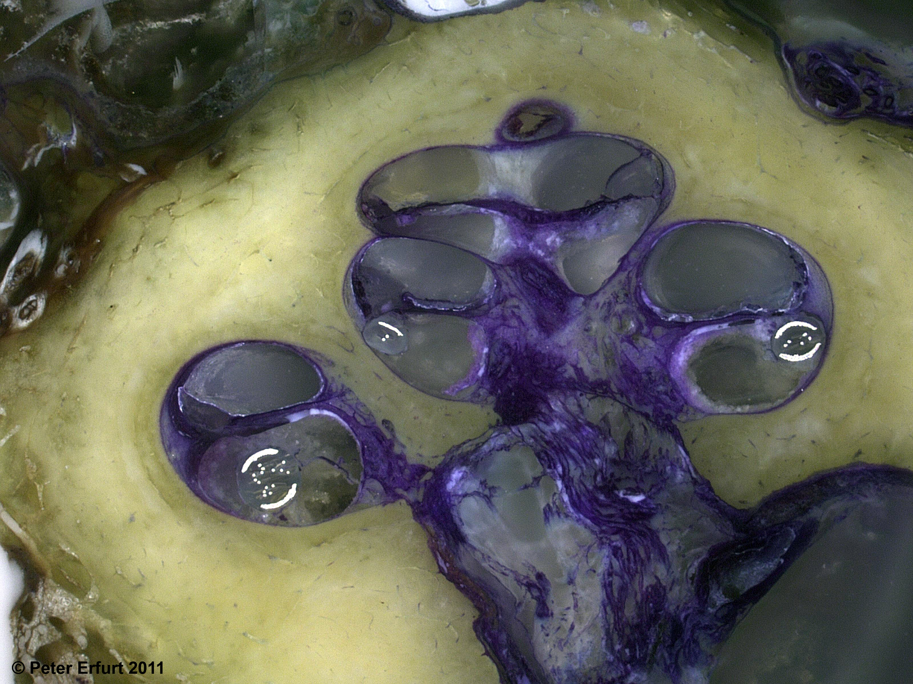
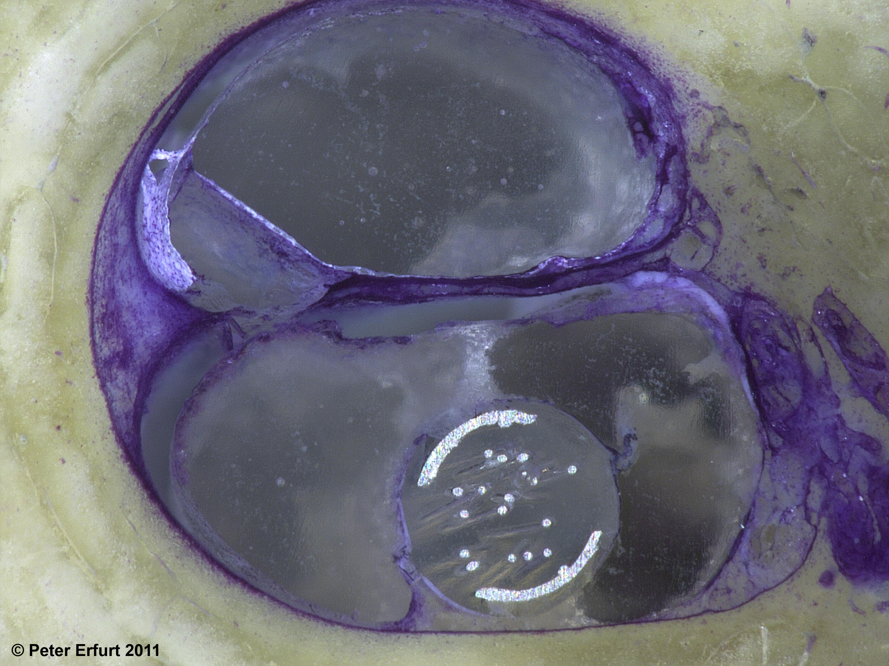
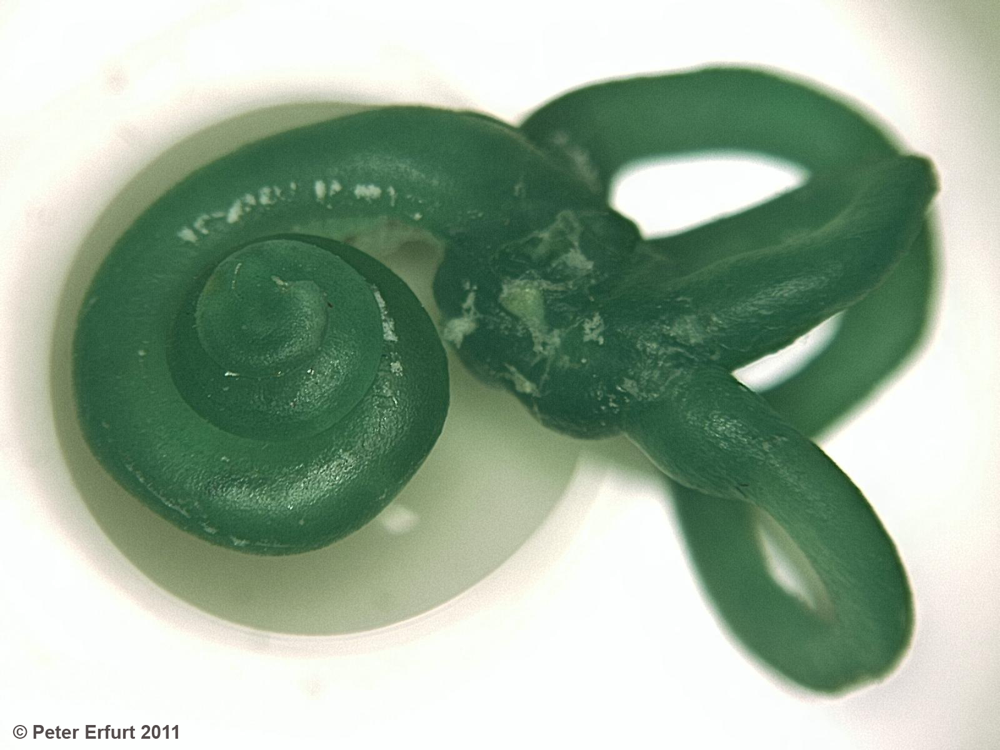

title: WG Lenarz - Specimen Preparation Laboratory

The Specimen Preparation Laboratory is equivalent to a standard temporal bone
laboratory with an attached histology unit. Its premises are equipped for
surgical training and performing preliminary test procedures on prepared
specimens. This enables services covering the entire field of ear, nose and
throat surgery to be provided. The main focus is on the cochlear implant and the
middle-ear implant.

As the demands made on cochlear implants are constantly changing, the
manufacturers modify electrode design to meet new requirements. The focus here
is on optimizing signal transmission, preservation of residual hearing, and
avoiding damage to the inner ear.

The prototypes are implanted in the cochlea by means of a simulated operation.
Here, surgeons are trained in necessary adjustments to operative techniques and
electrode behaviour assessed. With the subsequent histological treatment of the
prepared specimens, use of the hard-ground technique enables the position of the
electrodes and possible damage profiles to be shown clearly – with additional
usage of radiological imaging methods (DVT, µ-CT) – and evaluated. The findings
are incorporated directly into the optimization of the prototypes.

Left: Mid-modiolar section of a human cochlea (30x magnification) with implanted
electrode (and without damage profile)

Middle: Detail view of the left image (100x magnification)

Right: Corrosion model of a human inner ear with vestibular
organ

This work is carried out in close cooperation with work groups from the
Department of Otolaryngology at Hannover Medical School (MHH), VIANNA and the
cochlear implant manufacturers.

Precisely the same can be done with middle-ear implants, bone-anchored auditory
systems, brain implants and middle-ear prostheses.

The Specimen Preparation Laboratory provides an opportunity for visiting
scientists and physicians (from Russia, Kazakhstan, Poland, Israel and other
countries) to familiarize themselves with, and gain training in, the new
implantation techniques and types of implant.

### Contact

-   Prof. Prof. h.c. Dr. med. T. Lenarz: <Lenarz.Thomas@mh-hannover.de>

-   P. Erfurt: <Erfurt.Peter@mh-hannover.de>
