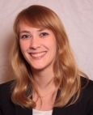

title: Sarah Vormelcher

  
**Sarah Vormelcher, B.Sc.**

Sarah Vormelcher is an audiologist and studied Biomedical Engineering (B.Sc.) at the University of Applied Sciences in Luebeck. Currently, she is working in the lab of Prof. Maier on “Implantable Middle Ear Hearing Devices” to complete her Master´s thesis at the Leibniz University of Hannover.
***

**Contact:**

	Sarah Vormelcher
	Medizinische Hochschule Hannover
	Klinik für Hals-Nasen-Ohrenheilkunde
	NIFE - VIANNA - AG Maier
	Stadtfelddamm 34
	30625 Hannover

<A HREF="&#109;&#97;&#105;&#108;&#116;&#111;&#58;&#86;&#111;&#114;&#109;&#101;&#108;&#99;&#104;&#101;&#114;&#46;&#83;&#97;&#114;&#97;&#104;&#64;&#109;&#104;&#45;&#104;&#97;&#110;&#110;&#111;&#118;&#101;&#114;&#46;&#100;&#101;">&#86;&#111;&#114;&#109;&#101;&#108;&#99;&#104;&#101;&#114;&#46;&#83;&#97;&#114;&#97;&#104;&#64;&#109;&#104;&#45;&#104;&#97;&#110;&#110;&#111;&#118;&#101;&#114;&#46;&#100;&#101;</A>

+49 (0)511 532-7283