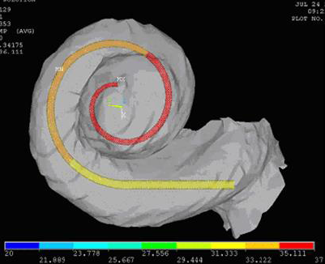

title:Projects

---
## [Hearing4all - EMS](http://www.vianna.de/01_workgroups/majdani/projects/ems.html)

### Electromechanical Stimulation of the Cochlea

{style="width:450px"}

**Contact: Dr. Wouter J. van Drunen | vanDrunen.Wouter@mh-hannover.de**

---
## [Mini-Hexapod](http://www.vianna.de/01_workgroups/majdani/projects/hexapod.html)

### Minimally invasive cochlear implant surgery

**Contact: [Marcel Kluge](http://www.vianna.de/01_workgroups/majdani/staff/marcel.html) | Kluge.Marcel@mh-hannover.de**

---
## [Akva-Med](projects/akvamed.html)

### Electrode Development: fluidically actuated implant

{style="width:300px"}

**Contact: [Silke Hügl](staff/silke.html) | Huegl.Silke@mh-hannover.de**

---
## RoboJig

Minimally-invasive CI-surgery

Overview of the RoboJig surgery vs. conventional approach.

---
## [GentleCI](http://www.vianna.de/01_workgroups/majdani/projects/gentleci.html)

### Electrode Development: nickel-titanium (nitinol) actuators for cochlear implants

{style="width:300px"}

**Contact: [Silke Hügl](staff/silke.html) | Huegl.Silke@mh-hannover.de**
