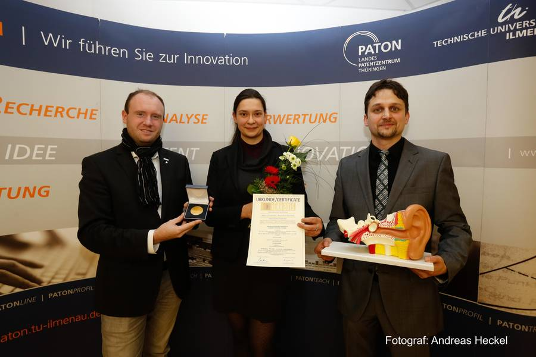

title: AkvaMed

<iframe width="600px" height="400px" src="https://www.youtube.com/embed/8Envgp2PDsA" frameborder="0" allowfullscreen></iframe>

### Aims:

"Aktiv-verformbare, hydraulisch-aktuierte, nachgiebige Mechanismen für schonende Implantate und Instrumentarien" (Akva-Med)
	
- Using compliant mechanisms for actuation of medical implants and instruments
- Planning, testing, analytical synthesis and fabrication of CI electrode carrier with fludically actuation 
- Expected benefit of such mechanisms:
  - Hearing preservation
  - Perimodiolar position within the scala tympani of the cochlea
  
### Patents and Awards:

- Goldmedal at the international traide fair „Ideen-Erfindungen-Neuheiten (IENA)“ (ideas-inventions-new products) Nürnberg, Germany, 2015; 
 Topic: „Adaptiver Elektrodenträger, seine Verwendung und Verfahren zur Insertion eines Cochlea-Implantat-Elektrodenträgers“
- Griebel, S.; Hügl., S.; Rau, T.S.; Majdani, O.; Wystup, C.; Lenarz, T.; Zentner, L.: 
 Adaptiver Elektrodenträger, seine Verwendung und Verfahren zu seiner Insertion
 file number: DE 10 2016 003 259.2, patent application 04.03.2016 

{style="width:525px; float:left"} {style="width:250px; float:right; margin-left:3em"} 

The research team from Medical School Hannover and Ilmenau University of Technology, represented by Silke Hügl (MHH) and Stefan Griebel (TUI), receive the gold medal from Henning Könicke (iENA manager, left). *Image: Andreas Heckel*

### Project Funding:
Funded by the German Research Foundation (DFG) under grant number MA 4038/9-1.

### Project Partners:

Ilmenau University of Technology, [Mechanism Technology](https://www.tu-ilmenau.de/en/mechanism-technology-group "TU Ilmenau - Mechanism Technology")

**Contact: 
[Silke Hügl](http://www.vianna.de/01_workgroups/majdani/staff/silke.html) | Huegl.Silke@mh-hannover.de**

