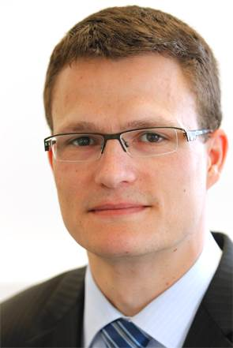
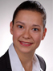
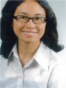
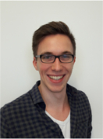
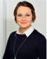
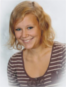
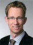

title:Staff

| Head of Research Group                                                                         |
|:------------------------------|:-----------------------|-------------------------------:|
|         | Dr.-Ing. Thomas S. Rau | Rau.Thomas@mh-hannover.de   |

| Research Team                                                                                                      |
|:------------------------------|:----------------------------------------------|--------------------------------------:|
|    | Prof. Dr. Omid Majdani                     | Majdani.Omid@mh-hannover.de        |
|   | [M. Sc. Silke Hügl](staff/silke.md)        | Huegl.Silke@mh-hannover.de         |
|   | Dipl.-Ing. Jakob Lexow                     | Lexow.Jakob@mh-hannover.de         |
|	| Dipl.-Phys. Mathias Müller		 | Mueller.Mathias@mh-hannover.de	  |
| 	| M. Sc. Nuha Suzaly			   			 | Suzaly.Nuha@mh-hannover.de          |
|	| Max Eike Timm								 |									  |

| Students                                                                                             |
|:------------------------------|:------------------------------------------|-------------------------------------------------:|
| 	| Shari Barati								| Medical Doctoral Thesis, Hannover Medical School 	|
| 	| Tobias Blum 								| Bachelor Thesis, Leibniz University Hannover      |
| 	| Denise Blume 								| Bachelor Thesis, Leibniz University Hannover      |
|	| Jakob Cramer 								| Bachelor Thesis, Technische Universität Berlin    |
|	| Lena Geiger								| Student Assistant, Hannover Medical School		| 
| 	| Till Gerking								| Medical Doctoral Thesis, Hannover Medical School	|
|		| Maximilian Henke							| Master Thesis, Leibniz University Hannover   		|
| 	| Christian Menke							| Medical Doctoral Thesis, Hannover Medical School	|
| | Christoph Rostkowski					| Medical Doctoral Thesis, Hannover Medical School	|
| 	| Evelyn Semke								| Medical Doctoral Thesis, Hannover Medical School	|
| 	| Katharina Spichal							| Medical Doctoral Thesis, Hannover Medical School	|
|		| Lea Uhlenbusch 							| Bachelor Thesis, Leibniz University Hannover      |
| 	| Jan-Niklas Wellers						| Medical Doctoral Thesis, Hannover Medical School  |
| 	| Sina Witte 				    			| Medical Doctoral Thesis, Hannover Medical School  |

| Former Staff                                                                                            |
|:------------------------------|:--------------------------------------------------------|--------------------------------------:|
|  | Dr. Wouter J. van Drunen                   | jetzt [Implandata Ophthalmic Products GmbH](http://www.implandata.com) |
|  | Dipl.-Inform. Samuel John                  | jetzt [HörSys GmbH](http://www.hoersys.de)  |
|  | Dipl.-Ing. Marcel Kluge					 | jetzt [HörSys GmbH](http://www.hoersys.de)  |
|                               | Dr.-Ing. Daniel Schurzig (04/2014 - 08/2015) | jetzt [MED-EL Deutschland](www.medel.com)
|                               | Dipl.-Ing. Lenka Harbach (12/2012 - 06/2014)          |                           |
|                               | Dipl.-Ing. (FH) Franziska Eckhardt (09/2010 - 12/2012)     |                           |
|                               | M. Sc. Priyant Mane (05/2010 - 05/2012)           | jetzt [Achtung Technik](http://www.achtung.in) |

| Alumni                                                                                            |
|:------------------------------|:-------------------------------------------|--------------------------------------:|
|| M. Sc. Alexander Becker 					 | jetzt [Institut für Mehrphasenprozesse (IMP), LUH](https://www.imp.uni-hannover.de/mitarbeiter.html)|
| 	  | Diana Kreul								| Medical Doctoral Thesis, Hannover Medical School	|
| | M. Sc. Katharina Rülander				 | 											   |
|	| M. Sc. Henrik Schädlich					 | jetzt Physik- & Mathematiklehrer			   |
