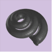
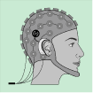
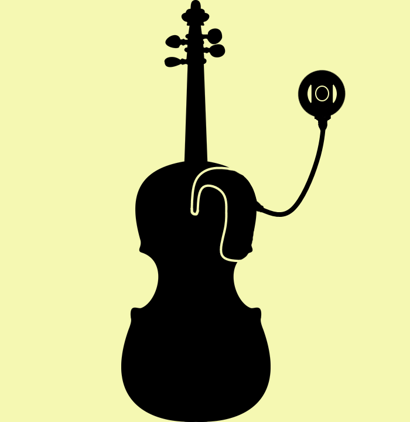

title: APG Lab - Auditory Prosthetic Group

{style="float:right; margin-left:1em"}

The Auditory Prosthetic Group of the German Hearing Center, part of the Medical University Hannover conducts research in signal processing and auditory modelling applied to implantable hearing prostheses including cochlear implants and hybrid electroacoustic stimulation devices. The group is very interdisciplinary covering fields of acoustics, signal processing, auditory models and psychophysics.

The group started in September 2013 as part of the Excellence Cluster Hearing4all.

- **[Linktree page](https://linktr.ee/auditoryprostheticgroup)**

---

# Research Interests
<!--- [Our reseach projects](nogueira/projects.md) --->

<!--- **[Signal Processing for Cochlear Implants](https://vianna.de/01_workgroups/nogueira/research/signal_processing.html)**
- **[Electric Acoustic Stimulation](https://vianna.de/01_workgroups/nogueira/research/eas.html)**
- **[Closed-Loop Cochlear Implants](https://vianna.de/01_workgroups/nogueira/research/closed-loop.html)** 
- **[Music and Cochlear Implants](https://vianna.de/01_workgroups/nogueira/research/music_and_CI.html)** --->

[{.img-rounded; .float:center}](https://vianna.de/01_workgroups/nogueira/research/signal_processing.html "Signal Processing for Cochlear Implants")
[{.img-rounded; .float:left}](https://vianna.de/01_workgroups/nogueira/research/eas.html "Electric Acoustic Stimulation")

[{.img-rounded; .float:center}](https://vianna.de/01_workgroups/nogueira/research/closed-loop.html "Closed-Loop Cochlear Implants")
[{.img-rounded; .float:right}](https://vianna.de/01_workgroups/nogueira/research/music_and_CI.html "Music and Cochlear Implants")

<!---{style="width:150px; float:right; margin-left:3em"}--->
---

| Contact                 |                            |
| ------------------------|--------------------------- |
| Head of Research Group:           | Prof. Dr.-Ing. Waldo Nogueira|
| Address:       | DHZ-Deutsches HörZentrum Hannover  Karl-Wiechert-Allee 3   30625 Hannover   Deutschland |
| Phone:                  | +49 (0)511 532 8025 |
| Fax:                    | +49 (0)511 532 6833 |
| E-Mail:                 |<nogueiravazquez.waldo@mh-hannover.de>|

---

