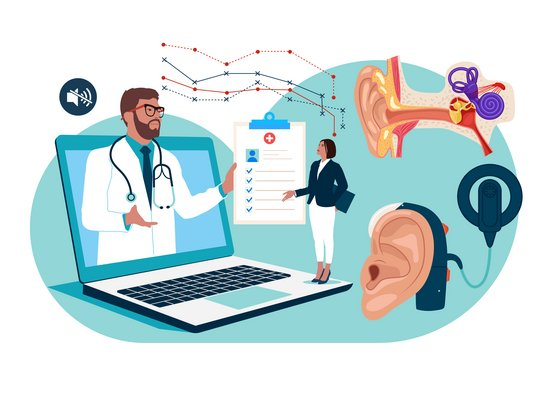

title: ICoStim
---

{style="float:right; margin-left:1em"}

## Closed-loop fitting of cochlear implants by automated determination of stimulation 
 

### Project description

The outcome of cochlear implant (CI) treatment relies on optimal parameter settings, which are currently determined through a labor-intensive, subjective fitting process. The ICoStim project aims to create a new system for objectively determining and optimizing these parameters using a closed-loop approach with a mobile electroencephalography (EEG) platform. This system records the patient's EEG response to CI stimulation, allowing for real-time adjustments and iterative optimization of the fitting. The approach does not require patient cooperation, making it suitable for patients that cannot give active feedback during the fitting process. The goal is a fast, accurate, and cost-effective fitting process that improves therapy outcomes.

More information: [EU Project Website](https://cordis.europa.eu/project/id/101044753)

Grant agreement ID: 101044753

<!---

  

--->

<!-- Labels and Date Container with inline style -->

  
<b>Start date</b>

  
<b>End date</b>

<!-- Date Container with inline style -->

  

  

<!-- Progress Bar -->

  

### Objective
Hearing loss is the most common sensory deficit in the elderly, and it is becoming a severe social as well as a health problem. Across the whole lifespan, from new-borns to the elderly, hearing loss impairs the exchange of information, thus significantly impacting everyday life, causing loneliness, isolation, dependence, frustration and communication disorders. Cochlear implants (CIs) are hearing prosthetics that stimulate the auditory nerve with electrodes placed inside the cochlea. CIs are gradually being implanted in subjects retaining low-frequency residual hearing. In general, these subjects obtain large benefits in speech perception from electric acoustic stimulation, although large variability exists and some subjects do not benefit. Therefore, it is highly desirable to create objective diagnostics to assess acoustic low-frequency hearing to indicate cochlear implantation, to monitor and preserve hearing during the implantation procedure and to understand the mechanisms related to electric acoustic stimulation benefits.
The ground-breaking nature of the READIHEAR project is to investigate the fundamental interaction mechanisms between electric and acoustic stimulation across the auditory pathway, from the cochlea up to the auditory cortex. The fundamental understanding will set the basis for a new generation of diagnostic devices of hearing loss that combine for the first time minimally invasive electric acoustic stimulation. Moreover, READIHEAR will assay a novel auditory prosthetic that makes use of the interaction mechanisms between acoustic and electric stimulation delivered through minimally invasive electrodes. These developments will be beneficial for a large population suffering from hearing loss across the whole lifespan, from young children who will benefit from improved hearing diagnostics to the elderly population who will benefit from minimally invasive electric acoustic stimulation technology as the treatment for age-related hearing loss.

### Team
| Head of Research Group | &nbsp; &nbsp; &nbsp; &nbsp; &nbsp; &nbsp; &nbsp; &nbsp; &nbsp; &nbsp; &nbsp; &nbsp; &nbsp; &nbsp; &nbsp; &nbsp; &nbsp; &nbsp; &nbsp; &nbsp; &nbsp; &nbsp; | &nbsp; &nbsp; &nbsp; &nbsp; &nbsp; &nbsp; &nbsp; &nbsp; &nbsp; &nbsp; &nbsp; &nbsp; &nbsp; &nbsp; &nbsp; &nbsp; &nbsp; &nbsp; &nbsp; &nbsp; &nbsp; &nbsp; &nbsp; &nbsp; &nbsp; &nbsp; &nbsp; &nbsp; &nbsp; &nbsp; &nbsp; &nbsp; &nbsp; &nbsp; &nbsp; |
| :----------------------------------- | :------------------------------------------------------------------------------------------------- | -------------------------------------: |
|  | [Dr.-Ing. Waldo Nogueira](https://vianna.de/01_workgroups/nogueira/staff/a_nogueira.html)          | <nogueiravazquez.waldo@mh-hannover.de> |

| Research Team &nbsp; &nbsp; &nbsp; &nbsp; &nbsp; &nbsp; &nbsp; &nbsp; | &nbsp; &nbsp; &nbsp; &nbsp; &nbsp; &nbsp; &nbsp; &nbsp; &nbsp; &nbsp; &nbsp; &nbsp; &nbsp; &nbsp; &nbsp; &nbsp; &nbsp; &nbsp; &nbsp; &nbsp; &nbsp; &nbsp; | &nbsp; &nbsp; &nbsp; &nbsp; &nbsp; &nbsp; &nbsp; &nbsp; &nbsp; &nbsp; &nbsp; &nbsp; &nbsp; &nbsp; &nbsp; &nbsp; &nbsp; &nbsp; &nbsp; &nbsp; &nbsp; &nbsp; &nbsp; &nbsp; &nbsp; &nbsp; &nbsp; &nbsp; &nbsp; &nbsp; &nbsp; &nbsp; &nbsp; &nbsp; &nbsp; |
| :----------------------------------- | :------------------------------------------------------------------------------------------------- | -------------------------------------: |
|       | [Dr.-Ing. Benjamin Krüger](https://www.vianna.de/01_workgroups/nogueira/staff/benjamin.html)       | <Krueger.Benjamin@mh-hannover.de>      |
| 	       | [Dr. rer. nat. Daniel Kipping](https://vianna.uber.space/01_workgroups/nogueira/staff/daniel.html) | <Kipping.Daniel@mh-hannover.de>	       |
| 	     | [Franklin Alvarez ](https://vianna.de/01_workgroups/nogueira/staff/franklin.html)                  | <Alvarez.Franklin@mh-hannover.de>	     |
| 	       | [Hanna Dolhopiatenko](https://vianna.uber.space/01_workgroups/nogueira/staff/hanna.html)           | <Dolhopiatenko.Hanna@mh-hannover.de>   |
| 	         | [Nina Aldag](https://vianna.uber.space/01_workgroups/nogueira/staff/nina.html)                     | <Aldag.Nina@mh-hannover.de>            |
| 	 | [Patrick Hinz](https://vianna.de/01_workgroups/nogueira/staff/patrick.html)	                      | <Hinz.Patrick@mh-hannover.de>          |
|       	 | [Yixuan Zhang](https://vianna.de/01_workgroups/nogueira/staff/zhang.html)	                        | <Zhang.Yixuan@mh-hannover.de>          |
| 	       | [Robert Hart](https://vianna.de/01_workgroups/nogueira/staff/hart.html)	                          | <Hart.Robert@mh-hannover.de>           |

### Peer-Reviewed Publications
#### 2025
* Hanna Dolhopiatenko, Waldo Nogueira (2025): **[Cortical temporal mismatch compensation in bimodal cochlear implant users: selective attention decoding and pupillometry study](http://arxiv.org/abs/2501.17048)**. Hearing Research (Under Review).
* Benjamin Krüger, Waldo Nogueira (2025): Phase coherence of cochlear microphonic potentials in cochlear implant users with ipsilateral residual hearing. The Journal of the Acoustical Society of America, (Under Review). JASA-12021
* Yixuan Zhang, Daniel Kipping, Waldo Nogueira (2025): **[Evaluating electrophysiological and behavioral measures of neural health in cochlear implant users: a computational simulation study](https://arxiv.org/abs/2409.14767)**, IEEE Transactions Biomedical Engineering, (First Revision).
* Franklin Alvarez, Yixuan Zhang, Daniel Kipping, Waldo Nogueira (2025). **[A computational loudness model of cochlear implant users](https://arxiv.org/abs/2501.17640)**. The Journal of the Acoustical Society of America, (Under Review)
* Nina Aldag, Waldo Nogueira (2025): **[Phoneme-related potentials recorded from normal hearing listeners and cochlear implant users in a selective attention paradigm to continuous speech](https://doi.org/10.1016/j.heares.2024.109136)**. Hear Res. 2024 Dec.

#### 2024
* Nina Aldag, Waldo Nogueira (2024): **[Psychoacoustic and electroencephalographic responses to changes in amplitude modulation depth and frequency in relation to speech recognition in cochlear implantees](https://doi.org/10.1038/s41598-024-58225-1)**. Scientific Reports.
* Daniel Kipping, Yixuan Zhang, Waldo Nogueira (2024): **[A Computational Model of the Electrically or Acoustically Evoked Compound Action Potential in Cochlear Implant Users With Residual Hearing](https://doi.org/10.1109/tbme.2024.3410686)**. IEEE Transactions on Biomedical Engineering
* Jasmin Thormählen, Benjamin Krüger, Waldo Nogueira (2024): **[Automatic localization of cochlear implant electrodes using cone beam computed tomography images](https://doi.org/10.1186/s12938-024-01249-5)**. BioMedical Engineering OnLine

#### 2023
* Franklin Alvarez, Daniel Kipping, Waldo Nogueira (2023): **[A computational model to simulate spectral modulation and speech perception experiments of cochlear implant users](https://doi.org/10.3389/fninf.2023.934472)**. Frontiers in Neuroinformatics.
* Hanna Dolhopiatenko, Waldo Nogueira (2023): **[Selective attention decoding in bimodal cochlear implant users](https://doi.org/10.3389/fnins.2022.1057605)**. Frontiers in Neuroscience.
                                                                                                                

### Conference Contributions
#### 2025
* Franklin Alvarez, Yixuan Zhang, Daniel Kipping, Waldo Nogueira (2025): **A computational model for loudness recruitment based on spike activity for electrically stimulated cochlea**, ARO 2025, Orlando, USA.
* Hanna Dolhopiatenko, Waldo Nogueira (2025): **Cortical Temporal Mismatch Compensation in Bimodal Cochlear Implant Users: A Selective Attention Decoding and Pupillometry Study**, ARO 2025, Orlando, USA.
* Patrick Hinz, Waldo Nogueira (2025): **Psychoacoustic electric-acoustic masking with round window extra-cochlear electric stimulation in partially inserted cochlear implant users with residual hearing**, ARO 2025, Orlando, USA.
* Daniel Kipping, Yixuan Zhang, Waldo Nogueira (2025): **A Computational Model of the Electrically or Acoustically Evoked Compound Action Potential in Cochlear Implant Users with Residual Hearing**, ARO 2025, Orlando, USA.
* Waldo Nogueira, Änne Großkopf, Yixuan Zhang, Daniel Kipping, Benjamin Krüger (2025): **Towards Extracochlear Electric-Acoustic Stimulation of the Auditory System**, ARO 2025, Orlando, USA.

#### 2024
* Benjamin Krüger, Waldo Nogueira (2024): **Extracochlear Electric-Acoustic Stimulation: Characterization of Auditory Perception, Side Effects, and Interaction with Electric-Acoustic Hearing**, Hearing4All International Symposium 2024, Hannover, Germany.
* Daniel Kipping, Yixuan Zhang, Waldo Nogueira (2024): **Simulating peripheral auditory responses to combined acoustic and intra- or extracochlear electric stimulation**, Hearing4All International Symposium 2024, Hannover, Germany.
* Waldo Nogueira, Enrique Lopez-Poveda, Benjamin Krüger, Constantino Dragicevic (2024): **Contralateral suppression of human hearing sensitivity in single-sided deaf cochlear implant users through psychoacoustics and otoacoustic emissions**, HWK Efferent Workshop 2024, Delmenhorst, Germany.
* Waldo Nogueira (2024): **Nuevos Implantes Auditivos Centrales y Periféricos: Auditory Nerve Implant (ANI), Extra-Cochlear Implant (ECI)**, 2024 SEORL, Malaga, Spain.
* Waldo Nogueira (2024): **Towards Extracochlear Electric-Acoustic Stimulation of the Auditory System**, DGA 2024 Aalen, Germany.
* Waldo Nogueira (2024): **Towards Extracochlear Electric-Acoustic Stimulation of the Auditory System**, Hearing4All International Symposium 2024, Hannover, Germany.
* Yixuan Zhang, Franklin Alvarez, Daniel Kipping, Waldo Nogueira (2024): **A 3D computational model framework of the stimulated peripheral auditory system**, VCCA 2024, Online.

#### 2023
* Nina Aldag, Waldo Nogueira (2023): **Detection of changes in amplitude modulation depth and rate can predict speech understanding in cochlear implant users – a behavioral and electrophysiological study**, CIAP 2023, Lake Tahoe, USA.
* Franklin Alvarez, Yixuan Zhang, Daniel Kipping, Waldo Nogueira (2023): **Loudness recruitment in computational models of electrically stimulated cochlea**, ICBT 2023, Hannover, Germany.
* Hanna Dolhopiatenko, Waldo Nogueira (2023): **Electric Acoustic Integration in Bimodal Cochlear Implant Users**, ARO 2023, Orlando, USA.
* Hanna Dolhopiatenko, Waldo Nogueira (2023): **Electric acoustic integration in bimodal cochlear implant users**, CIAP 2023, Lake Tahoe, USA.
* Daniel Kipping, Yixuan Zhang, Waldo Nogueira (2023): **A computational model of the electrically and acoustically evoked compound action potential in hybrid cochlear implant users**, CIAP 2023, Lake Tahoe, USA.
* Daniel Kipping, Yixuan Zhang, Waldo Nogueira (2023): **A computational model of the electrically and acoustically evoked compound action potential in Cochlear Implant Users with Residual Hearing**, Hearing4All International Symposium 2023, Oldenburg, Germany.
* Benjamin Krüger, Änne Großkopf, Waldo Nogueira (2023): **Towards extracochlear electric-acoustic stimulation of the auditory system**, CIAP 2023, Lake Tahoe, USA.
* Waldo Nogueira (2023): **ReadiHear: Rehabilitation and Diagnosis of Hearing Loss based on Electric Acoustic InteRaction**, AEDA 2023, Madrid, Spain.

---

| Contact                 |                            |
| ------------------------|--------------------------- |
| Head of Research Group:           | Prof. Dr.-Ing. Waldo Nogueira|
| Address:       | DHZ-Deutsches HörZentrum Hannover  Karl-Wiechert-Allee 3   30625 Hannover   Deutschland |
| Phone:                  | +49 (0)511 532 8025 |
| Fax:                    | +49 (0)511 532 6833 |
| E-Mail:                 |<nogueiravazquez.waldo@mh-hannover.de>|

---

