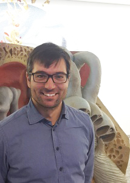

title: Prof. Dr.-Ing. Waldo Nogueira

Professor for Auditory Prosthesis 	

**Contact:**

	Waldo Nogueira
	Deutsches HörZentrum Hannover
	Karl-Wiechert-Allee 3
	30625 Hannover
	Nogueira(at)mh-hannover.de

**Links:**

* **[DHZ](http://www.hoerzentrum-hannover.de/index.php?id=19)**

* **[HNO - für Wissenschaftler](https://www.mhh.de/kliniken-und-spezialzentren/klinik-fuer-hals-nasen-ohrenheilkunde/fuer-wissenschaftler/)**

* **[Hearing4all](https://hearing4all.eu/EN/index.php)**:	

* **[Initiative Wissenschaften Hannover](https://wissen.hannover.de/Einrichtungen/Medizinische-%C2%ADHochschule-%C2%ADHannover/H%C3%B6ren-f%C3%BCr-alle-Hearing4all)**
Hearing4all - Exzellente Hörforschung - Im Interview: Prof. Dr. Andreas Büchner, Jun. Prof. Dr. Waldo Nogueira (Quelle: Madsack Medienagentur) 

* **[ResearchGate](https://www.researchgate.net/lab/Waldo-Nogueira-Lab)**

***

