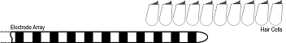

title: Projects

- ## **[EAS-Masking](https://www.vianna.de/01_workgroups/nogueira/projects/eas.html)**

- - -

- ## **[BINOM](https://www.vianna.de/01_workgroups/nogueira/projects/binom.html)** 
{style="float:right; margin-left:3em"}

- - -

- ## **[BINOM](https://www.vianna.de/01_workgroups/nogueira/projects/binom.html)** {style="float:right; margin-left:3em"}
- - -

- ## **[MusIC](https://www.vianna.de/01_workgroups/nogueira/projects/music.html)**

- - -

- ## **[DSA-CI](https://www.vianna.de/01_workgroups/nogueira/projects/dsaci.html)**    

- - -    
### Contact:
DHZ-Deutsches HörZentrum Hannover:

    Prof. Dr.-Ing. Waldo Nogueira
    Karl-Wiechert-Allee 3 
    30625 Hannover    
    
