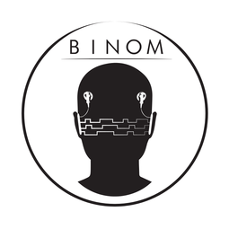

Title: Coding of Electrical Stimulation Patterns for Binaural Signal Processing in Cochlear Implants
## Coding of Electrical Stimulation Patterns for Binaural Signal Processing in Cochlear Implants

{.img-rounded; .float:center}

A cochlear implant (CI) is a small electronic device that is surgically implanted in the inner ear and can restore the sense of hearing of a profoundly deaf person by electrical
stimulation of the auditory nerve. Although nowadays speech intelligibility in quiet environments and even speech over the telephone represents no major problem for most CI users, speech intelligibility in noisy environments is still a major challenge. CI users need significantly higher Signal-to-Noise Ratios (SNRs) to achieve the same speech intelligibility as normal-hearing (NH) listeners. For this reason, binaural speech enhancement techniques have emerged to improve the SNR in noisy acoustic conditions by making use of the information captured by the microphones on both the left and the right ear. However, the transmission of the audio signals from one ear to the other needs to be done with low latency, low bitrates and a very high quality such that the binaural algorithms can improve speech performance in noise without unnecessarily decreasing the battery life of the devices. This project therefore is about designing a new codec that allows for such a transmission of signals while meeting the requirements mentioned. This enables the additionally aspired development of enhanced binaural signal processing strategies for CIs.

---

### Funding:
This project is funded by the German Research Foundation (DFG) - Project number: 381895691

---

### Budget:
445,800 €

---

| Contact                 |                            |
| ------------------------|--------------------------- |
| Head of Research Group:   |Prof. Dr.-Ing. Waldo Nogueira|
| Address:       | DHZ-Deutsches HörZentrum Hannover  Karl-Wiechert-Allee 3   30625 Hannover |
| Phone:                  | +49 (0)511 532 8025 |
| Fax:                    | +49 (0)511 532 6833 |
| E-Mail:                 |<nogueiravazquez.waldo@mh-hannover.de>|

---
    
### Publications:

- T. Gajecki, W. Nogueira. [Enhancement of Interaural Level Differences for Bilateral Cochlear Implant Users](https://www.sciencedirect.com/science/article/pii/S0378595521001477). Hearing Research, 2021.

- R. Hinrichs, T. Gajecki, J. Ostermann, W. Nogueira. [A Subjective and Objective Evaluation of a Codec for the Electrical Stimulation Patterns of Cochlear Implants](https://asa.scitation.org/doi/full/10.1121/10.0003571). The Journal of the Acoustical Society of America, 2020.

- T. Gajecki, W. Nogueira. [The Effect of Synchronized Linked Band Selection on Speech Intelligibility of Bilateral Cochlear Implant Users](https://www.sciencedirect.com/science/article/pii/S0378595520303221). Hearing Research, 2020.

- S. Tahmasebi, T. Gajecki, W. Nogueira. [Design and Evaluation of a Real-Time Audio Source Separation Algorithm to Remix Music for Cochlear Implant Users](https://www.frontiersin.org/articles/10.3389/fnins.2020.00434/full). Frontiers in Neuroscience, 2020.

- R. Hinrichs, T. Gajecki, J. Ostermann, W. Nogueira. [Coding of Electrical Stimulation Patterns for Binaural Sound Coding Strategies for Cochlear Implants](https://ieeexplore.ieee.org/document/8857271). IEEE EMBC, 2019.

- T. Gajecki, W. Nogueira. [A Synchronized Binaural N-of-M Sound Coding Strategy to Improve Speech Intelligibility in Noise of Bilateral Cochlear Implant Users](https://ieeexplore.ieee.org/document/8578042). ITG Speech Communication, 2018.

- T. Gajecki, W. Nogueira. [Deep Learning Models to Remix Music for Cochlear Implant Users](https://asa.scitation.org/doi/10.1121/1.5042056). The Journal of the Acoustical Society of America, 2018.

- W. Nogueira, T. Gajecki, B. Krüger, J. Janer, A. Büchner. [Development of a Sound Coding Strategy based on a Deep Recurrent Neural Network for Monaural Source Separation in Cochlear Implants](https://ieeexplore.ieee.org/document/7776166). ITG Speech Communication. Padeborn, Germany, 2016.
 
    

