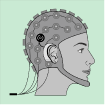
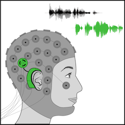

title: Closed-Loop Cochlear Implant

{.img-rounded; .float:center}

# Selective Attention Decoding

* Auditory selective attention: Focus on target speaker in background noise
* Cerebral cortex activity in delta (1-4 Hz) and theta (4-8 Hz) band tracks envelope of attended speech
* Envelope can be reconstructed based on single-trial electroencephalography (EEG)

{style="width:150px; float:right; margin-left:3em"}

Our EEG systems: 

* High-desity scalp EEG
* cEEGrid
* Invasive EEG

Future application: Neuro-steered cochlear implants (CIs)

# Objective Measures of Speech Perception

We are developing methods to investigate speech perception of CI users objectively through EEG. The ultimate goal of this project is to improve the fitting procedure of CIs, especially in children or disabled adults. We are using the following measures:

* Cortical Auditory Evoked Potential (CAEP)
* Acoustic Change Complex (ACC)
* Auditory Steady State Response (ASSR)

---

### Team Members:

* **[Hanna Dolhopiatenko](https://vianna.uber.space/01_workgroups/nogueira/staff/hanna.html)**
* **[Nina Aldag](https://vianna.uber.space/01_workgroups/nogueira/staff/nina.html)**
* **[Caroline Valim](https://vianna.uber.space/01_workgroups/nogueira/staff/caroline.html)**

---
   
### Publications:

* Aldag N, Büchner B,  Lenarz T, Nogueira W. (2022) **[Towards Decoding Selective Attention Through Cochlear Implant Electrodes as Sensors in Subjects with Contralateral Acoustic Hearing.](https://iopscience.iop.org/article/10.1088/1741-2552/ac4de6)** J. Neural Eng. 19 016023.

* Nogueira, W., Dolhopiatenko, H., Schierholz, I., Büchner, A., Mirkovic, B., Bleichner, M. G., & Debener, S. (2019).  **[Decoding selective attention in normal hearing listeners and bilateral cochlear implant users with concealed ear EEG. Frontiers in Neuroscience.](https://www.frontiersin.org/articles/10.3389/fnins.2019.00720/full)** Frontiers in Neuroscience, 13(JUL), 1–15. https://doi.org/10.3389/fnins.2019.00720

* Nogueira, W., Cosatti, G., Schierholz, I., Egger, M., Mirkovic, B., and Büchner, A. (2020).  **[Toward Decoding Selective Attention From Single-Trial EEG Data in Cochlear Implant Users.](https://ieeexplore.ieee.org/document/8674613)** IEEE Transactions on Biomedical Engineering, vol. 67, no. 1, pp. 38-49, Jan. 2020, doi: 10.1109/TBME.2019.2907638.

* Nogueira, W. and Dolhopiatenko, H. (2020). **[Towards Decoding Selective Attention from Single-Trial EEG Data in Cochlear Implant users based on Deep Neural Networks," ICASSP 2020 - 2020 IEEE International Conference on Acoustics.](https://ieeexplore.ieee.org/document/9054021)** Speech and Signal Processing (ICASSP), Barcelona, Spain, 2020, pp. 8708-8712, doi: 10.1109/ICASSP40776.2020.9054021.

---

| Contact                 |                            |
| ------------------------|--------------------------- |
| Head of Research Group: | Prof. Dr.-Ing. Waldo Nogueira|
| Address:       | DHZ-Deutsches HörZentrum Hannover  Karl-Wiechert-Allee 3   30625 Hannover |
| Phone:                  | +49 (0)511 532 8025 |
| Fax:                    | +49 (0)511 532 6833 |
| E-Mail:                 |<nogueiravazquez.waldo@mh-hannover.de>|

---
