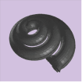
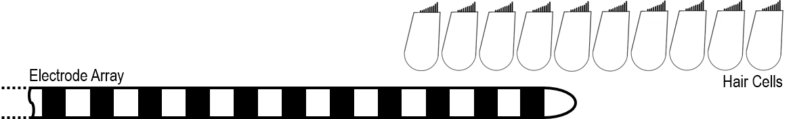
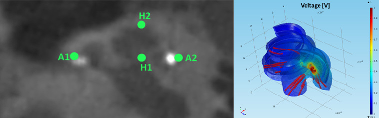

title: Electric Acoustic Stimulation

{.img-rounded; .float:left}

# Psychoacoustics in EAS users
* Investigation of psychoacoustic electric-acoustic masking for combined EAS
* The effect of ES on acoustic hearing if electric and acoustic stimuli are presented simultaneously.
* The effect of AS on electric hearing if electric and acoustic stimuli are presented simultaneously.

# Electrophysiological measurements in EAS users
* Electrophysiological measurements are used to examine electric-acoustic interaction in EAS users.
* Telemetry capabilities of the CI systems are used to derive intracochlear electrocochleography in EAS users.
* Cochlear microphonic (CM) and auditory nerve neurophonic (ANN) potentials, recorded in response to AS, ES, and in response to combined EAS are used to determine peripheral electric-acoustic interaction electrophysiologically.

# Sound coding for EAS users
* Development and evaluation of sound coding for EAS users conveying low-frequency information of speech electrically to improve the speech perception for ES alone.
* Investigation of EAS fittings to optimize speech perception for EAS users.

# Computational modeling for EAS
* Development of 3D models of the cochlea for ES and EAS
* Models of neural coding in auditory nerve fibers in response to ES, AS, and EAS
* Models of electrophysiological responses such as the electrically or acoustically evoked compound action potential to investigate the effect of electric-acoustic interaction on these measures
* Neural networks to emulate psychoacoustic experiments or speech perception of EAS users in different neural health conditions

# Binaural fusion of electric-acoustic stimulation 
* Investigation of central electic acoustic interaction through speech understanding performance and cortical EEG measurements;
* Investigataion of peripheral electric acoustic interaction through electric-acoustic pitch matching and measurment of auditory brainstem responses; 
* Optimization of the CI fitting  using the measurements of central and peripheral electric acoustic interaction. 

Abbreviations:
ES:          electric stimulation
AS:         acoustic stimulation
EAS:       electric-acoustic stimulation

---

### Team Members

* **[Benjamin Krüger](https://vianna.de/01_workgroups/nogueira/staff/benjamin.html)**
* **[Daniel Kipping](https://vianna.de/01_workgroups/nogueira/staff/daniel.html)**
* **[Hanna Dolhopiatenko](https://vianna.de/01_workgroups/nogueira/staff/hanna.html)**

---
### Publications

* **[A computational model of a single auditory nerve fiber for electric-acoustic stimulation]()** 
 D. Kipping, W. Nogueira (Under Review). Submitted to the Journal of the Association for Research in Otolaryngology (JARO) in 9/2021.
* D. Kipping, B. Krüger, W. Nogueira (2020), **[The role of electroneural versus electrophonic stimulation on psychoacoustic electric-acoustic masking in cochlear implant users with residual hearing](https://www.sciencedirect.com/science/article/pii/S0378595520303075?via%3Dihub)**.  Hearing Research 395, 108036. 
* W. Nogueira, B. Krüger, A. Büchner, E. Lopez-Poveda (2018),**[Contralateral suppression of human hearing sensitivity in single-sided deaf cochlear implant users.](https://www.sciencedirect.com/science/article/pii/S0378595517305671?via%3Dihub)**. Hearing Research 2019 Mar 1;373:121-129. doi: 10.1016/j.heares.2018.06.001. Epub 2018 Jun 15.
* M. Imsiecke, B. Krüger, A. Büchner, T. Lenarz, W. Nogueira (2018), **[Electric-acoustic forward masking in cochlear implant users with ipsilateral residual hearing.](https://www.sciencedirect.com/science/article/pii/S0378595517305026?via%3Dihub)**. Hearing Research, Hear Res. 2018 Jul;364:25-37. doi: 10.1016/j.heares.2018.04.003. Epub 2018 Apr 9.
* B. Krüger, A. Büchner, W. Nogueira (2017), **[Simultaneous masking between electric and acoustic stimulation in cochlear implant users with residual low-frequency hearing.](http://www.sciencedirect.com/science/article/pii/S0378595517300424?via%3Dihub)**. Hearing Research, https://doi.org/10.1016/j.heares.2017.06.014.

---

| Contact                 |                            |
| ------------------------|--------------------------- |
| Head of Research Group:   | Prof. Dr.-Ing. Waldo Nogueira|
| Address:       | DHZ-Deutsches HörZentrum Hannover  Karl-Wiechert-Allee 3   30625 Hannover |
| Phone:                  | +49 (0)511 532 8025 |
| Fax:                    | +49 (0)511 532 6833 |
| E-Mail:                 |<nogueiravazquez.waldo@mh-hannover.de>|

---
