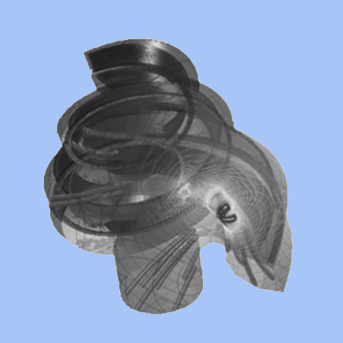
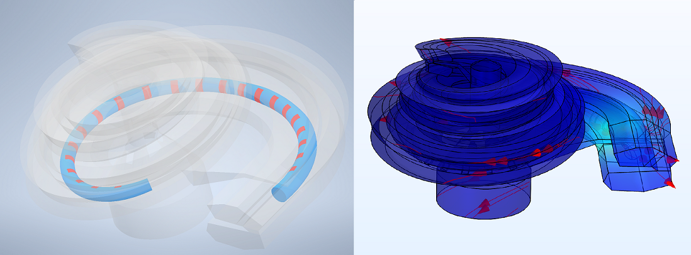
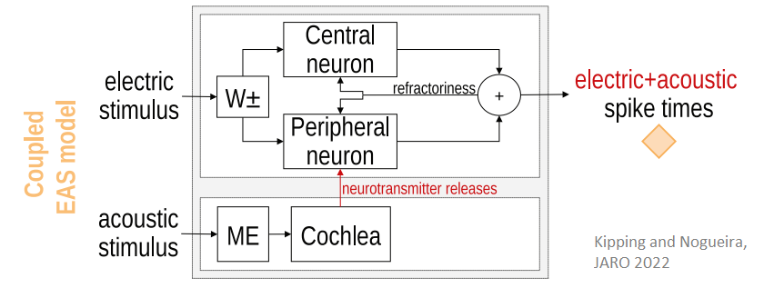

title: Computational Modelling

{.img-rounded; .float:left}  

---

# Topics:

---

##  3D FEM Model of a Human Cochlea and a Cochlear Implant
- 3D finite element method (FEM) models of human cochleae to simulate the voltage distribution in the cochlea when stimulating with a cochlear implant (CI)
- The 3D model can be customized based on landmarks from CBCT imaging data to represent individual patients
- Voltage distributions can be used to study the activation of the auditory nerve by a CI   

{.img-rounded; .float:left}  

---

##  3D FEM Model of Auditory Nerve and Auditory Nerve Implant
- 3D FEM model of a human cochlea and auditory nerve to predict the voltage spread with the novel auditory nerve implant (ANI)
- The ANI delivers intraneural stimulation to the auditory nerve through penetrating electrodes   

---

## Auditory Nerve Fiber models
- Phenomenological and physiological models of auditory nerve fibers stimulated acoustically, electrically, or with **[electric-acoustic stimulation (EAS)](https://vianna.de/01_workgroups/nogueira/research/eas.html)**
- Neuron models can be coupled to FEM models for realistic current input

{.img-rounded; .float:left} 

---

## Electrophysiology and Neural Health
- Models of neural degeneration to study the effect on thresholds, evoked potentials, or signal transmission 
- A model of the acoustically or electrically evoked compound action potential (aCAP/eCAP) measured through intracochlear electrodes  

---

## Auditory Experiments Simulations
- Computational models to simulate performance of cochlea implant users in different auditory experiments
- Objective measurements of speech intelligibility from neural spike activity

---

# Team members
- **[Daniel Kipping](https://vianna.de/01_workgroups/nogueira/staff/daniel.html)**
- **[Franklin Alvarez](https://vianna.de/01_workgroups/nogueira/staff/franklin.html)**
- **[Yixuan Zhang](https://vianna.de/01_workgroups/nogueira/staff/zhang.html)**

---

# Publications
- Nogueira et al., 2016. **[Validation of a Cochlear Implant Patient-Specific Model of the Voltage Distribution in a Clinical Setting](https://doi.org/10.3389/fbioe.2016.00084)**. Front. Bioeng. Biotechnol. 4, 1–16. 
- Jürgens et al., 2018. **[The effects of electrical field spatial spread and some cognitive factors on speech-in-noise performance of individual cochlear implant users - A computer model study](https://doi.org/10.1371/journal.pone.0193842)**. PLoS One 13, e0193842. 
- Ashida and Nogueira, 2018. **[Spike-Conducting Integrate-and-Fire Model](https://doi.org/10.1523/ENEURO.0112-18.2018)**. eneuro 5, ENEURO.0112-18.2018. 
- Kipping and Nogueira, 2022. **[A computational model of a single auditory nerve fiber for electric-acoustic stimulation.](https://doi.org/10.1007/s10162-022-00870-2)** J. Assoc. Res. Otolaryngol. 23, 835-858. Source code: [Zenodo](https://doi.org/10.5281/zenodo.5467990) or [GitHub](https://github.com/APGDHZ/Single-fiber-EAS-model/releases/tag/v1.0.2).
- Alvarez et al., 2023. **[A Computational Model to Simulate Spectral Modulation and Speech Perception Experiments of Cochlear Implant Users](https://www.frontiersin.org/journals/neuroinformatics/articles/10.3389/fninf.2023.934472/full)**. Frontiers in Neuroinformatics.
- Kipping et al., 2024. **[A Computational Model of the Electrically or Acoustically Evoked Compound Action Potential in Cochlear Implant Users with Residual Hearing](https://arxiv.org/abs/2402.07673)**. IEEE Transactions on Biomedical Engineering (under review). Source code: [Zenodo](https://zenodo.org/records/10619893) or [GitLab](https://gitlab.gwdg.de/apg/eas-cap-model-2024).
- Zhang et al., 2025: **[Evaluating electrophysiological and behavioral measures of neural health in cochlear implant users: a computational simulation study](
https://ieeexplore.ieee.org/document/11023559)**. IEEE Transactions on Biomedical Engineering. Data available: [GitLab](https://gitlab.gwdg.de/apg/neural-health).
- Alvarez et al., 2025. **[A computational loudness model for electrical stimulation with cochlear implants.](https://doi.org/10.48550/arXiv.2501.17640)** 
