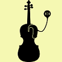

title: Music and Cochlear Implants

{.img-rounded; .float:center}

# MusIC: Making Music More Accessible for Cochlear Implant Users

- Enhancing the signing voice of music to improve music appreciation for CI users
- Real-time music source separation to apply enhancement on singing voice
- Parametrization of CI sound coding strategies for singing music
- Sound Coding Strategy for music

## Music Source Separation Using Deep Neural Networks:

Music samples of the Real-time Music Source Separation experiment. 
In this experiment a multilayer perceptron has been used to separate the singing voice from the instrumental accompaniment to remix the music track. It has been shown that CI users enjoy music more, when the singing voice is enhanced with respect to the background instruments. Our results indicate that CI users enjoy music more when the singing voice is 8 dB enhanced with respect to the background accompaniment.

### Audio Example: 

Below is a demo of the music tracks used in this experiment.

| Music Track |       Example 1 |  Example 2 |  
|:----------------------------|:----------------------------|----------------------------:|
|Original Mixture | <audio controls><source src="/__downloads/apg/original.mp3" type="audio/mpeg"> Your browser.</audio>| <audio controls><source src="/__downloads/apg/originalsec.mp3" type="audio/mpeg"> Your browser.</audio>| 
|Enhanced Mixture | <audio controls><source src="/__downloads/apg/enhanced.mp3" type="audio/mpeg"> Your browser.</audio>| <audio controls><source src="/__downloads/apg/enhancedsec.mp3" type="audio/mpeg"> Your browser.</audio>|
|Vocals Signal | <audio controls><source src="/__downloads/apg/speech.wav" type="audio/mpeg"> Your browser.</audio>| <audio controls><source src="/__downloads/apg/speechsec.mp3" type="audio/mpeg"> Your browser.</audio>|
|Instruments Signal | <audio controls><source src="/__downloads/apg/instruments.mp3" type="audio/mpeg"> Your browser.</audio>| <audio controls><source src="/__downloads/apg/instrumentsec.mp3" type="audio/mpeg"> Your browser.</audio>|

---

# Music4u: Objective Deep Learning Models to Make Music More Accessible for Cochlear Implant Users  

* Difficult to enjoy complex music as i.e. classical pieces for CI-users.
* Investigating, which musical component (i.e. melody) in instrumental classical music CI-users want to enhance.
* Testing, if selective attention decoding is possible for CI-users.
* Feeding EEG-data into neural networks to enhance source separation of attended sound source.
* **[Funding: German Research Foundation (DFG, Germany), 2021-2024](https://gepris.dfg.de/gepris/projekt/446611346?language=en)**

---

### Team Members
* **[Tom Gajecki](https://www.vianna.de/01_workgroups/nogueira/staff/tom.html)**
* **[Sina Tahmasebi](https://www.vianna.de/01_workgroups/nogueira/staff/sina.html)**
* **[Jonas Althoff](https://www.vianna.de/01_workgroups/nogueira/staff/Jonas.html)**

---

### Publications:
    
- S. Tahmasebi, T. Gajȩcki, W. Nogueira. **[Design and Evaluation of a Real-Time Audio Source Separation Algorithm to Remix Music for Cochlear Implant Users.](https://www.frontiersin.org/articles/10.3389/fnins.2020.00434/full)** Frontiers in Neuroscience. 14, 434. doi: 110.3389/fnins.2020.00434. Epub 2020 May 14.  

- W. Nogueira, A.  Nagathi, R. Martin. **[Making Music More Accessible for Cochlear Implant Listeners: Recent Developments.](https://ieeexplore.ieee.org/abstract/document/8588408)**, in IEEE Signal Processing Magazine, vol. 36, no. 1, pp. 115-127, Jan. 2019, doi: 10.1109/MSP.2018.2874059.

- T. Gajęcki, W. Nogueira. **[Deep learning models to remix music for cochlear implant users.](https://asa.scitation.org/doi/full/10.1121/1.5042056)**, The Journal of the Acoustical Society of America, 143(6), 3602-3615. June 2018.

- J. Pons, J. Janer, T. Rode, W. Nogueira. **[Remixing music using source separation algorithms to improve the musical experience of cochlear implant users](https://asa.scitation.org/doi/full/10.1121/1.4971424)**, The Journal of the Acoustical Society of America, 140(6), 4338-4349. December 2016.

    
---

| Contact                 |                            |
| ------------------------|--------------------------- |
| Head of Research Group:           | Prof. Dr.-Ing. Waldo Nogueira |
| Address:       | DHZ-Deutsches HörZentrum Hannover  Karl-Wiechert-Allee 3   30625 Hannover |
| Phone:                  | +49 (0)511 532 8025 |
| Fax:                    | +49 (0)511 532 6833 |
| E-Mail:                 |<nogueiravazquez.waldo@mh-hannover.de>|

---
    
