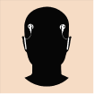
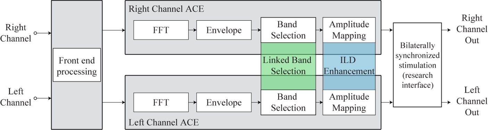
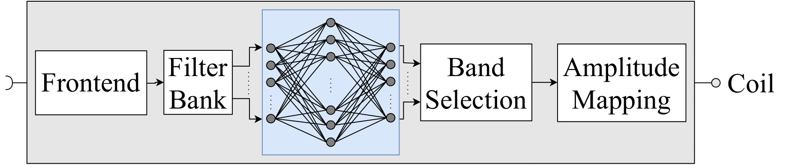

title: Signal Processing for Cochlear Implants

  

## Binaural Signal Processing

* Binaural signal processing strategies to improve speech intelligibility and sound localization
* Coding of electrical stimulation patterns for bilateral wireless communication
* Investigation of the effect bilaterally synchronized electrical stimulation
* Enhancement of interaural cues to improve spatial hearing
* Binaural speech processing based on deep learning models

  

## Deep Learning

* Automatic singing voice enhancement based on deep neural networks
* Real-time music processing to improve music perception
* End-to-end cochlear implant speech coding and denoising strategies
* Classical music remixing using multi-head neural networks
* Brain-informed music source separation

  

---
### Team Members
* **[Tom Gajecki](https://vianna.uber.space/01_workgroups/nogueira/staff/tom.html)**
* **[Sina Tahmasebi](https://vianna.uber.space/01_workgroups/nogueira/staff/sina.html)**
---

### Publications:

- T. Gajecki, Yichi Zhang, W. Nogueira. [A Deep Denoising Sound Coding Strategy for Cochlear Implants.]() IEEE Transactions on Biomedical Engineering, 2022 (Under review).

- T. Gajecki, W. Nogueira. [Deep Latent Fusion Layers for Binaural Speech Enhancement.](https://www.techrxiv.org/articles/preprint/Deep_Latent_Fusion_Layers_for_Binaural_Speech_Enhancement/21215378) IEEE Transactions on Speech and Language Processing, 2022 (Under review).

- T. Gajecki, W. Nogueira. [An End-to-End Deep Learning Speech Coding and Denoising Strategy for Cochlear Implants](https://www.biorxiv.org/content/10.1101/2021.11.04.467324v10.full.pdf). International Conference on Acoustics, Speech, & Signal Processing (ICASSP), 2022.

- T. Gajecki, W. Nogueira. [Enhancement of Interaural Level Differences for Bilateral Cochlear Implant Users](https://www.sciencedirect.com/science/article/pii/S0378595521001477). Hearing Research, 2021.

- R. Hinrichs, T. Gajecki, J. Ostermann, W. Nogueira. [A Subjective and Objective Evaluation of a Codec for the Electrical Stimulation Patterns of Cochlear Implants](https://asa.scitation.org/doi/full/10.1121/10.0003571). The Journal of the Acoustical Society of America, 2020.

- T. Gajecki, W. Nogueira. [The Effect of Synchronized Linked Band Selection on Speech Intelligibility of Bilateral Cochlear Implant Users](https://www.sciencedirect.com/science/article/pii/S0378595520303221). Hearing Research, 2020.

- S. Tahmasebi, T. Gajecki, W. Nogueira. [Design and Evaluation of a Real-Time Audio Source Separation Algorithm to Remix Music for Cochlear Implant Users](https://www.frontiersin.org/articles/10.3389/fnins.2020.00434/full). Frontiers in Neuroscience, 2020.

- R. Hinrichs, T. Gajecki, J. Ostermann, W. Nogueira. [Coding of Electrical Stimulation Patterns for Binaural Sound Coding Strategies for Cochlear Implants](https://ieeexplore.ieee.org/document/8857271). IEEE EMBC, 2019.

- T. Gajecki, W. Nogueira. [A Synchronized Binaural N-of-M Sound Coding Strategy to Improve Speech Intelligibility in Noise of Bilateral Cochlear Implant Users](https://ieeexplore.ieee.org/document/8578042). ITG Speech Communication, 2018.

- T. Gajecki, W. Nogueira. [Deep Learning Models to Remix Music for Cochlear Implant Users](https://asa.scitation.org/doi/10.1121/1.5042056). The Journal of the Acoustical Society of America, 2018.

- W. Nogueira, T. Gajecki, B. Krüger, J. Janer, A. Büchner. [Development of a Sound Coding Strategy based on a Deep Recurrent Neural Network for Monaural Source Separation in Cochlear Implants](https://ieeexplore.ieee.org/document/7776166). ITG Speech Communication. Padeborn, Germany, 2016.

---

| Contact                 |                            |
| ------------------------|--------------------------- |
| Head of Research Group:   |Prof. Dr.-Ing. Waldo Nogueira|
| Address:       | DHZ-Deutsches HörZentrum Hannover  Karl-Wiechert-Allee 3   30625 Hannover |
| Phone:                  | +49 (0)511 532 8025 |
| Fax:                    | +49 (0)511 532 6833 |
| E-Mail:                 |<nogueiravazquez.waldo@mh-hannover.de>|

---
