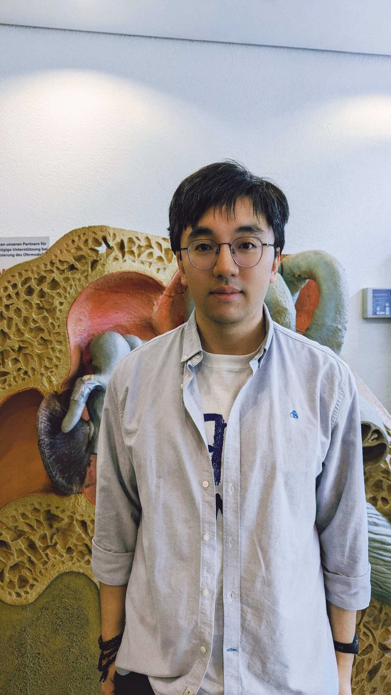

title: Yixuan Zhang

Research employee	

**Research and Interests**

* Computational modeling - finite element simulation of electrically stimulated human cochlea
* Models of the auditory periphery
* Auditory nerve fiber - neural health estimation
* Cochlear implant (CI) focused stimulation

---

### Funding
* Deutsche Forschungsgemeinschaft (DFG, German Research Foundation) – SFB/TRR-298-SIIRI – Project-ID 426335750
* European Research Council (ERC): Rehabilitation and Diagnosis of Hearing Loss based on Electric Acoustic Interaction (ReadiHear), 
  Project number: 101044753

---

### Publications
### Peer-reviewed Journal Publications:
- Y. Zhang, D. Kipping, W. Nogueira (2024): **[Evaluating electrophysiological and behavioral measures of neural health in cochlear implant users: a computational simulation study](
https://doi.org/10.48550/arXiv.2409.14767)**. IEEE Transactions on Biomedical Engineering (Under review). Data avaliable: [GitLab](https://gitlab.gwdg.de/apg/neural-health).

- D. Kipping, Y. Zhang, W. Nogueira (2024): **[A Computational Model of the Electrically or Acoustically Evoked Compound Action Potential in Cochlear Implant Users with Residual Hearing](https://doi.org/10.1109/tbme.2024.3410686)**. IEEE Transactions on Biomedical Engineering. Source code: [Zenodo](https://zenodo.org/records/10619893) or [GitLab](https://gitlab.gwdg.de/apg/eas-cap-model-2024).

### Conference contributions (first author):
- Y. Zhang, F. Alvarez, D. Kipping,  W. Nogueira (2023): [**A 3D computational model framework of the stimulated peripheral auditory system**](https://computationalaudiology.com/a-3d-computational-model-framework-of-the-stimulated-peripheral-auditory-system/). Virtual Conference on Computational Audiology(VCCA2024).

### Supervision of students

- Y. Xi (2024): **Optimization and validation of an electrical
stimulated 3D model of the human inner**. Srudent research project. Supervisor: Y. Zhang. Examiners: Prof. P. Junker & Prof. W. Nogueira.

---

| Contact                 |                            |
| ------------------------|--------------------------- |
| Research employee:           | Yixuan Zhang|
| Address:       | DHZ-Deutsches HörZentrum Hannover  Karl-Wiechert-Allee 3   30625 Hannover |
| Phone:                  | +49 (0)511 532 8397 |
| Fax:                    | +49 (0)511 532 6833 |
| E-Mail:                 |<Zhang.Yixuan@mh-hannover.de>|

---
