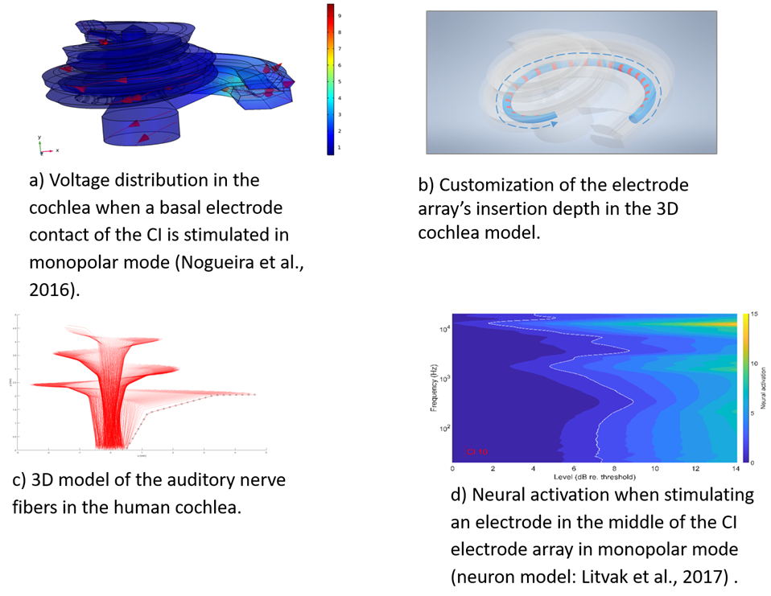

title: Technologies

- - -

##  3D computational model of the electrically excited human cochlea

  

This 3D numerical model of a human cochlea is based on finite element method (FEM) simulations. The FEM model simulates the electric voltage distribution in the cochlea when stimulating with a cochlear implant (CI) in the scala tympani (a). Based on the several landmarks from clinical imaging data, this 3D framework can be customized to represent individual patients (b). The 3D FEM model and the auditory nerve model can be adapted based on the size of the patient’s cochlea and the location of the CI electrode array inside the scala tympani. The results help us to study how the auditory nerve (c) is activated by the CI. Various types of neuron models can be coupled to the FEM model for this purpose (d). Moreover, we investigate how signals originating from the auditory nerve can be recorded through the CI to estimate the nerve’s health. 

- - -

##  DeHoCI Simulator

{style="float:right; margin-left:3em"}

DeHoCI Simulator ver 0.0 is a software tool that can be used by any professional in the field of Cochlear Implants to understand how a cochlear implant works. DeHoCI offers the possibility to simulate the sound a cochlear implant user perceives. Sound is synthesized from the electrical patterns delivered by a Cochlear Implant device.

Additionally DeHoCI incorporates a simulator of the electrical field and the auditory nerve in the cochlea  that allows the visualization of stimulation patterns.

This software tool has been implemented in MATLAB unfortunately, but still can be run as a standalone application.

---

## MusIC4allApp1.0

{style="float:right; margin-left:3em; width:200px;"}

[Prof. Dr.-Ing. Waldo Nogueira](nogueira.md)

The App offers an original method to listen and interact with new music compositions for cochlear implants. It has been developed for Android operating system and  can be downloaded from Google Play.

- - -

## MusIC4allApp2.0

[Prof. Dr.-Ing. Waldo Nogueira](nogueira.md)

This version of the App is under development. 

- - -

## Open source algorithms & models

GitHub repositories for different projects carried out at the APG.

| Paper                   |Repository                  |
| ------------------------|--------------------------- |
|Gajecki et.al., 2022 | Deep ACE 2.0 (comming soon)|
|Gajecki & Nogueira, 2022 | [Deep Fusion Layers](https://github.com/APGDHZ/FusionLayers)|
|Alvarez & Nogueira, 2022 | [SAMII](https://github.com/APGDHZ/clarity_CC_SAMII)|
|Kipping & Nogueira, 2022 | [Single-fiber EAS model](https://github.com/APGDHZ/Single-fiber-EAS-model)|
|[Gajecki & Nogueira, 2022](https://ieeexplore.ieee.org/document/9746963)| [Deep ACE 1.0](https://github.com/APGDHZ/DeepACE)
|[Nogueira & Dolhopiatenko, 2020](https://ieeexplore.ieee.org/document/9054021)| [Selective attention DNN](https://github.com/APGDHZ/SelectiveAttentionDNN)|
|[Langner et. al., 2020](https://www.sciencedirect.com/science/article/pii/S0378595520303622?via%3Dihub)| [Loudness model](https://github.com/APGDHZ/LoudnessModel)|

---

| Contact                 |                            |
| ------------------------|--------------------------- |
| Head of Research Group:           | Prof. Dr.-Ing. Waldo Nogueira|
| Address:       | DHZ-Deutsches HörZentrum Hannover  Karl-Wiechert-Allee 3   30625 Hannover   Deutschland |
| Phone:                  | +49 (0)511 532 8025 |
| Fax:                    | +49 (0)511 532 6833 |
| E-Mail:                 |<nogueiravazquez.waldo@mh-hannover.de>|

---

