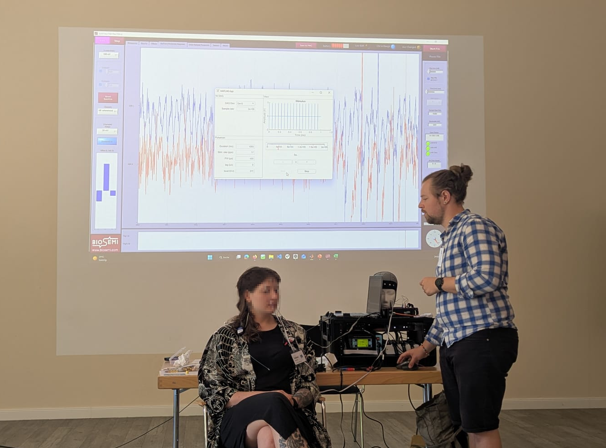
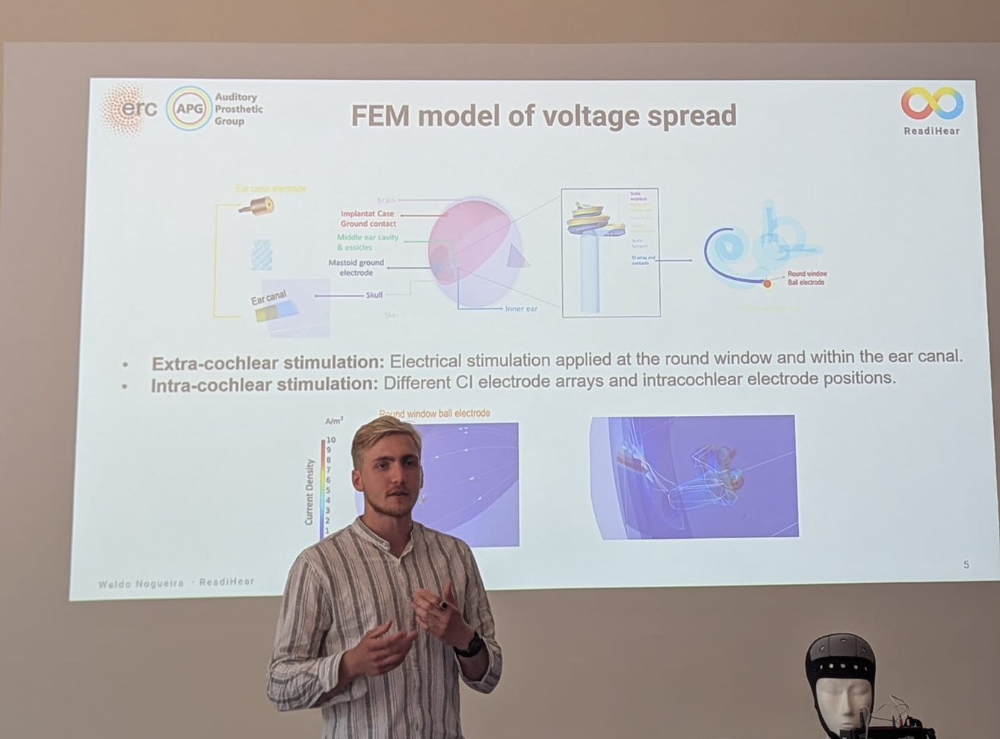

title: Workshops
---

## Readistim: Research Platform for Non-Invasive and Minimally Invasive Electrical–Acoustic Stimulation and Electrophysiological Recording
_(Patrick Hinz, June 24th 2026, Visselhövede)_
 

### Description:
READISTIM is a versatile research and diagnostic platform for simultaneous electrical and acoustic stimulation combined with electrophysiological recordings. The system enables the investigation of residual hearing using both non-invasive and minimally invasive stimulation approaches, including ear-canal electrodes and trans-tympanic promontory or round-window stimulation. Integrated recording methods such as auditory brainstem responses (ABRs) provide objective measures of auditory function, making the platform suitable for studies involving adults, children, and newborns. Its modular and mobile design allows flexible use in laboratories, clinics, and operating rooms.

### Application Areas:
- Clinical Diagnostics and Rehabilitation  
Pre-, intra-, and post-operative assessment of patients with residual hearing and candidates for electric acoustic stimulation (EAS).

- Pediatric and Newborn Hearing Assessment  
Objective investigation of auditory function in populations where behavioral hearing tests are difficult or impossible.

- Hearing Research and Technology Development  
Evaluation of new stimulation paradigms, electrode concepts, and diagnostic procedures for hearing preservation and restoration.

- Medical Education and Training  
Hands-on teaching platform for students and clinicians to learn electrical and acoustic stimulation techniques and electrophysiological measurements.

- Prototype Development and Translational Research  
Testbed for future diagnostic and rehabilitation devices with improved portability, flexibility, and functionality.

 
_Funding was provided by the European Research Council (ERC): Rehabilitation and Diagnosis of Hearing Loss based on Electric Acoustic Interaction (ReadiHear), Project number: 101044753_

 

## PAMEAS: A computational model framework of auditory nerve activity with acoustic and electric stimulation
_(Roman Stracke, Yixuan Zhang, June 24th 2026, Visselhövede)_
 

### Description:
The Peripheral Auditory Model for Electric-Acoustic Stimulation (PAMEAS) is a computational model framework that serves as a platform for exploring the fundamental interactions between acoustic and electric stimulation in the human cochlea. The workshop included a demonstration of the PAMEAS framework in its functionality, including features as peri-stimulus time histogram estimation, compound action potential estimation, and electrocochleography estimation for both acoustic and electric stimulation. In addition to a theoretical overview, a hands-on tutorial on how to run simple simulations within the framework was provided.

### Application Areas:
- Prediction of auditory nerve activity
- Estimation of electric-acoustic interaction
- Validating cochlear implant sound coding strategies

 
_Funding was provided by the European Research Council (ERC): Rehabilitation and Diagnosis of Hearing Loss based on Electric Acoustic Interaction (ReadiHear), Project number: 101044753_

 

| Contact                 |                            |
| ------------------------|--------------------------- |
| Head of Research Group:           | Prof. Dr.-Ing. Waldo Nogueira|
| Address:       | DHZ-Deutsches HörZentrum Hannover  Karl-Wiechert-Allee 3   30625 Hannover   Deutschland |
| Phone:                  | +49 (0)511 532 8025 |
| Fax:                    | +49 (0)511 532 6833 |
| E-Mail:                 |<nogueiravazquez.waldo@mh-hannover.de>|

---
