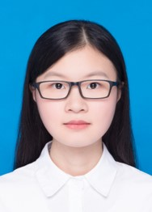
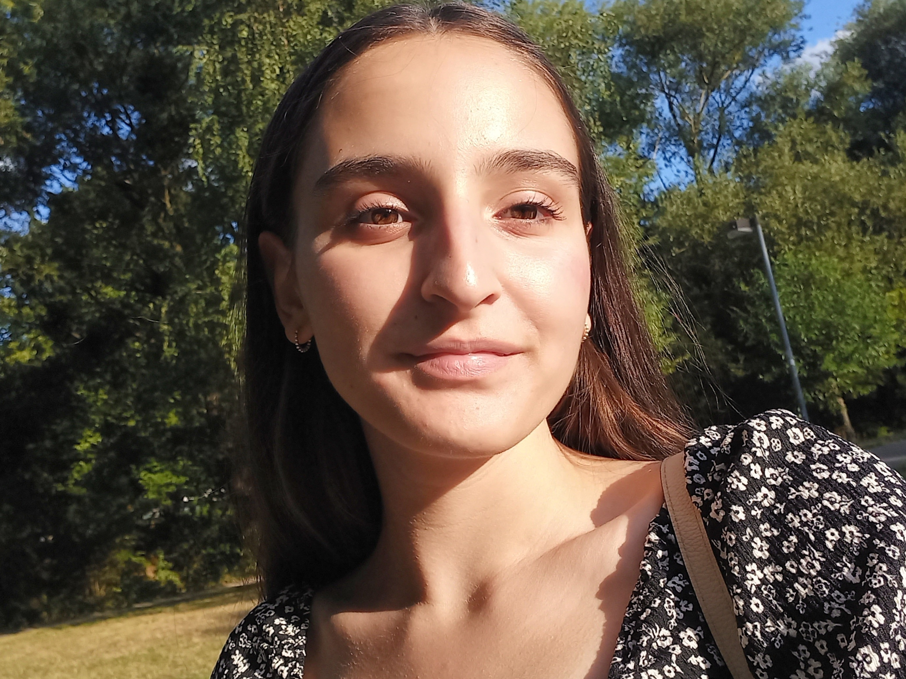

title: Staff

|Head of research group|        |   |   |
|--------------|:---------------|----|----|
||Privatdozentin Dr. med. vet. Verena Scheper |Scheper.verena@mh-hannover.de| +49 (0)511 532 4369 |

|Technical Staff|                     |      |    +49 (0)511 -  |
|--------------|:---------------------|------|-----|
|   |Name| E-Mail|Extension|
| | Michaela Kreinenmeyer	|	Kreinemeyer.Michaela@mh-hannover.de | 532 1525|

|Research Team  |    |  | +49 (0)511 - |
|---------|:------|------|-----|
|   |Name| E-Mail|Extension|
|  |Jana Schwieger, Dr. med. vet., Postdoc | Schwieger.jana@mh-hannover.de|532 7262|
|  |  PD Dr. Farnaz Matin-Mann, MD|	Matin-Mann.Farnaz@mh-hannover.de| 17 7443| 
|  | Marleen Grzybowski, M.Sc.| Grzybowski.Marleen@mh-hannover.de | 532 4192|
|  | Martina Knabel, M.Sc.| Knabel.Martina@mh-hannover.de | 532 1464 |
|   | Chunjiang Wei, M.Sc., PhD Student  	|	Wei.chunjiang@mh-hannover.de | 532 1464|
|  |  Yanjing Luo, M.Sc. PhD student|	Yanjing.luo@mh-hannover.de| 532 7262| 

|FWJ|                     |      |    +49 (0)511 -  |
|--------------|:---------------------|------|-----|
|   |Name| E-Mail|Extension|
| | Angeliki Tsioska | Tsioska.Angeliki@mh-hannover| 532 1529|

We closely work together with Prof. Dr. med. A. Warnecke and Prof. Dr. rer. nat. G. Paasche and their lab teams. In VIANNA in NIFE we optimise our research by combining our lab spaces and other recources. 

**The team of all three working groups (not complete):** 
  
