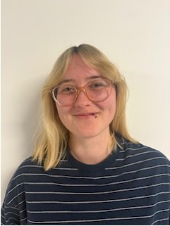
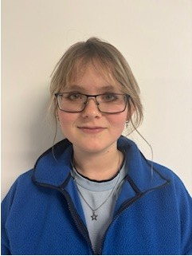

title: Staff

|Head of research group|    |      |           |
|:--|:---------------|:----|----:|
|{style="width:150px"}|Professor Dr. med. vet.  Verena Scheper |Scheper.verena@mh-hannover.de|+49 (0)511 532 4369 |

|Technical Staff|Name|E-Mail|+49 (0)511-|
|:--|:---------------|:----|----:|
|{style="width:150px"}|Michaela Kreiennmeyer |Kreienmeyer.Michaela@mh-hannover.de|532 7262|

|Research Team|Name|E-Mail|+49 (0)511-|
|:--|:---------------|:----|----:|
|{style="width:150px"}|Marleen Grzybowski, M.Sc.|Grzybowski.Marleen@mh-hannover.de|532 7262 |
|{style="width:150px"}|Martina Knabel, M.Sc.|Knabel.Martina@mh-hannover.de|532 1538|

|FWJ|Name|E-Mail|+49 (0)511-|
|:--|:---------------|:----|----:|
|{style="width:150px"}|Summer Prickschat|Prickschat.Summer@mh-hannover.de|532 1538|
|{style="width:150px"}|Priska Fleischer|Fleischer.Priska@mh-hannover.de|532 1538|

We closely work together with Prof. Dr. med. A. Warnecke and Prof. Dr. rer. nat. G. Paasche and their lab teams. In VIANNA in NIFE we optimise our research by combining our lab spaces and other recources. 

**The team of all three working groups (not complete):** 

  
