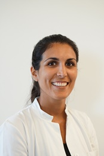

title: Staff

|Head of research group|        |   |
|--------------|:---------------|----|
| |[Dr. med. vet. Verena Scheper](Dr. med. vet. Verena Scheper.html)|	scheper.verena(at)mh-hannover.de|   

|Technical Staff|                     |      |    +49 (0)511 -  |
|--------------|:---------------------|------|-----|
|   |Name| EMail|Extension|
| | Nina Armbrecht	|	armbrecht.nina(at)mh-hannover.de     | 532 1464|

|Research Team  |    |  | +49 (0)511 - |
|---------|:------|------|-----|
|   |Name| EMail|Extension|
|  | Ziwen Gao, M.Sc. 	|	gao.ziwen(at)mh-hannover.de | 532 7262|
|  |Jana Schwieger, Dr. med. vet. | schwieger.jana(at)mh-hannover.de|532 7262|
|    | Melanie Steffens, Dr. rer. nat. | steffens.melanie(at)mh-hannover.de|532 9494 |
| |  Farnaz Matin, MD|	Matin.Farnaz(at)mh-hannover.de| 17 7443   

|  Students   ||
|-----------|-------------|
|   |Name| EMail|
|Christoph Pannier| Dentist, PhD student|pannier.christoph(at)mh-hannover.de|
|Noushin Kakuan| PhD Student, MD student|noushin.t.kakuan(at)stud.mh-hannover.de|
|Katarina Klötzer| PhD Student, MD student|noushin.t.kakuan(at)stud.mh-hannover.de|

title: staff

**Head of research group**

Dr. med. vet. Verena Scheper, Veterinarian| scheper.verena(at)mh-hannover.de

---------------------------
**Research Team**

Dr. med vet. Jana Schwieger, Veterinarian | schwieger.jana(at)mh-hannover.de

Christoph Pannier, Dentist, PhD student | pannier.christoph(at)mh-hannover.de

Noushin Kakuan, PhD Student, MD student | noushin.t.kakuan(at)stud.mh-hannover.de

Katarina Klötzer, PhD Student, MD student 

Lennart Ryll, FWJ | ryll.lennart(at)mh-hannover.de

-----------------------------

We closely work together with Prof. A. Warnecke and Dr. Paasche and their lab teams. In VIANNA in NIFE we optimise our research by combining our lab spaces and other recources. 

**The team of all three working groups (not complete):** 
  
