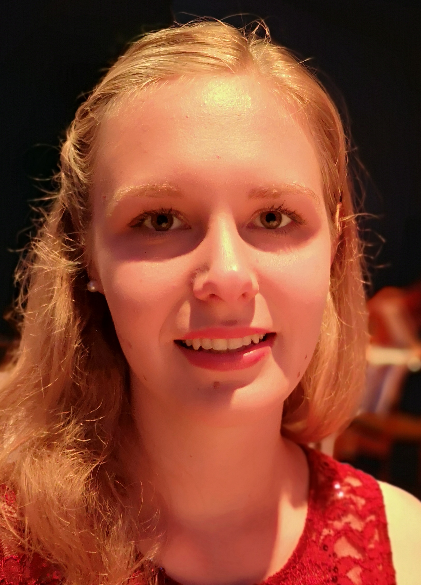
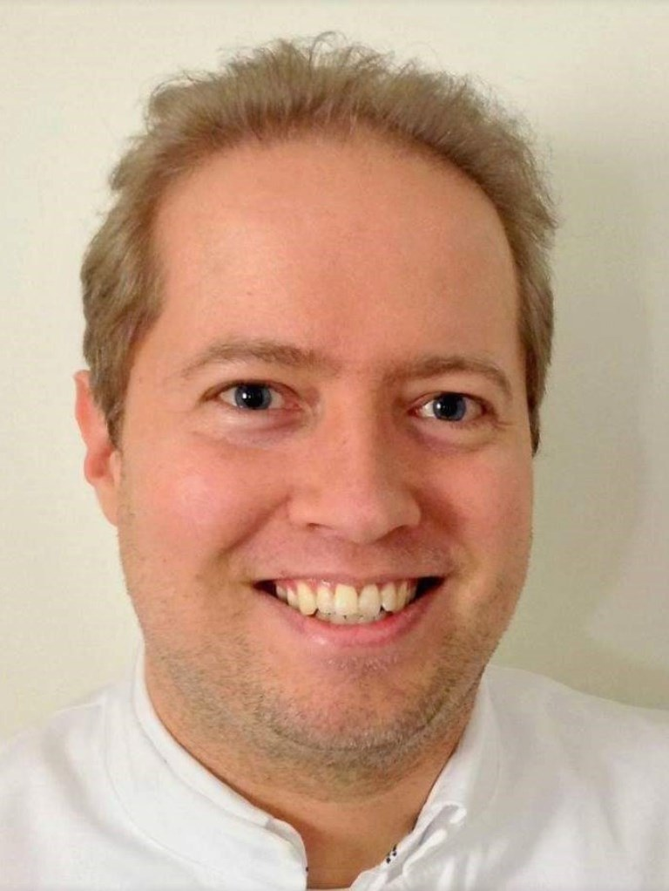

title: Staff

|Head of research group|        |   |
|--------------|:---------------|----|
| |[Privatdozentin Dr. med. vet. Verena Scheper](Dr. med. vet. Verena Scheper.html)|	Scheper.verena(at)mh-hannover.de|   

|Technical Staff|                     |      |    +49 (0)511 -  |
|--------------|:---------------------|------|-----|
|   |Name| EMail|Extension|
| | Nina Armbrecht	|	Armbrecht.nina(at)mh-hannover.de     | 532 1529|

|Research Team  |    |  | +49 (0)511 - |
|---------|:------|------|-----|
|   |Name| EMail|Extension|
|  | Ziwen Gao, M.Sc., PhD Student  	|	Gao.ziwen(at)mh-hannover.de | 532 7262|
|  |Jana Schwieger, Dr. med. vet. | Schwieger.jana(at)mh-hannover.de|532 7262|
|   | Kathrin Anja Malfeld, veterinarian, PhD Student |  Malfeld.Kathrin@mh-hannover.de |532 1529 |
|     |  Farnaz Matin, MD|	Matin.Farnaz(at)mh-hannover.de| 17 7443|   
|     |  Claas-Tido Peck, M.Sc.|	Peck.Claas-Tido(at)mh-hannover.de| 1538| 

|  Students   ||
|-----------|-------------|
|Name| EMail|
|Christoph Pannier, Dentist, PhD student|Pannier.christoph(at)mh-hannover.de|
|Noushin Kakuan, PhD Student, MD student|Noushin.t.kakuan(at)stud.mh-hannover.de|
|Katarina Klötzer, PhD Student, MD student|
|Katarina-Sophie Jung, PhD Student, MD student|
|Maciek Wilk, veterinarian, PhD Student|

We closely work together with PD Dr. med. A. Warnecke and PD Dr. rer. nat. G. Paasche and their lab teams. In VIANNA in NIFE we optimise our research by combining our lab spaces and other recources. 

**The team of all three working groups (not complete):** 
  
