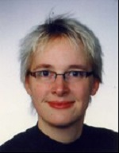

title: Staff

|Head of research group|        |   |
|--------------|:---------------|----|
| |[Privatdozentin Dr. med. vet. Verena Scheper](scheper/Dr.med.vet.Verena Scheper.md)|	Scheper.verena@mh-hannover.de| +49 (0)511 532 4369 |

|Technical Staff|                     |      |    +49 (0)511 -  |
|--------------|:---------------------|------|-----|
|   |Name| EMail|Extension|
| | Nina Armbrecht	|	Armbrecht.nina@mh-hannover.de     | 532 1529|
| | Michaela Kreinenmeyer	|	Kreinemeyer.Michaela@mh-hannover.de   | 532 1525|

|Research Team  |    |  | +49 (0)511 - |
|---------|:------|------|-----|
|   |Name| EMail|Extension|
|  | Ziwen Gao, M.Sc., PhD Student  	|	Gao.ziwen@mh-hannover.de | 532 7262|
|  |Jana Schwieger, Dr. med. vet. | Schwieger.jana@mh-hannover.de|532 7262|
|   | Kathrin Anja Malfeld, veterinarian, PhD Student |  Malfeld.Kathrin@mh-hannover.de |532 1529 |
|  |  Farnaz Matin, MD|	Matin.Farnaz@mh-hannover.de| 17 7443|   
|  |  Claas-Tido Peck, M.Sc.|	Peck.Claas-Tido@mh-hannover.de| 532 1538| 
|  | Marleen Grzybowski, M.Sc.| Grzybowski.Marleen@mh-hannover.de | 532 4192|
|  | Martina Knabel, M.Sc.| Knabel.Martina@mh-hannover.de | 532 1464 |
|   | Chunjiang Wei, M.Sc., PhD Student  	|	Wei.chunjiang@mh-hannover.de | 532 1464|

|FWJ|                     |      |    +49 (0)511 -  |
|--------------|:---------------------|------|-----|
|   |Name| EMail|Extension|
| | Ines Kruse |	 Kruse.Ines@mh-hannover| 532 1529|
| | Sofia Zehme |	Zehme.Sofia@mh-hannover| 532 1529|

|  Students   ||
|-----------|-------------|
|Name| EMail|
|Christoph Pannier, Dentist, PhD student|Pannier.christoph@mh-hannover.de|
|Noushin Kakuan, PhD Student, MD student|Noushin.t.kakuan@stud.mh-hannover.de|
|Katarina Klötzer, PhD Student, MD student|
|Katarina-Sophie Jung, PhD Student, MD student|
|Maciek Wilk, veterinarian, PhD Student|

We closely work together with PD Dr. med. A. Warnecke and PD Dr. rer. nat. G. Paasche and their lab teams. In VIANNA in NIFE we optimise our research by combining our lab spaces and other recources. 

**The team of all three working groups (not complete):** 
  
