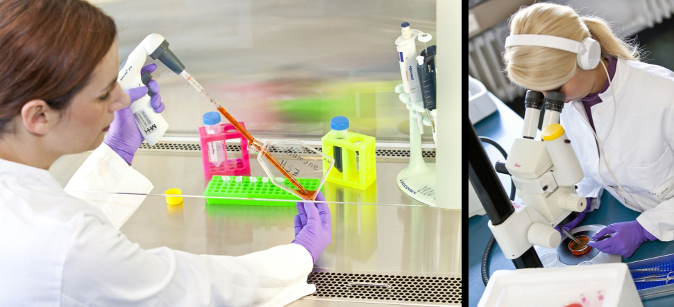

title: Warnecke Lab - Protection and Regeneration of the Inner Ear
***

 

Despite extensive investment in medical research, only a handful of new therapeutic products emerge each year. This applies especially for the therapy of inner ear related diseases. A close interrelation between clinicians and scientist within our group aims at developing novel therapeutic strategies that result in a rapid translation to the clinic. There are multiple approaches for addressing inner ear disease that will change the future of hearing impaired people and especially cochlear implant users. Cell-based approaches show a variety of advantages including the possibility to deliver complex proteins and drugs over extended time periods. A key factor in the development of cell therapy is the source of the cells. Concentrating on autologous cells and cell products, protection and regeneration of the inner ear is envisaged and may enhance the performance that can be achieved with a Cochlea Implant. Currently, biohybrid electrodes that have been developed in our research group are implanted routinely in our clinic in order to reduce foreign body reaction and inflammation. Human mesenchymal stem cells (MSC) are utilized as autologous cell source for the cell based systems. These cells have immunomodulatory properties and can prevent foreign body reaction and inflammation further enhancing the performance of the implants. 

In this context, genetic modification as well as structuring of the implant surface will be performed in order to induce and control differentiation of processes of MSC. In addition, the endogenous regenerative capacities of the inner ear will be explored in model systems in vitro and in vivo. Stem cell technology, molecular biology as well as modern imaging technologies are combined in an interdisciplinary approach to pursue our envisaged goals.

 
***

**Contact Information:**

    Prof. Dr. med. A. Warnecke
    Medizinische Hochschule Hannover
    Carl-Neuberg-Str. 1
    30625 Hannover
<Warnecke.Athanasia@mh-hannover.de> 
